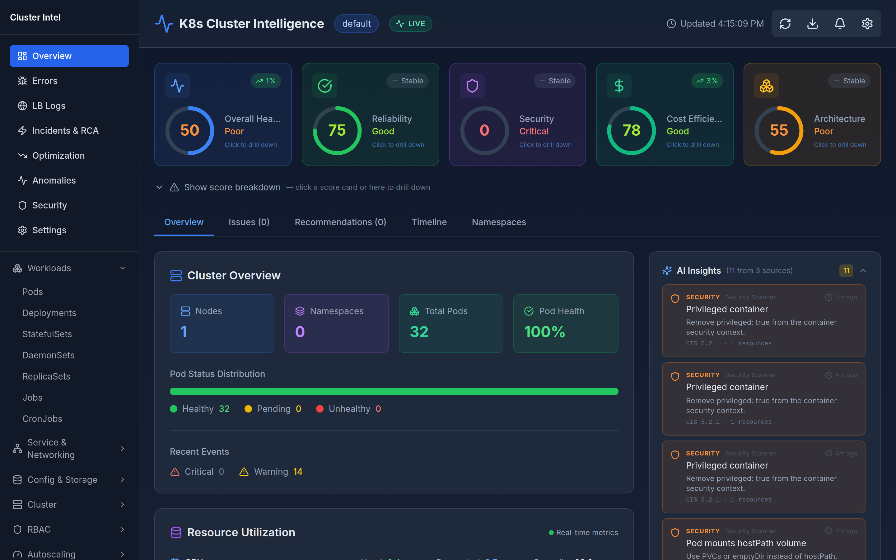
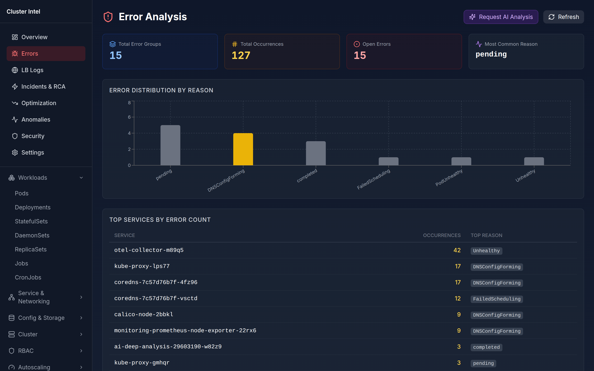
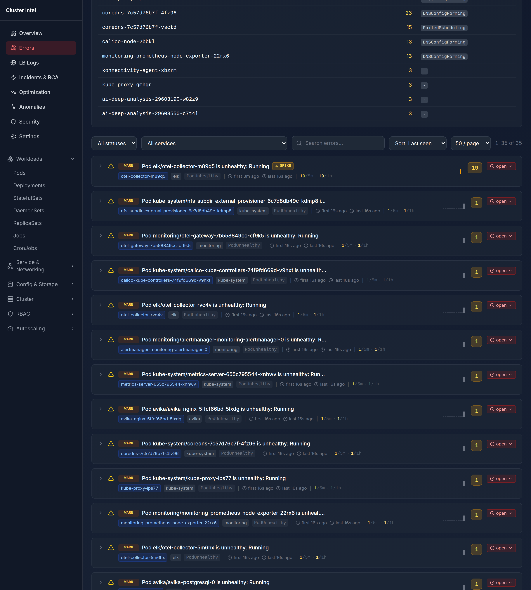
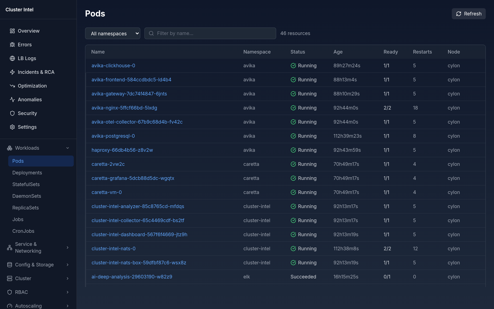
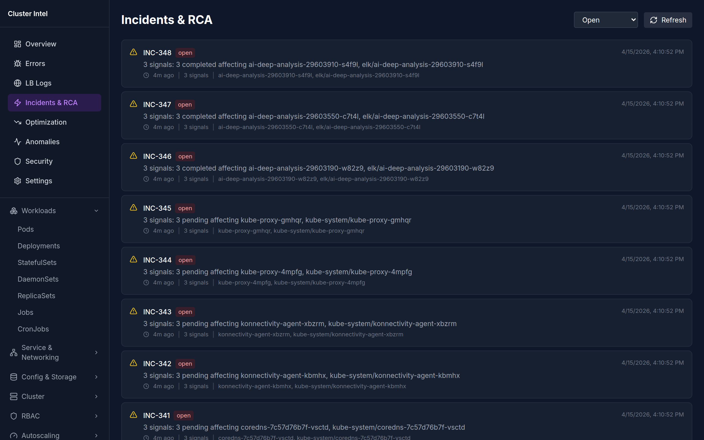
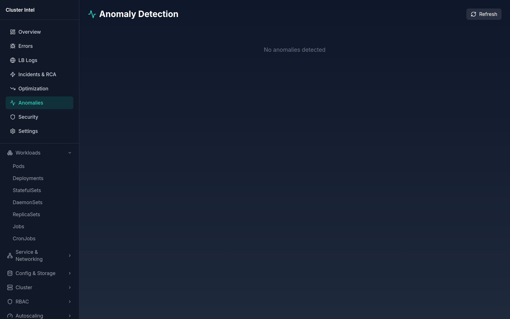
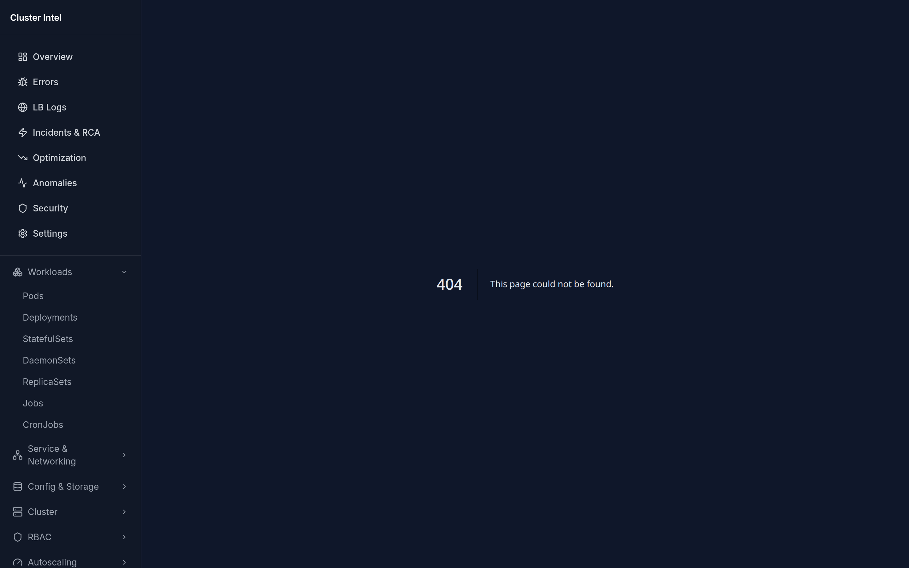

# hetu

> *hetu* (हेतु, Sanskrit) — **cause, reason, motive**.
> The thing this engine tries to find when something goes wrong in your cluster.

A Kubernetes cluster intelligence engine: deterministic health scoring,
four-level drill-down, Sentry-style error grouping, anomaly detection, and
LLM-backed root-cause analysis. Built in Go (collector + analyzer) and
Next.js 16 (dashboard).

[](LICENSE)
[](go.mod)
[](src/dashboard/package.json)

---

## Why another dashboard

Ops teams drown in green-dot telemetry. Existing tooling shows you raw
counts but not impact, hides scoring inside black boxes, and stops
drill-down at *"open Grafana"*. Errors stay open for weeks; memory leaks.

`hetu` answers a different question: **"why is this pod hurting my score,
and what should I do about it?"** Every number on the dashboard is
auditable to a rule and drills down four levels deep — from a top-level
score, into the rule that deducted it, into the resources causing the
deduction, into the per-resource impact tab.

## Screenshots

| Overview — health scores + AI insights | Errors — Sentry-style grouping |
| --- | --- |
|  |  |

| Errors detail — sparkline + spike + severity chip | Workloads browser |
| --- | --- |
|  |  |

| Incidents & RCA | Anomalies (z-score) | Recommendations |
| --- | --- | --- |
|  |  |  |

## Architecture

Three Go services + a Next.js dashboard, glued by HTTP/SSE.

```
┌──────────────┐    ┌────────────────┐    ┌──────────────┐    ┌──────────────┐
│ Kubernetes   │ →  │   collector    │ →  │   analyzer   │ →  │  dashboard   │
│  + Prom      │    │  Go · ring 10K │    │  Go · scoring│    │  Next.js 16  │
└──────────────┘    │  qps 50 burst  │    │  + RCA + LLM │    │  + SSE proxy │
                    │  100 · resync  │    │  + eviction  │    └──────────────┘
                    │  5m · scrape   │    │  loop        │
                    │  30s           │    └──────────────┘
                    └────────────────┘
```

Full diagram & component breakdown: see the impress.js deck at
[`docs/presentation/index.html`](docs/presentation/index.html) (open in any
modern browser).

## Scalability — defaults

Every number below is in the source. *Italic* = file & line.

| Component | Knob | Default | Source |
|---|---|---|---|
| Collector | ring buffer | **10 000 events** | *src/collector/main.go:706* |
| Collector | k8s qps / burst | **50 / 100** | *src/collector/main.go:136-137* |
| Collector | resync period | **5 min** | *RESYNC_PERIOD* |
| Collector | metrics scrape | **30 s** | *METRICS_SCRAPE_INTERVAL* |
| Analyzer | analysis tick | **5 min** | *ANALYSIS_INTERVAL* |
| Analyzer | eviction sweep | **5 min** | *EVICT_INTERVAL* |
| Analyzer | incidents cap · TTL | **500 · 24h / 48h** | *eviction.go:40-42* |
| Analyzer | error groups · TTL | **200 · 7 d** (50 occ/group) | *eviction.go:43-44* |
| Analyzer | anomaly stats · TTL | **1 000 · 2 h** | *eviction.go:45-46* |
| Analyzer | RCA reports · TTL | **500 · 48 h** | *eviction.go:47-48* |
| Analyzer | optimizer recs · TTL | **300 · 7 d** | *eviction.go:49-50* |
| LLM | daily token budget | **1 000 000 / day** | *values.yaml:210* |
| LLM | max tokens / call | **4 096** | *LLM_MAX_TOKENS* |
| Helm | analyzer limits | **1 CPU · 512 Mi** | *values.yaml:120-121* |
| Helm | collector limits | **500 m · 256 Mi** | *values.yaml:91-92* |
| Helm | dashboard limits | **500 m · 256 Mi** | *values.yaml:149-150* |

## Quick start (local)

Requires Go 1.25, Node 22, a reachable Kubernetes context, and (optionally)
an Ollama / OpenAI / Anthropic endpoint for LLM features.

```bash
# Interactive runner — prompts for every config, validates, then starts
# collector + analyzer + dashboard.
scripts/run-local.sh

# Or non-interactive (CI shape):
ENVIRONMENT=dev scripts/run-local.sh start --yes

# Pre-flight without starting anything
scripts/run-local.sh doctor

# Lint env file only
scripts/run-local.sh lint

# Stop, status, restart, logs (per-service tail)
scripts/run-local.sh {stop|status|restart|logs}
```

Dashboard at <http://localhost:3003>, analyzer at <http://localhost:18081>,
collector at <http://localhost:18080/healthz>.

Full reference: [`docs/script_usage.md`](docs/script_usage.md).

## Quick start (Helm)

```bash
helm upgrade --install hetu deploy/helm/cluster-intel \
  --namespace cluster-intel --create-namespace \
  -f values-deploy.yaml
```

In-cluster guide: [`deploy/helm/cluster-intel/README.md`](deploy/helm/cluster-intel/README.md).

## What's where

| Path | Purpose |
|---|---|
| `src/collector/` | K8s API + Prometheus scraper, Go ring-buffered |
| `src/collector-podlogs/` | Pod log tailing, error fingerprinting (Sentry-style) |
| `src/collector-lblogs/` | Optional CloudWatch poller |
| `src/analyzer/` | Scoring engine, correlator, RCA, eviction, REST API |
| `src/dashboard/` | Next.js 16 web UI (App Router + RSC) |
| `pkg/types/` | Shared event/score/RCA types |
| `pkg/config/` | Layered config loader (file + env + Helm) |
| `deploy/helm/cluster-intel/` | Single-source Helm chart (no kustomize) |
| `scripts/run-local.sh` | Interactive avk-style local runner |
| `docs/` | Architecture, scoring, confidence, demo walkthrough, plans |
| `docs/presentation/` | impress.js demo deck — open `index.html` |

## Key docs

- **Health scoring math** — [`docs/SCORING_SYSTEM.md`](docs/SCORING_SYSTEM.md)
- **Confidence honesty** — [`docs/CONFIDENCE_SCORES.md`](docs/CONFIDENCE_SCORES.md) *(why some confidence numbers don't mean what you think)*
- **Architecture deep-dive** — [`docs/ARCHITECTURE.md`](docs/ARCHITECTURE.md)
- **API contracts** — [`docs/API_CONTRACTS.md`](docs/API_CONTRACTS.md)
- **Errors plan** *(in progress)* — [`docs/ERRORS_PLAN.md`](docs/ERRORS_PLAN.md)
- **Demo walkthrough** — [`docs/DEMO_WALKTHROUGH.md`](docs/DEMO_WALKTHROUGH.md)
- **Roadmap** — [`docs/ROADMAP.md`](docs/ROADMAP.md)

## Status & roadmap

This is a working MVP — 196 tests, 0 failures, deterministic scoring,
in-memory storage with TTL eviction. It is **not** yet wired to a
persistence layer; restart loses incidents/errors/anomalies. Work in
flight (see `docs/ROADMAP.md` and `docs/ERRORS_PLAN.md`):

- Postgres persistence + score trendlines
- Errors: rate buckets ✅ · severity sort ✅ · pagination ✅ · cross-service `faultKey` · embedding-based dedup · typed LLM `Analysis`
- CI workflow (GitHub Actions)
- Multi-cluster aggregation
- Pluggable scoring rules

## Contributing

Bug reports and PRs welcome. Before opening a PR:

```bash
go test ./...                                    # Go suite
cd src/dashboard && npm test && npx playwright test  # JS / E2E
scripts/run-local.sh doctor                      # local pre-flight
```

## License

[MIT](LICENSE)
