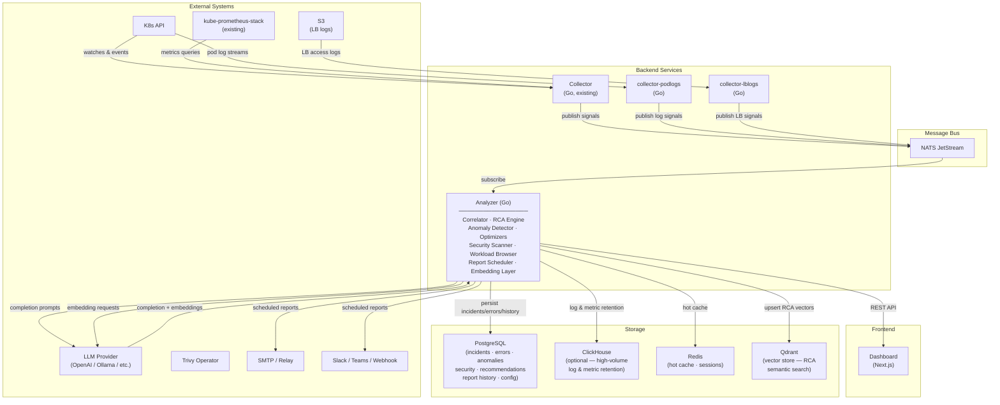
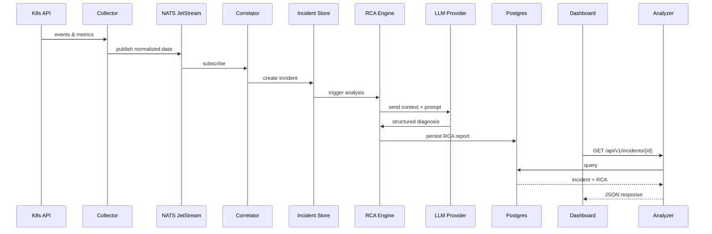
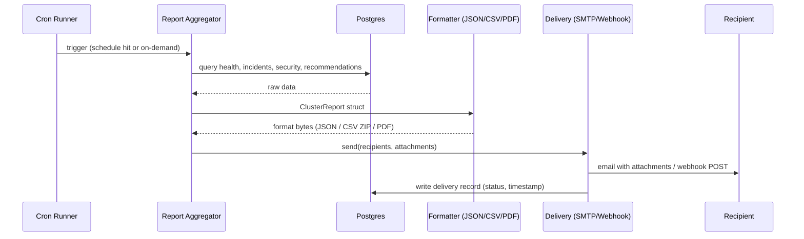

# K8s AI Cluster Intelligence Engine - Architecture (v8)

## System Overview



## Component Responsibilities

### 1. Data Collection Layer

| Component | Responsibility | Data Sources |
|-----------|---------------|--------------|
| Collector (Go, existing) | Watch cluster state changes and scrape metrics | Pods, Deployments, Events, Nodes, Services, PVCs, RBAC, NetworkPolicies via K8s API; CPU, Memory, Network, Disk via kube-prometheus-stack |
| collector-podlogs (Go, NEW) | Stream and forward pod logs | K8s API pod log streams |
| collector-lblogs (Go, NEW) | Ingest load-balancer access logs | S3 buckets |
| Security Scanner | Aggregate vulnerability and misconfiguration reports | Trivy Operator CRDs |

### 2. Message Bus

| Component | Responsibility | Notes |
|-----------|---------------|-------|
| NATS JetStream | Durable, ordered delivery between collectors and analyzers | Subjects per data type; at-least-once semantics |

### 3. Analyzer (Go, existing + v7 extensions)

| Sub-component | Responsibility | Output |
|---------------|---------------|--------|
| Correlator | Correlate events, metrics, and logs into incidents | Incident records |
| RCA Engine | Root-cause analysis via LLM | RCA reports |
| Optimizers | Resource, cost, and reliability optimization suggestions | Scored recommendations |
| Anomaly Detector | Detect anomalous patterns in time-series and logs | Anomaly alerts |
| Workload Browser | Queryable inventory of workloads and their status | Workload index |
| Report Scheduler | Aggregate cluster data into structured reports; deliver on schedule or on-demand via email/webhook | ClusterReport (JSON/CSV/PDF) |

### 4. Security Scanner

| Component | Responsibility | Output |
|-----------|---------------|--------|
| Vuln Aggregator | Collect Trivy Operator VulnerabilityReports | Vulnerability summaries |
| Policy Checker | Evaluate workloads against security baselines | Policy violations |

### 5. Frontend

| Component | Responsibility | Output |
|-----------|---------------|--------|
| Dashboard (Next.js) | Visualize health, incidents, RCA reports, recommendations | Interactive UI |

## Data Flow

End-to-end root-cause analysis path:



## Resource Footprint

### Minimum Requirements (Small Cluster <100 nodes)

| Component | CPU | Memory | Storage |
|-----------|-----|--------|---------|
| Collector | 100m | 256Mi | - |
| collector-podlogs | 100m | 128Mi | - |
| collector-lblogs | 50m | 128Mi | - |
| Analyzer | 500m | 1Gi | - |
| Security Scanner | 100m | 256Mi | - |
| Dashboard | 50m | 128Mi | - |
| NATS JetStream | 100m | 256Mi | 2Gi |
| Redis | 100m | 256Mi | 1Gi |
| PostgreSQL | 200m | 512Mi | 10Gi |
| **Total** | **~1.3 cores** | **~2.9Gi** | **~13Gi** |

### Recommended (Medium Cluster 100-1000 nodes)

| Component | CPU | Memory | Storage |
|-----------|-----|--------|---------|
| Collector | 500m | 1Gi | - |
| collector-podlogs | 250m | 512Mi | - |
| collector-lblogs | 100m | 256Mi | - |
| Analyzer | 2000m | 4Gi | - |
| Security Scanner | 250m | 512Mi | - |
| Dashboard | 100m | 256Mi | - |
| NATS JetStream | 500m | 1Gi | 10Gi |
| Redis | 500m | 1Gi | 5Gi |
| PostgreSQL | 1000m | 2Gi | 50Gi |
| ClickHouse (optional) | 1000m | 2Gi | 100Gi |
| **Total** | **~6.2 cores** | **~12.5Gi** | **~165Gi** |

### Large Scale (1000-10000+ nodes)

- Deploy collector as DaemonSet with node-level aggregation
- Shard analyzer across multiple pods
- Use ClickHouse for high-volume log and metric retention
- Implement hierarchical aggregation
- Consider multi-cluster federation

## Security Model

### RBAC Requirements

```yaml
# cluster-intel-reader (existing) - read-only access for collection
apiVersion: rbac.authorization.k8s.io/v1
kind: ClusterRole
metadata:
  name: cluster-intel-reader
rules:
  # Read-only access to most resources
  - apiGroups: [""]
    resources: ["pods", "pods/log", "services", "endpoints", "nodes", "events",
                "namespaces", "configmaps", "secrets", "persistentvolumeclaims"]
    verbs: ["get", "list", "watch"]

  # Metrics and status
  - apiGroups: ["metrics.k8s.io"]
    resources: ["pods", "nodes"]
    verbs: ["get", "list"]

  # Workloads
  - apiGroups: ["apps"]
    resources: ["deployments", "replicasets", "statefulsets", "daemonsets"]
    verbs: ["get", "list", "watch"]

  # Autoscaling
  - apiGroups: ["autoscaling"]
    resources: ["horizontalpodautoscalers"]
    verbs: ["get", "list", "watch"]

  # Networking
  - apiGroups: ["networking.k8s.io"]
    resources: ["networkpolicies", "ingresses"]
    verbs: ["get", "list", "watch"]

  # RBAC (for security analysis)
  - apiGroups: ["rbac.authorization.k8s.io"]
    resources: ["roles", "rolebindings", "clusterroles", "clusterrolebindings"]
    verbs: ["get", "list", "watch"]

  # Policy
  - apiGroups: ["policy"]
    resources: ["poddisruptionbudgets", "podsecuritypolicies"]
    verbs: ["get", "list", "watch"]

  # Trivy Operator CRDs
  - apiGroups: ["aquasecurity.github.io"]
    resources: ["vulnerabilityreports", "configauditreports"]
    verbs: ["get", "list", "watch"]
```

```yaml
# cluster-intel-writer (new, opt-in) - write access for remediation actions
apiVersion: rbac.authorization.k8s.io/v1
kind: ClusterRole
metadata:
  name: cluster-intel-writer
rules:
  # Patch deployments for resource right-sizing
  - apiGroups: ["apps"]
    resources: ["deployments", "statefulsets"]
    verbs: ["patch", "update"]

  # Manage HPA recommendations
  - apiGroups: ["autoscaling"]
    resources: ["horizontalpodautoscalers"]
    verbs: ["create", "patch", "update"]

  # Create events for audit trail
  - apiGroups: [""]
    resources: ["events"]
    verbs: ["create"]
```

### Network Policies

```
┌──────────────────────────────────────────────────────────────┐
│                    NETWORK SEGMENTATION                       │
├──────────────────────────────────────────────────────────────┤
│                                                              │
│  ┌─────────────┐        ┌─────────────┐                     │
│  │ Collector   │◄──────►│ K8s API     │  (Allowed)          │
│  └─────────────┘        └─────────────┘                     │
│         │                                                    │
│         ▼                                                    │
│  ┌─────────────┐        ┌─────────────┐                     │
│  │ Processor   │◄──────►│ Redis       │  (Internal only)    │
│  └─────────────┘        └─────────────┘                     │
│         │                                                    │
│         ▼                                                    │
│  ┌─────────────┐        ┌─────────────┐                     │
│  │ Analyzer    │───────►│ LLM Backend │  (Egress allowed)   │
│  └─────────────┘        └─────────────┘                     │
│         │                                                    │
│         ▼                                                    │
│  ┌─────────────┐        ┌─────────────┐                     │
│  │ API Server  │◄──────►│ Dashboard   │  (Ingress allowed)  │
│  └─────────────┘        └─────────────┘                     │
│                                                              │
└──────────────────────────────────────────────────────────────┘
```

### Secrets Management

- LLM API keys stored in Kubernetes Secrets (or external secrets operator)
- Database credentials via Secret references
- TLS certificates for internal communication
- Service account tokens auto-rotated
- Support for Vault/AWS Secrets Manager/GCP Secret Manager

## Configuration Model

All external endpoints (Postgres, ClickHouse, Redis, NATS, Prometheus, LLM providers, S3 buckets) are configurable via `pkg/config` -- see `docs/PLAN_V7.md` section 4.5 for the complete specification, config schema, env-var conventions, and Helm chart values.

## Multi-Cluster Support

```
┌─────────────────────────────────────────────────────────────────┐
│                     MULTI-CLUSTER TOPOLOGY                       │
├─────────────────────────────────────────────────────────────────┤
│                                                                  │
│  ┌──────────────────┐   ┌──────────────────┐                    │
│  │  Cluster A       │   │  Cluster B       │                    │
│  │  ┌────────────┐  │   │  ┌────────────┐  │                    │
│  │  │ Collector  │  │   │  │ Collector  │  │                    │
│  │  │ Agent      │──┼───┼──│ Agent      │  │                    │
│  │  └────────────┘  │   │  └────────────┘  │                    │
│  └──────────────────┘   └──────────────────┘                    │
│            │                     │                               │
│            └──────────┬──────────┘                               │
│                       ▼                                          │
│            ┌──────────────────────┐                              │
│            │  Central Hub         │                              │
│            │  ┌────────────────┐  │                              │
│            │  │ Federation     │  │                              │
│            │  │ Controller     │  │                              │
│            │  └────────────────┘  │                              │
│            │  ┌────────────────┐  │                              │
│            │  │ Global         │  │                              │
│            │  │ Dashboard      │  │                              │
│            │  └────────────────┘  │                              │
│            └──────────────────────┘                              │
│                                                                  │
└─────────────────────────────────────────────────────────────────┘
```

## Report Export & Scheduled Delivery

### Overview

The Report Scheduler is a sub-component of the Analyzer service. It aggregates live cluster data from Postgres/Redis into a `ClusterReport` snapshot, serialises it to the requested format(s), and delivers it immediately (on-demand) or on a recurring schedule via SMTP email or webhook.

No separate service is required. The scheduler runs as a `robfig/cron` goroutine inside the existing Analyzer process and stores its configuration and delivery history in the same Postgres database.

### Report Data Model

```
ClusterReport {
  metadata: {
    cluster_id        string
    generated_at      time.Time
    period            string    // "daily" | "weekly" | "bi-weekly" | "monthly" | "on-demand"
    period_start      time.Time
    period_end        time.Time
  }
  health: {
    overall_score     int
    dimension_scores  map[string]int   // reliability, security, efficiency, …
    score_delta       int              // change vs previous period
    top_issues        []Issue
  }
  incidents: {
    total             int
    open              int
    critical          int
    resolved_in_period int
    list              []Incident
  }
  security: {
    risk_score        int
    critical_findings int
    high_findings     int
    list              []Finding
  }
  optimization: {
    total_savings_monthly_usd float64
    recommendations           []Recommendation
  }
  anomalies: {
    detected int
    list     []Anomaly
  }
}
```

### Export Formats

| Format | Generation | Use case |
|--------|-----------|----------|
| **JSON** | Serialise `ClusterReport` struct → gzip-compressed download | Machine consumption, CI/CD pipelines, Slack bots |
| **CSV** | ZIP archive of 4 files: `health.csv`, `incidents.csv`, `security.csv`, `recommendations.csv` | Excel/Sheets analysis, finance and ops teams |
| **PDF** | **On-demand**: `window.print()` on `/management` page (already styled). **Scheduled**: `chromedp` headless Chrome renders `/management?token=<report-token>` → PDF blob attached to email | Executive distribution, archival, compliance |

The on-demand JSON and CSV exports are also available as direct browser downloads from the `/management` page without any backend scheduling configured.

### Schedule Frequencies

| Value | Cron expression | Description |
|-------|----------------|-------------|
| `daily` | `0 <HH> * * *` | Every day at configured time |
| `weekly` | `0 <HH> * * <DOW>` | Chosen day of week + time |
| `bi-weekly` | `0 <HH> * * <DOW>/2` | Every two weeks |
| `monthly-1` | `0 <HH> 1 * *` | 1st of every month |
| `monthly-15` | `0 <HH> 15 * *` | 15th of every month |
| `monthly-last` | `0 <HH> L * *` | Last day of every month |
| `custom` | user-supplied | Raw cron expression (power user) |

All schedules are stored in UTC; the settings UI converts from the user's chosen display timezone.

### API Endpoints

```
# Schedule management
POST   /api/v1/reports/schedules          Create a new schedule
GET    /api/v1/reports/schedules          List all schedules
PUT    /api/v1/reports/schedules/{id}     Update a schedule
DELETE /api/v1/reports/schedules/{id}     Delete a schedule

# Trigger / export
POST   /api/v1/reports/send-now           Trigger immediate generation + delivery
GET    /api/v1/reports/export?format=json Download current snapshot as JSON
GET    /api/v1/reports/export?format=csv  Download current snapshot as ZIP of CSVs

# History
GET    /api/v1/reports/history            Last 30 delivery records (status, timestamp, recipients)
```

### Delivery Channels

| Phase | Channel | Notes |
|-------|---------|-------|
| 1 | **SMTP email** | Configurable host, port, STARTTLS/TLS, auth. Formats attached as files. |
| 2 | **Slack webhook** | Rich Slack Block Kit card with key KPIs inline; JSON/CSV/PDF attached or linked. Reuses v6.3 alerting channel plumbing. |
| 3 | **Microsoft Teams webhook** | Adaptive Card with same KPIs. |
| 4 | **Generic HTTP webhook** | POST `ClusterReport` JSON to any URL; optional HMAC-SHA256 signature header. Covers PagerDuty, OpsGenie, custom integrations. |

Phases 2-4 share the same channel-abstraction interface planned in v6.3 (Advanced Alerting). Reports are a richer payload on the same delivery pipe, not a separate system.

### Backend Implementation

```
Analyzer service additions:
  pkg/reports/
    model.go          — ClusterReport type + sub-types
    aggregator.go     — collects data from Postgres/Redis into ClusterReport
    formatter_json.go — JSON serialisation + gzip
    formatter_csv.go  — ZIP of CSV sheets
    formatter_pdf.go  — chromedp headless Chrome → PDF bytes
    scheduler.go      — robfig/cron runner; loads schedules from DB on start
    delivery.go       — SMTP + channel dispatch interface
    handler.go        — HTTP handlers for /api/v1/reports/*

Database tables (Postgres):
  report_schedules   — id, frequency, cron_expr, formats[], channels[],
                       sections[], recipients[], tz, created_at, updated_at
  report_deliveries  — id, schedule_id, triggered_by, status, formats[],
                       recipients[], delivered_at, error_msg
```

### Settings UI

A new **"Report Delivery"** tab is added to `/settings`:

- **SMTP configuration**: host, port, auth credentials (stored encrypted in Postgres)
- **Recipients**: add/remove list of email addresses (or Slack channel, webhook URL by channel type)
- **Schedules**: CRUD list — each row shows frequency, next run, formats, last delivery status
- **Send test now**: triggers `POST /api/v1/reports/send-now` and shows delivery status inline

### Delivery Sequence



### Phased Delivery

| Phase | Scope | Effort |
|-------|-------|--------|
| **1 — Frontend export** | Export buttons on `/management`: JSON download, CSV download, `window.print()` PDF. No backend changes. | ~1 day |
| **2 — Backend export API** | `pkg/reports` aggregator + JSON/CSV formatters + `/api/v1/reports/export` endpoints. SQLite → Postgres migration for persistence. | ~2–3 days |
| **3 — SMTP + scheduler** | `report_schedules` table, cron runner, SMTP delivery, delivery history, Settings UI "Report Delivery" tab. | ~3–4 days |
| **4 — PDF (server-side) + multi-channel** | chromedp PDF formatter, Slack/Teams/webhook channel adapters. | ~2–3 days |

## Performance Considerations

### Rate Limiting

| Operation | Default Rate | Configurable |
|-----------|-------------|--------------|
| K8s API calls | 50 QPS | Yes |
| LLM requests | 10 RPM | Yes |
| Metric scrapes | 15s interval | Yes |
| Event processing | 1000/s | Yes |

### Caching Strategy

- **L1 Cache (In-memory)**: Hot data, 5-minute TTL
- **L2 Cache (Redis)**: Warm data, 1-hour TTL
- **L3 Cache (DB)**: Cold data, queryable history

### Backpressure Handling

```
┌─────────────────────────────────────────────────────┐
│               BACKPRESSURE MECHANISM                 │
├─────────────────────────────────────────────────────┤
│                                                     │
│  Input Rate > Processing Rate?                      │
│         │                                           │
│         ▼                                           │
│  ┌─────────────────────────────────────────────┐   │
│  │ 1. Drop low-priority events (INFO level)    │   │
│  │ 2. Increase aggregation window              │   │
│  │ 3. Sample high-frequency metrics            │   │
│  │ 4. Queue overflow → disk spill              │   │
│  │ 5. Alert on sustained pressure              │   │
│  └─────────────────────────────────────────────┘   │
│                                                     │
└─────────────────────────────────────────────────────┘
```

## Air-Gap Deployment

For air-gapped environments:

1. **Local LLM**: Deploy Ollama/vLLM with open models (Llama, Mistral)
2. **Image Registry**: Use internal registry mirror
3. **No External Dependencies**: All telemetry stays internal
4. **Offline Updates**: Support for manual update packages

```yaml
# Air-gap configuration
llm:
  backend: "ollama"
  endpoint: "http://ollama.ai-system.svc:11434"
  model: "llama3:70b"
  
telemetry:
  externalExport: false
  
updates:
  mode: "offline"
  packagePath: "/mnt/updates"
```
