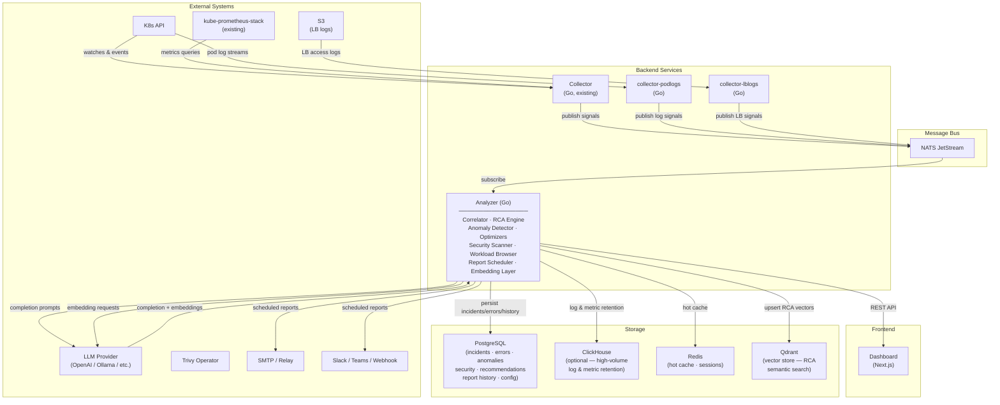
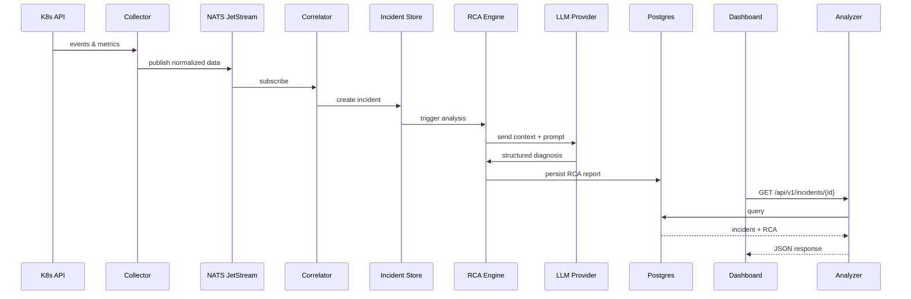
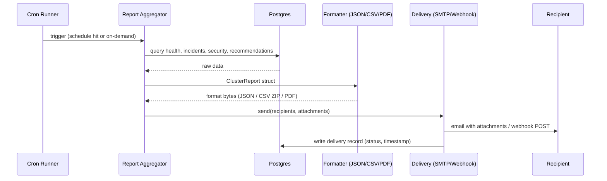

# K8s AI Cluster Intelligence Engine - Architecture (v8)

## System Overview



## Component Responsibilities

### 1. Data Collection Layer

| Component | Responsibility | Data Sources |
|-----------|---------------|--------------|
| Collector (Go, existing) | Watch cluster state changes and scrape metrics | Pods, Deployments, Events, Nodes, Services, PVCs, RBAC, NetworkPolicies via K8s API; CPU, Memory, Network, Disk via kube-prometheus-stack |
| collector-podlogs (Go, NEW) | Stream and forward pod logs | K8s API pod log streams |
| collector-lblogs (Go, NEW) | Ingest load-balancer access logs | S3 buckets |
| Security Scanner | Aggregate vulnerability and misconfiguration reports | Trivy Operator CRDs |

### 2. Message Bus

| Component | Responsibility | Notes |
|-----------|---------------|-------|
| NATS JetStream | Durable, ordered delivery between collectors and analyzers | Subjects per data type; at-least-once semantics |

### 3. Analyzer (Go, existing + v7 extensions)

| Sub-component | Responsibility | Output |
|---------------|---------------|--------|
| Correlator | Correlate events, metrics, and logs into incidents | Incident records |
| RCA Engine | Root-cause analysis via LLM | RCA reports |
| Optimizers | Resource, cost, and reliability optimization suggestions | Scored recommendations |
| Anomaly Detector | Detect anomalous patterns in time-series and logs | Anomaly alerts |
| Workload Browser | Queryable inventory of workloads and their status | Workload index |
| Report Scheduler | Aggregate cluster data into structured reports; deliver on schedule or on-demand via email/webhook | ClusterReport (JSON/CSV/PDF) |

### 4. Security Scanner

| Component | Responsibility | Output |
|-----------|---------------|--------|
| Vuln Aggregator | Collect Trivy Operator VulnerabilityReports | Vulnerability summaries |
| Policy Checker | Evaluate workloads against security baselines | Policy violations |

### 5. Frontend

| Component | Responsibility | Output |
|-----------|---------------|--------|
| Dashboard (Next.js) | Visualize health, incidents, RCA reports, recommendations | Interactive UI |

## Data Flow

End-to-end root-cause analysis path:



## Resource Footprint

### Minimum Requirements (Small Cluster <100 nodes)

| Component | CPU | Memory | Storage |
|-----------|-----|--------|---------|
| Collector | 100m | 256Mi | - |
| collector-podlogs | 100m | 128Mi | - |
| collector-lblogs | 50m | 128Mi | - |
| Analyzer | 500m | 1Gi | - |
| Security Scanner | 100m | 256Mi | - |
| Dashboard | 50m | 128Mi | - |
| NATS JetStream | 100m | 256Mi | 2Gi |
| Redis | 100m | 256Mi | 1Gi |
| PostgreSQL | 200m | 512Mi | 10Gi |
| **Total** | **~1.3 cores** | **~2.9Gi** | **~13Gi** |

### Recommended (Medium Cluster 100-1000 nodes)

| Component | CPU | Memory | Storage |
|-----------|-----|--------|---------|
| Collector | 500m | 1Gi | - |
| collector-podlogs | 250m | 512Mi | - |
| collector-lblogs | 100m | 256Mi | - |
| Analyzer | 2000m | 4Gi | - |
| Security Scanner | 250m | 512Mi | - |
| Dashboard | 100m | 256Mi | - |
| NATS JetStream | 500m | 1Gi | 10Gi |
| Redis | 500m | 1Gi | 5Gi |
| PostgreSQL | 1000m | 2Gi | 50Gi |
| ClickHouse (optional) | 1000m | 2Gi | 100Gi |
| **Total** | **~6.2 cores** | **~12.5Gi** | **~165Gi** |

### Large Scale (1000-10000+ nodes)

- Deploy collector as DaemonSet with node-level aggregation
- Shard analyzer across multiple pods
- Use ClickHouse for high-volume log and metric retention
- Implement hierarchical aggregation
- Consider multi-cluster federation

## Security Model

### RBAC Requirements

```yaml
# cluster-intel-reader (existing) - read-only access for collection
apiVersion: rbac.authorization.k8s.io/v1
kind: ClusterRole
metadata:
  name: cluster-intel-reader
rules:
  # Read-only access to most resources
  - apiGroups: [""]
    resources: ["pods", "pods/log", "services", "endpoints", "nodes", "events",
                "namespaces", "configmaps", "secrets", "persistentvolumeclaims"]
    verbs: ["get", "list", "watch"]

  # Metrics and status
  - apiGroups: ["metrics.k8s.io"]
    resources: ["pods", "nodes"]
    verbs: ["get", "list"]

  # Workloads
  - apiGroups: ["apps"]
    resources: ["deployments", "replicasets", "statefulsets", "daemonsets"]
    verbs: ["get", "list", "watch"]

  # Autoscaling
  - apiGroups: ["autoscaling"]
    resources: ["horizontalpodautoscalers"]
    verbs: ["get", "list", "watch"]

  # Networking
  - apiGroups: ["networking.k8s.io"]
    resources: ["networkpolicies", "ingresses"]
    verbs: ["get", "list", "watch"]

  # RBAC (for security analysis)
  - apiGroups: ["rbac.authorization.k8s.io"]
    resources: ["roles", "rolebindings", "clusterroles", "clusterrolebindings"]
    verbs: ["get", "list", "watch"]

  # Policy
  - apiGroups: ["policy"]
    resources: ["poddisruptionbudgets", "podsecuritypolicies"]
    verbs: ["get", "list", "watch"]

  # Trivy Operator CRDs
  - apiGroups: ["aquasecurity.github.io"]
    resources: ["vulnerabilityreports", "configauditreports"]
    verbs: ["get", "list", "watch"]
```

```yaml
# cluster-intel-writer (new, opt-in) - write access for remediation actions
apiVersion: rbac.authorization.k8s.io/v1
kind: ClusterRole
metadata:
  name: cluster-intel-writer
rules:
  # Patch deployments for resource right-sizing
  - apiGroups: ["apps"]
    resources: ["deployments", "statefulsets"]
    verbs: ["patch", "update"]

  # Manage HPA recommendations
  - apiGroups: ["autoscaling"]
    resources: ["horizontalpodautoscalers"]
    verbs: ["create", "patch", "update"]

  # Create events for audit trail
  - apiGroups: [""]
    resources: ["events"]
    verbs: ["create"]
```

### Network Policies

```
┌──────────────────────────────────────────────────────────────┐
│                    NETWORK SEGMENTATION                       │
├──────────────────────────────────────────────────────────────┤
│                                                              │
│  ┌─────────────┐        ┌─────────────┐                     │
│  │ Collector   │◄──────►│ K8s API     │  (Allowed)          │
│  └─────────────┘        └─────────────┘                     │
│         │                                                    │
│         ▼                                                    │
│  ┌─────────────┐        ┌─────────────┐                     │
│  │ Processor   │◄──────►│ Redis       │  (Internal only)    │
│  └─────────────┘        └─────────────┘                     │
│         │                                                    │
│         ▼                                                    │
│  ┌─────────────┐        ┌─────────────┐                     │
│  │ Analyzer    │───────►│ LLM Backend │  (Egress allowed)   │
│  └─────────────┘        └─────────────┘                     │
│         │                                                    │
│         ▼                                                    │
│  ┌─────────────┐        ┌─────────────┐                     │
│  │ API Server  │◄──────►│ Dashboard   │  (Ingress allowed)  │
│  └─────────────┘        └─────────────┘                     │
│                                                              │
└──────────────────────────────────────────────────────────────┘
```

### Secrets Management

- LLM API keys stored in Kubernetes Secrets (or external secrets operator)
- Database credentials via Secret references
- TLS certificates for internal communication
- Service account tokens auto-rotated
- Support for Vault/AWS Secrets Manager/GCP Secret Manager

## Configuration Model

All external endpoints (Postgres, ClickHouse, Redis, NATS, Prometheus, LLM providers, S3 buckets) are configurable via `pkg/config` -- see `docs/PLAN_V7.md` section 4.5 for the complete specification, config schema, env-var conventions, and Helm chart values.

## Multi-Cluster Support

```
┌─────────────────────────────────────────────────────────────────┐
│                     MULTI-CLUSTER TOPOLOGY                       │
├─────────────────────────────────────────────────────────────────┤
│                                                                  │
│  ┌──────────────────┐   ┌──────────────────┐                    │
│  │  Cluster A       │   │  Cluster B       │                    │
│  │  ┌────────────┐  │   │  ┌────────────┐  │                    │
│  │  │ Collector  │  │   │  │ Collector  │  │                    │
│  │  │ Agent      │──┼───┼──│ Agent      │  │                    │
│  │  └────────────┘  │   │  └────────────┘  │                    │
│  └──────────────────┘   └──────────────────┘                    │
│            │                     │                               │
│            └──────────┬──────────┘                               │
│                       ▼                                          │
│            ┌──────────────────────┐                              │
│            │  Central Hub         │                              │
│            │  ┌────────────────┐  │                              │
│            │  │ Federation     │  │                              │
│            │  │ Controller     │  │                              │
│            │  └────────────────┘  │                              │
│            │  ┌────────────────┐  │                              │
│            │  │ Global         │  │                              │
│            │  │ Dashboard      │  │                              │
│            │  └────────────────┘  │                              │
│            └──────────────────────┘                              │
│                                                                  │
└─────────────────────────────────────────────────────────────────┘
```

## Report Export & Scheduled Delivery

### Overview

The Report Scheduler is a sub-component of the Analyzer service. It aggregates live cluster data from Postgres/Redis into a `ClusterReport` snapshot, serialises it to the requested format(s), and delivers it immediately (on-demand) or on a recurring schedule via SMTP email or webhook.

No separate service is required. The scheduler runs as a `robfig/cron` goroutine inside the existing Analyzer process and stores its configuration and delivery history in the same Postgres database.

### Report Data Model

```
ClusterReport {
  metadata: {
    cluster_id        string
    generated_at      time.Time
    period            string    // "daily" | "weekly" | "bi-weekly" | "monthly" | "on-demand"
    period_start      time.Time
    period_end        time.Time
  }
  health: {
    overall_score     int
    dimension_scores  map[string]int   // reliability, security, efficiency, …
    score_delta       int              // change vs previous period
    top_issues        []Issue
  }
  incidents: {
    total             int
    open              int
    critical          int
    resolved_in_period int
    list              []Incident
  }
  security: {
    risk_score        int
    critical_findings int
    high_findings     int
    list              []Finding
  }
  optimization: {
    total_savings_monthly_usd float64
    recommendations           []Recommendation
  }
  anomalies: {
    detected int
    list     []Anomaly
  }
}
```

### Export Formats

| Format | Generation | Use case |
|--------|-----------|----------|
| **JSON** | Serialise `ClusterReport` struct → gzip-compressed download | Machine consumption, CI/CD pipelines, Slack bots |
| **CSV** | ZIP archive of 4 files: `health.csv`, `incidents.csv`, `security.csv`, `recommendations.csv` | Excel/Sheets analysis, finance and ops teams |
| **PDF** | **On-demand**: `window.print()` on `/management` page (already styled). **Scheduled**: `chromedp` headless Chrome renders `/management?token=<report-token>` → PDF blob attached to email | Executive distribution, archival, compliance |

The on-demand JSON and CSV exports are also available as direct browser downloads from the `/management` page without any backend scheduling configured.

### Schedule Frequencies

| Value | Cron expression | Description |
|-------|----------------|-------------|
| `daily` | `0 <HH> * * *` | Every day at configured time |
| `weekly` | `0 <HH> * * <DOW>` | Chosen day of week + time |
| `bi-weekly` | `0 <HH> * * <DOW>/2` | Every two weeks |
| `monthly-1` | `0 <HH> 1 * *` | 1st of every month |
| `monthly-15` | `0 <HH> 15 * *` | 15th of every month |
| `monthly-last` | `0 <HH> L * *` | Last day of every month |
| `custom` | user-supplied | Raw cron expression (power user) |

All schedules are stored in UTC; the settings UI converts from the user's chosen display timezone.

### API Endpoints

```
# Schedule management
POST   /api/v1/reports/schedules          Create a new schedule
GET    /api/v1/reports/schedules          List all schedules
PUT    /api/v1/reports/schedules/{id}     Update a schedule
DELETE /api/v1/reports/schedules/{id}     Delete a schedule

# Trigger / export
POST   /api/v1/reports/send-now           Trigger immediate generation + delivery
GET    /api/v1/reports/export?format=json Download current snapshot as JSON
GET    /api/v1/reports/export?format=csv  Download current snapshot as ZIP of CSVs

# History
GET    /api/v1/reports/history            Last 30 delivery records (status, timestamp, recipients)
```

### Delivery Channels

| Phase | Channel | Notes |
|-------|---------|-------|
| 1 | **SMTP email** | Configurable host, port, STARTTLS/TLS, auth. Formats attached as files. |
| 2 | **Slack webhook** | Rich Slack Block Kit card with key KPIs inline; JSON/CSV/PDF attached or linked. Reuses v6.3 alerting channel plumbing. |
| 3 | **Microsoft Teams webhook** | Adaptive Card with same KPIs. |
| 4 | **Generic HTTP webhook** | POST `ClusterReport` JSON to any URL; optional HMAC-SHA256 signature header. Covers PagerDuty, OpsGenie, custom integrations. |

Phases 2-4 share the same channel-abstraction interface planned in v6.3 (Advanced Alerting). Reports are a richer payload on the same delivery pipe, not a separate system.

### Backend Implementation

```
Analyzer service additions:
  pkg/reports/
    model.go          — ClusterReport type + sub-types
    aggregator.go     — collects data from Postgres/Redis into ClusterReport
    formatter_json.go — JSON serialisation + gzip
    formatter_csv.go  — ZIP of CSV sheets
    formatter_pdf.go  — chromedp headless Chrome → PDF bytes
    scheduler.go      — robfig/cron runner; loads schedules from DB on start
    delivery.go       — SMTP + channel dispatch interface
    handler.go        — HTTP handlers for /api/v1/reports/*

Database tables (Postgres):
  report_schedules   — id, frequency, cron_expr, formats[], channels[],
                       sections[], recipients[], tz, created_at, updated_at
  report_deliveries  — id, schedule_id, triggered_by, status, formats[],
                       recipients[], delivered_at, error_msg
```

### Settings UI

A new **"Report Delivery"** tab is added to `/settings`:

- **SMTP configuration**: host, port, auth credentials (stored encrypted in Postgres)
- **Recipients**: add/remove list of email addresses (or Slack channel, webhook URL by channel type)
- **Schedules**: CRUD list — each row shows frequency, next run, formats, last delivery status
- **Send test now**: triggers `POST /api/v1/reports/send-now` and shows delivery status inline

### Delivery Sequence



### Phased Delivery

| Phase | Scope | Effort |
|-------|-------|--------|
| **1 — Frontend export** | Export buttons on `/management`: JSON download, CSV download, `window.print()` PDF. No backend changes. | ~1 day |
| **2 — Backend export API** | `pkg/reports` aggregator + JSON/CSV formatters + `/api/v1/reports/export` endpoints. SQLite → Postgres migration for persistence. | ~2–3 days |
| **3 — SMTP + scheduler** | `report_schedules` table, cron runner, SMTP delivery, delivery history, Settings UI "Report Delivery" tab. | ~3–4 days |
| **4 — PDF (server-side) + multi-channel** | chromedp PDF formatter, Slack/Teams/webhook channel adapters. | ~2–3 days |

## Performance Considerations

### Rate Limiting

| Operation | Default Rate | Configurable |
|-----------|-------------|--------------|
| K8s API calls | 50 QPS | Yes |
| LLM requests | 10 RPM | Yes |
| Metric scrapes | 15s interval | Yes |
| Event processing | 1000/s | Yes |

### Caching Strategy

- **L1 Cache (In-memory)**: Hot data, 5-minute TTL
- **L2 Cache (Redis)**: Warm data, 1-hour TTL
- **L3 Cache (DB)**: Cold data, queryable history

### Backpressure Handling

```
┌─────────────────────────────────────────────────────┐
│               BACKPRESSURE MECHANISM                 │
├─────────────────────────────────────────────────────┤
│                                                     │
│  Input Rate > Processing Rate?                      │
│         │                                           │
│         ▼                                           │
│  ┌─────────────────────────────────────────────┐   │
│  │ 1. Drop low-priority events (INFO level)    │   │
│  │ 2. Increase aggregation window              │   │
│  │ 3. Sample high-frequency metrics            │   │
│  │ 4. Queue overflow → disk spill              │   │
│  │ 5. Alert on sustained pressure              │   │
│  └─────────────────────────────────────────────┘   │
│                                                     │
└─────────────────────────────────────────────────────┘
```

## Collector Design Rationale

### Why Three Separate Collector Binaries?

The three collector binaries serve fundamentally different data sources with different dependency profiles, deployment topologies, and RBAC requirements. Splitting them keeps each binary minimal and independently deployable.

| | `collector` | `collector-podlogs` | `collector-lblogs` |
|--|-------------|---------------------|--------------------|
| **Data source** | K8s API (events, pod/node/HPA state, metrics API) | K8s logs API (streaming container stdout/stderr) | AWS S3 / CloudWatch (ALB · NLB · ELB access logs) |
| **Output** | HTTP ring-buffer API (polled by Analyzer) | NATS `logs.*` subjects | NATS `lb.request` / `lb.spike` subjects |
| **Key Go deps** | `k8s.io/client-go`, `k8s.io/metrics`, Prometheus client | `k8s.io/client-go`, NATS bus pkg | `aws-sdk-go-v2` (S3 + CloudWatch), NATS bus pkg |
| **K8s RBAC** | `get/list/watch` on pods, nodes, events, metrics, HPA, PVC, RBAC CRDs | `get/list` pods, `get` pods/log | none — only needs NATS + AWS credentials |
| **IAM / cloud** | none | none | IRSA (pod annotation) or static AWS credentials |
| **Can run outside K8s** | no | no | yes — only needs NATS URL + AWS access |
| **Scaling unit** | 1 replica (watches entire API server) | 1 replica per cluster (reconciliation loop) | 1 replica (S3 polling is stateful, in-memory tracker) |
| **Binary size** | ~40 MB | ~39 MB | ~11 MB (AWS SDK not in K8s binaries) |

### Why OTel Collector Cannot Replace Them

The OpenTelemetry Collector deployed in this stack (`monitoring/otel-collector.yaml`) is an **app-level telemetry forwarder**: it receives OTLP traces emitted by cluster-intel services and routes them to Tempo. It is not a K8s data collector. Even the full OTel Contrib distribution cannot replace the custom collectors for these reasons:

#### 1. Wrong output protocol — no NATS exporter

OTel Contrib ships 60+ exporters (Prometheus, Kafka, Loki, OTLP, Elasticsearch…). None target NATS. All three custom collectors publish to NATS topics consumed by the Analyzer. Bridging this gap requires a custom exporter plugin compiled into a bespoke OTel distribution.

#### 2. Wrong data model — telemetry points vs domain objects

OTel's data model is `Metric | Trace | Log` in OTLP wire format. The cluster-intel collectors produce typed domain objects:

```
collector       → TelemetryEvent { reason, involvedObject, count, score }
collector-podlogs → ParsedLog { fingerprint, level, stackTrace, reason, service }
collector-lblogs  → LBRequest { elb, target_group, elb_status, latency_ms }
                    LBSpikeEvent { 5xx_rate, baseline, target_group }
```

These carry semantic meaning specific to the analyzer's correlation engine. Mapping them onto OTLP would require a custom processor layer that reimplements the same logic.

#### 3. No health scoring — `k8s_cluster` receiver collects raw metrics only

OTel's `k8s_cluster` receiver scrapes kubelet metrics (CPU/memory per pod/node). It does not:
- Watch the full K8s object graph for state transitions
- Detect `CrashLoopBackOff`, `ImagePullBackOff`, node pressure conditions
- Compute composite health scores from pod status + event severity + HPA scaling pressure

The `k8sobjects` receiver can stream raw K8s object JSON as log records but applies no aggregation, scoring, or incident correlation.

#### 4. No error fingerprinting — `filelog` receiver tails files, not K8s API

OTel's `filelog` receiver reads log files from node filesystem via hostPath mounts (requires DaemonSet). `collector-podlogs` calls the K8s API `pods/log` endpoint directly (no node access needed). Beyond the transport difference, OTel has no concept of error deduplication by fingerprint (hash of stack trace template + class name) or grouping by service across pods.

#### 5. No ALB-specific log parser

OTel's `awss3` receiver ingests S3 files as opaque blobs. ALB/NLB/ELB access logs use a space-delimited format with 26+ type-specific fields. `collector-lblogs` implements three parsers (ALB, NLB, Classic ELB), offset tracking per S3 prefix, and spike detection. None of these exist in OTel contrib.

#### Summary

```
OTel Collector   = telemetry pipeline  (move bytes, add attributes, route)
cluster-intel    = intelligence adapters (translate raw K8s/cloud state →
                   typed domain events that drive the Analyzer's AI engine)
```

OTel is correctly used *alongside* the collectors — not instead of them. The
observability stack (Tempo + OTel + Grafana) traces the cluster-intel services
themselves. The custom collectors feed the analyzer's correlation and RCA engine.

---

## Collector Consolidation — Unified Binary Design

The three collector binaries can be merged into a single binary. Below is an
honest complexity breakdown with a concrete design.

### Subsystem Interface

Each collector becomes a subsystem behind a shared interface:

```go
// pkg/collector/subsystem.go
type Subsystem interface {
    Name()  string
    Start(ctx context.Context) error
    Stop()
}
```

Unified `main.go` composes enabled subsystems based on config feature flags:

```go
// ENABLE_K8S_COLLECTOR=true   (default)
// ENABLE_PODLOGS=true          (default)
// ENABLE_LBLOGS=false          (requires AWS credentials)

var subsystems []Subsystem
if cfg.Collector.K8sEnabled   { subsystems = append(subsystems, k8s.New(cfg, k8sClient, nats)) }
if cfg.Collector.PodlogsEnabled { subsystems = append(subsystems, podlogs.New(cfg, k8sClient, nats)) }
if cfg.Collector.LblogsEnabled  { subsystems = append(subsystems, lblogs.New(cfg, awsCfg, nats)) }
```

Shared infrastructure is initialised once:

```
One K8s client (both k8s and podlogs subsystems share it)
One NATS connection
One HTTP server (combined /healthz, /readyz, /metrics, /api/v1/* endpoints)
One signal handler → calls Stop() on all subsystems
One Prometheus registry → subsystems register their own counters under it
```

### Directory Layout

```
src/collector/              ← renamed: existing main collector becomes k8s subsystem
  main.go                   ← new unified entrypoint
  config.go                 ← merged config with feature flags
  http.go                   ← combined HTTP server
  subsystems/
    k8s/
      collector.go          ← existing main.go informer + metrics logic
    podlogs/
      collector.go          ← existing collector-podlogs/main.go logic
      parser.go             ← existing ParseLogLine + Fingerprint
    lblogs/
      collector.go          ← existing collector-lblogs/main.go logic
      parsers.go            ← ALB / NLB / Classic ELB parsers
      cloudwatch.go         ← CloudWatch source
      http_pusher.go        ← HTTP delivery fallback
```

The three existing source directories (`src/collector-podlogs/`,
`src/collector-lblogs/`) become dead code and can be removed after migration.

### Go Module — Combined Dependencies

```
k8s.io/client-go        (k8s + podlogs subsystems)
k8s.io/metrics          (k8s subsystem only)
aws/aws-sdk-go-v2/s3    (lblogs subsystem — adds ~20 MB to binary)
aws/aws-sdk-go-v2/cloudwatchlogs
github.com/nats-io/nats.go
github.com/prometheus/client_golang
```

The AWS SDK is always compiled in. To exclude it for K8s-only deployments, use
Go build tags (`//go:build !nolblogs`) — adds build complexity but keeps the
K8s-only image at ~45 MB instead of ~65 MB.

### Helm Chart Changes

Three Deployments → One Deployment:

```diff
- collector.yaml           (3 separate deployments)
- collector-podlogs.yaml
- collector-lblogs.yaml
+ collector.yaml           (one deployment, feature flags via env)

# values.yaml additions
+ collector:
+   k8sEnabled: true
+   podlogsEnabled: true
+   lbLogsEnabled: false
+   watchNamespaces: ""
+   awsRegion: ""
+   lbConfigs: "[]"         # JSON array of LBConfig objects
```

ServiceAccount gets combined RBAC (K8s `pods/log` + IRSA annotation for AWS):

```yaml
serviceAccount:
  annotations:
    eks.amazonaws.com/role-arn: "arn:aws:iam::ACCOUNT:role/cluster-intel-lblogs"
```

### Complexity Breakdown

| Area | Effort | Notes |
|------|--------|-------|
| Subsystem interface + unified main | **~1 day** | ~200 lines; mostly plumbing |
| Move k8s + podlogs logic into packages | **~0.5 day** | Mechanical refactor; shared K8s client |
| Move lblogs logic into package | **~0.5 day** | AWS client init moves to main |
| Merge configs + feature flags | **~0.5 day** | One struct, env-var driven |
| Unified HTTP server | **~0.5 day** | Combine existing routes |
| Update Helm chart | **~1 day** | Merge 3 Deployments + RBAC |
| Update docker-compose + Dockerfiles | **~0.5 day** | One Dockerfile instead of three |
| Tests (unit + integration) | **~2 days** | Each subsystem testable in isolation |
| **Total** | **~6–7 days** | Assuming green-field restructure |

### Tradeoffs

| | Unified binary | Keep separate |
|--|---------------|---------------|
| Operational complexity | Lower — one Deployment to watch | Higher — three Deployments |
| Independent scaling | **Not possible** | Each scaled on its own |
| Blast radius | **Higher** — lblogs panic stops K8s watching | Isolated per subsystem |
| Binary size | ~65 MB (AWS SDK always present) | 40 + 39 + 11 = 90 MB total, but isolated |
| AWS IAM in K8s pods | IRSA on main collector pod | IRSA on lblogs pod only |
| K8s-only deployments | AWS SDK always compiled in | Clean separation |
| Build tags to exclude lblogs | Possible but adds CI matrix | Not needed |

### Recommendation

**Merge `collector` + `collector-podlogs` now (low complexity, ~2 days):**
Both need `k8s.io/client-go`, share the K8s client, and have the same RBAC
scope. There is no cross-dependency penalty. This eliminates one Deployment and
halves the K8s API server connection count.

**Keep `collector-lblogs` separate** (or make it opt-in with a build tag):
It has a completely different external dependency (AWS SDK), different IAM
requirements (IRSA), can run outside the cluster, and has zero overlap with
the K8s RBAC model. Merging it saves one Deployment but adds AWS SDK to every
cluster-intel installation regardless of whether S3 log ingestion is used.

If you do want a single binary for all three, the build-tag approach is the
right path — `make docker-build` builds with lblogs enabled by default;
`make docker-build NO_LBLOGS=1` produces the lean K8s-only image.

## Air-Gap Deployment

For air-gapped environments:

1. **Local LLM**: Deploy Ollama/vLLM with open models (Llama, Mistral)
2. **Image Registry**: Use internal registry mirror
3. **No External Dependencies**: All telemetry stays internal
4. **Offline Updates**: Support for manual update packages

```yaml
# Air-gap configuration
llm:
  backend: "ollama"
  endpoint: "http://ollama.ai-system.svc:11434"
  model: "llama3:70b"
  
telemetry:
  externalExport: false
  
updates:
  mode: "offline"
  packagePath: "/mnt/updates"
```
