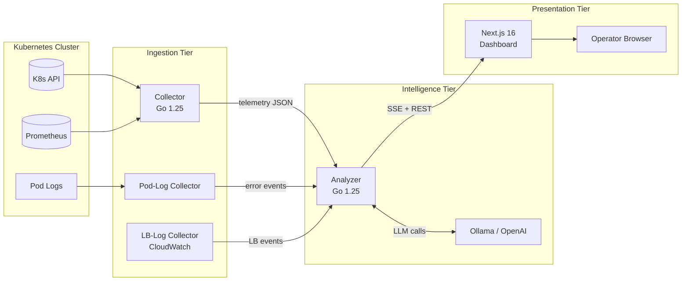
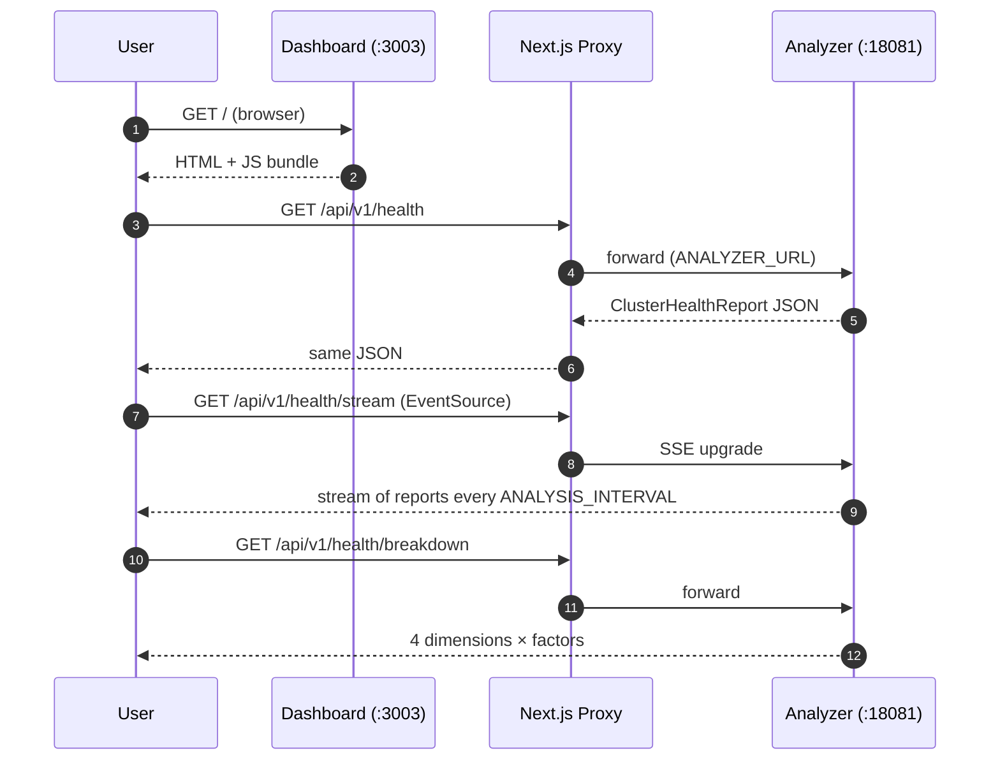
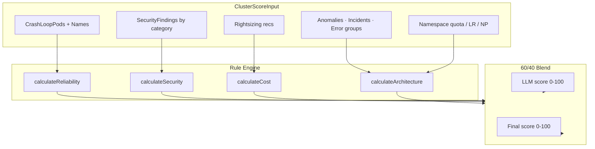
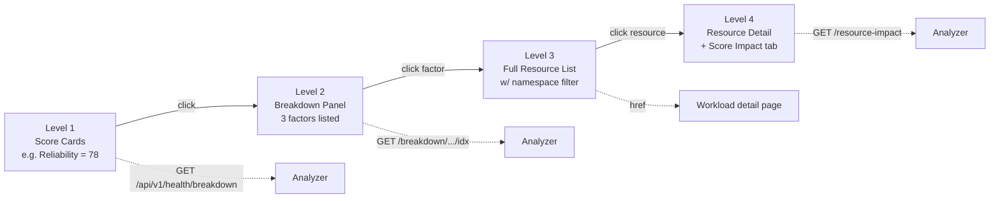
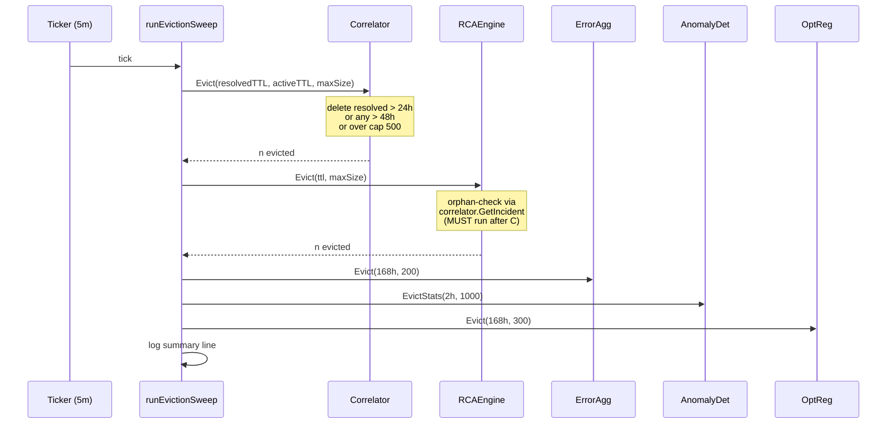
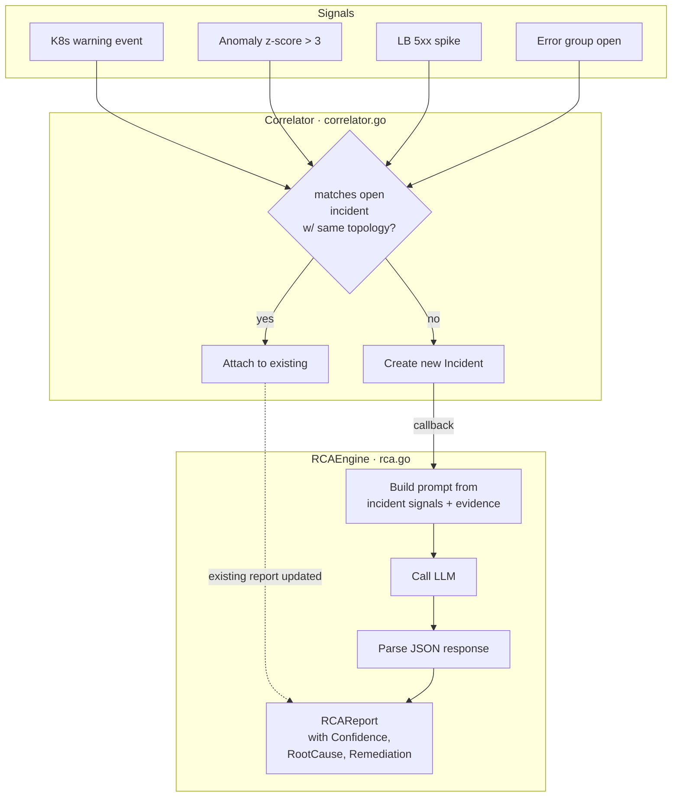

# K8s Cluster Intelligence Engine — Demo Walkthrough

A visual tour of how the system ingests cluster state, scores it,
correlates incidents, and presents drill-down analytics to operators.
Use this as your speaker-support doc for the live demo.

---

## 1. System at a glance

Three services, one message flow. Collector gathers, analyzer reasons,
dashboard displays.



Components in this repo:

| Directory | Purpose |
|---|---|
| `src/collector` | Scrapes K8s API + Prometheus, emits ring-buffered telemetry |
| `src/collector-podlogs` | Tails container logs, parses errors, publishes via NATS |
| `src/collector-lblogs` | Pulls AWS load-balancer logs via CloudWatch |
| `src/analyzer` | Scoring, correlation, RCA, drill-down APIs, eviction |
| `src/dashboard` | Next.js 16 app; SSE for live, REST for everything else |
| `pkg/*` | Shared types, middleware, LLM client, store, bus, K8s client |

---

## 2. Request flow: the dashboard's first paint



Relevant code:
- Proxy: `src/dashboard/app/api/v1/[...path]/route.ts`
- Main page: `src/dashboard/app/page.tsx:259`
- Analyzer handlers: `src/analyzer/main.go:1717` (breakdown),
  `:1897` (rule breakdown), `:1977` (resource impact)

---

## 3. The scoring engine — deterministic, auditable, blendable



Each `calculate*` function emits a **ScoreResult**:

```go
type ScoreResult struct {
    Score      int              // 0-100 after clamping
    Base       int              // starting base, usually 100
    Deductions []ScoreDeduction // negative impact rules
    Bonuses    []ScoreDeduction // informational positives
}

type ScoreDeduction struct {
    Rule         string   // e.g. "CrashLoopBackOff pods"
    Impact       int      // negative, capped at rule Max
    Max          int      // deepest possible deduction
    Count        int      // # resources triggering it
    Resources    []string // truncated to 10 for wire
    AllResources []string // full list, json:"-"
}
```

Blending (`BlendWithLLM`): rule \* 0.6 + LLM \* 0.4, clamped 0–100. If
LLM output is nil or negative, we return the rule score unchanged —
the engine works stand-alone.

Algorithm details: `docs/SCORING_SYSTEM.md`.

---

## 4. Four-level drill-down

The critical UX feature that took two audit passes to get right.



### Why the index-alignment regression test matters

Earlier versions of `handleHealthBreakdown` built factors from
scanner-specific queries (PodHealth categories, security findings by
severity, optimizer recs by type), iterated via Go's random
map-iteration. **Factor index 2 on Level 2 ≠ factor index 2 on Level
3.** The test at
`src/analyzer/handlers_drilldown_test.go:TestHandleHealthBreakdown_IndexAlignment`
walks every factor returned by `/breakdown`, calls
`/breakdown/{dim}/{idx}`, and asserts the `rule` field matches. This
is our regression guard.

---

## 5. TTL + max-size eviction

Five handler maps used to grow without bound. One sweep every 5
minutes keeps memory flat.



**Ordering is not cosmetic.** If RCA ran before Correlator, RCA would
never see an "orphan" because the orphan's incident would still exist.
Test: `TestRunEvictionSweep_CorrelatorBeforeRCA`.

Configurable via 12 env vars (all with safe defaults):

| Var | Default |
|---|---|
| `EVICT_INTERVAL` | `5m` |
| `EVICT_INCIDENT_RESOLVED_TTL` / `_ACTIVE_TTL` / `_MAX` | `24h` / `48h` / `500` |
| `EVICT_ERROR_GROUP_TTL` / `_MAX` | `168h` / `200` |
| `EVICT_ANOMALY_STATS_TTL` / `_MAX` | `2h` / `1000` |
| `EVICT_RCA_REPORT_TTL` / `_MAX` | `48h` / `500` |
| `EVICT_OPT_REC_TTL` / `_MAX` | `168h` / `300` |

---

## 6. Signal → Incident → RCA

Incidents don't come from one source. The Correlator clusters
topology-matching signals within a time window into a single
incident, then the RCA engine (LLM-backed) summarises and proposes
remediation.



Rate-limited to 1 concurrent LLM call (`src/analyzer/main.go` RCA
channel, capacity 100, timeout 3min) so sudden incident storms don't
DoS the LLM backend.

---

## 7. Teleprompter log viewer (the math)

The log tab anchors the **newest line at viewport midpoint** while
older lines scroll up and out. This needed a non-obvious DOM trick.

```
+--------------------------+  <- scroll container
|                          |
|   …older log lines…      |
|   pod/log line N-2       |
|   pod/log line N-1       |
|===== pod/log line N =====|  <- bottomRef anchor
|                          |  <- spacer div (aria-hidden)
|                          |     height = container.clientHeight × 0.5
|                          |
+--------------------------+  <- scrollHeight
```

Without the spacer, `scrollTop = scrollHeight - clientHeight × 0.5`
always exceeds the max scrollable position and clamps to the bottom —
which is why the earlier "teleprompter" commit looked identical to
regular autoscroll. A `ResizeObserver` keeps the spacer sized to 50%
of the visible container, and a `programmaticScroll` ref prevents the
follow-pause detection from misfiring during our own scroll writes.

Code: `src/dashboard/app/workloads/[kind]/[namespace]/[name]/page.tsx:460-513`.

---

## 8. Backend scanner cadence

Each scanner has its own goroutine and interval. They feed `ScoreInput`
on the next analysis tick.

```mermaid
gantt
    title Background scanners (intervals)
    dateFormat X
    axisFormat %Ms

    section PodHealth
    scan :a1, 0, 120000
    scan :a2, 120000, 120000

    section Security (CIS)
    scan :b1, 0, 300000

    section Anomaly
    scan :c1, 0, 180000

    section Optimizer (all 5)
    scan :d1, 0, 600000

    section Analysis + Score
    tick :e1, 0, 30000
    tick :e2, 30000, 30000
    tick :e3, 60000, 30000

    section Eviction sweep
    sweep :f1, 0, 300000
```



Tuned so that quick feedback (pod health every 2m) coexists with
expensive scans (optimizer every 10m). Eviction runs every 5m.

---

## 9. Test pyramid

| Layer | Count | Where |
|---|---|---|
| Go unit / httptest | **112** | `src/analyzer/*_test.go`, `src/collector/*_test.go`, `pkg/*/*_test.go` |
| Playwright E2E (chromium + mobile) | **34** | `src/dashboard/tests/*.spec.ts` |
| Total automated | **146** | — |

Coverage highlights:
- Rule-based scoring: every deduction rule is tested
- Eviction: all 5 `Evict` methods + sweep ordering + cold-start warming-up
- Drill-down: **index-alignment regression test** (the critical bug that caused wrong data at Level 3)
- Log scroll: spacer DOM invariants tested with `page.routeWebSocket`
- Irregular plurals: `/workloads/ingresses/...` sends `kind=Ingress`, not `Ingresse`

See `docs/CONFIDENCE_SCORES.md` for an honest note about where
"confidence" values come from (they are not calibrated probabilities).

---

## 10. Running the demo

```bash
# One command starts everything at the right ports with the right env
scripts/run-local.sh start

# → dashboard: http://localhost:3003/
# → analyzer:  http://localhost:18081/
# → logs:      tail -f /tmp/cluster-intel-logs/{analyzer,dashboard}.log
```

Demo path:

1. Open `http://localhost:3003/` → Overall Health card.
2. Click a score card → breakdown panel expands.
3. Click any factor → Level-3 inline panel with full resource list
   and namespace filter.
4. Click a resource → workload detail page → **Score Impact tab**
   (Level 4) shows which rules this resource is triggering.
5. Navigate to **Incidents** → open one → RCA report with confidence.
6. Switch **Profile → Demo** (header badge) to populate all pages with
   synthetic but consistent data — useful for a screen-capture demo
   where you want every widget populated.
7. Logs tab on any pod → scrolling keeps newest line at midpoint;
   scroll up to pause, click Follow to re-anchor.

---

## 11. Roadmap (next session hooks)

- CI workflow (`.github/workflows/ci.yml` — none today)
- Persistence (SQLite or Postgres; maps currently in-memory)
- Historical trend views for dimension scores
- Confidence calibration (see `CONFIDENCE_SCORES.md` §path-to-calibrated)
- Delete legacy `src/e2e/*.js` Puppeteer tests
- Test coverage for `pkg/bus`, `pkg/kube`, `pkg/llm`, `pkg/store`
- Tighten error-group-to-pod matching in Level-4 impact (currently
  matches on `Service` or `LastPod`, misses many pods)
