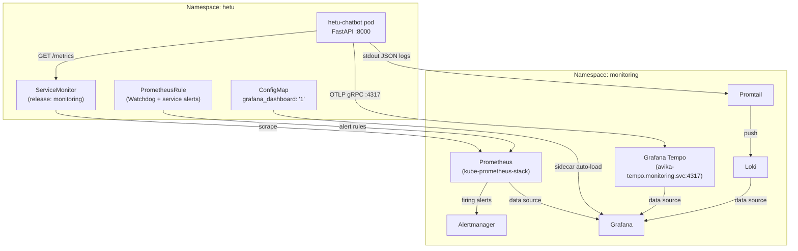
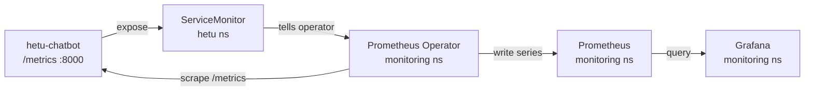
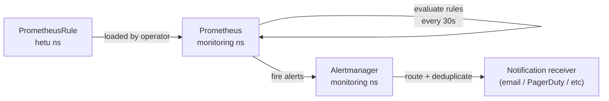
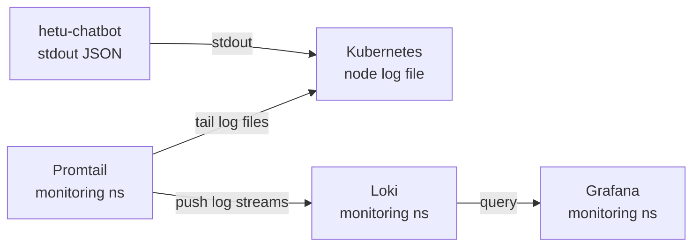
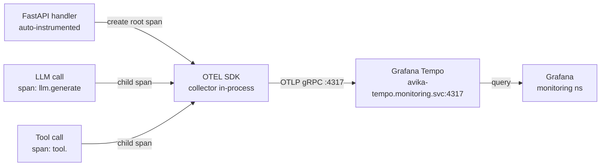
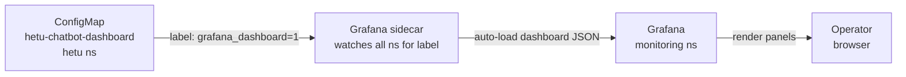

# Observability Architecture — hetu-chatbot

**Service:** `hetu-chatbot`  
**Namespace:** `hetu`  
**Runtime:** FastAPI on port 8000  
**Part of:** hetu Kubernetes Cluster Intelligence Engine  
**Authored:** 2026-06-21  

---

## 1. Overview

This document covers the full observability stack for the `hetu-chatbot` service. It exists as a mandatory pre-deploy artefact for GitHub issue #5. All seven pillars are wired in from first deploy — not retrofitted.

| Pillar | Satisfied by | Target store | Namespace of resource |
|---|---|---|---|
| **Metrics** | `prometheus-client` `/metrics` endpoint + `ServiceMonitor` | Prometheus (`monitoring` ns) | `hetu` |
| **Alerting** | `PrometheusRule` (Watchdog + 3 service alerts) | Alertmanager (`monitoring` ns) | `hetu` |
| **Logging** | `python-json-logger` structured JSON stdout | Loki (via Promtail) | — (stdout) |
| **Tracing** | OTEL SDK, OTLP gRPC exporter | Tempo (`avika-tempo.monitoring.svc:4317`) | — (in-process) |
| **Health** | `/health` HTTP endpoint; k8s liveness + readiness probes | Kubernetes control plane | `hetu` |
| **Dashboards** | Grafana dashboard `ConfigMap` (label `grafana_dashboard: "1"`) | Grafana (`monitoring` ns) | `hetu` |
| **Architecture doc** | This file | Git (`docs/OBSERVABILITY_ARCHITECTURE.md`) | — |

---

## 2. Top-Level Data-Flow Diagram



---

## 3. Metrics

### What is emitted

The `hetu-chatbot` FastAPI application uses `prometheus-client` and exposes a `/metrics` endpoint (Prometheus text format) on port 8000.

| Metric name | Type | Labels | Description |
|---|---|---|---|
| `chatbot_requests_total` | Counter | `endpoint` | Total HTTP requests received |
| `chatbot_request_errors_total` | Counter | `endpoint` | Total requests that returned an error |
| `chatbot_request_latency_seconds` | Histogram | `endpoint` | Request duration in seconds |
| `chatbot_llm_tokens_total` | Counter | `provider`, `model` | Total tokens consumed from LLM providers |
| `chatbot_tool_calls_total` | Counter | `tool`, `status` | Tool invocations with success/failure status |

### Where it goes

`ServiceMonitor` in the `hetu` namespace (label `release: monitoring`) instructs the Prometheus Operator (running in `monitoring` ns) to scrape the pod's `/metrics` endpoint. Prometheus stores the time series and makes them available to Grafana and Alertmanager.

### Resources

| Resource | Kind | Namespace |
|---|---|---|
| `hetu-chatbot` | `ServiceMonitor` | `hetu` |
| `prometheus-operated` | `StatefulSet` (Prometheus) | `monitoring` |

### Metrics data-flow



---

## 4. Alerting

### What is emitted

A `PrometheusRule` custom resource in the `hetu` namespace defines four alert rules:

| Alert name | Condition | Severity |
|---|---|---|
| `Watchdog` | Always-firing dead-man's switch — confirms the alert pipeline is live | none |
| `HetuChatbotDown` | `hetu-chatbot` pod is not reachable for > 1 minute | critical |
| `HetuChatbotHighErrorRate` | Error rate (`chatbot_request_errors_total / chatbot_requests_total`) exceeds threshold | warning |
| `HetuChatbotLatencyP99` | p99 of `chatbot_request_latency_seconds` breaches SLO | warning |

The Watchdog alert is mandatory — it fires continuously so that silence in Alertmanager is itself an alert.

### Where it goes

Prometheus evaluates the rules and fires alerts to Alertmanager (in `monitoring` ns). Alertmanager routes and deduplicates them.

### Resources

| Resource | Kind | Namespace |
|---|---|---|
| `hetu-chatbot-alerts` | `PrometheusRule` | `hetu` |
| `alertmanager-operated` | `StatefulSet` (Alertmanager) | `monitoring` |

### Alerting data-flow



---

## 5. Logging

### What is emitted

The `hetu-chatbot` application uses `python-json-logger` to emit structured JSON to stdout on every log statement. Every log line contains:

| Field | Example value | Notes |
|---|---|---|
| `level` | `"INFO"` | Log severity |
| `timestamp` | `"2026-06-21T10:42:00.000Z"` | UTC ISO-8601 |
| `service` | `"hetu-chatbot"` | Static, set at startup |
| `trace_id` | `"4bf92f3577b34da6..."` | Extracted from current OTEL span context |

The `trace_id` field is populated from the active OpenTelemetry span on every request-handling log statement. This connects log lines to distributed traces (see section 7).

### Where it goes

Kubernetes captures stdout from the pod. Promtail (running as a DaemonSet in `monitoring` ns) tails pod logs and ships them to Loki. Grafana queries Loki for log exploration and correlated log/trace views.

### Resources

| Resource | Kind | Namespace |
|---|---|---|
| Promtail DaemonSet | `DaemonSet` | `monitoring` |
| Loki | `StatefulSet` | `monitoring` |

### Logging data-flow



---

## 6. Tracing

### What is emitted

The `hetu-chatbot` application initialises the OpenTelemetry SDK at startup with an OTLP gRPC exporter. All spans are exported to `avika-tempo.monitoring.svc:4317`.

**Auto-instrumented paths:**

- FastAPI HTTP handlers (via `opentelemetry-instrumentation-fastapi`)
- HTTPX outbound HTTP calls (via `opentelemetry-instrumentation-httpx`)

**Custom spans:**

| Span name | Attributes | Created on |
|---|---|---|
| `llm.generate` | `llm.provider`, `llm.model`, `llm.tokens_used` | Every LLM inference call |
| `tool.<name>` | `tool.name`, `tool.status` | Every tool invocation |

Every custom span captures `trace_id` which is also injected into the structured log output for the same request.

### Where it goes

OTLP gRPC → Tempo (`avika-tempo.monitoring.svc:4317`) → Grafana Tempo data source → Grafana trace explorer and correlated trace/log view.

### Resources

| Resource | Kind | Namespace |
|---|---|---|
| `avika-tempo` | `Service` | `monitoring` (avika Tempo) |
| Grafana Tempo data source | `ConfigMap` or Grafana config | `hetu` |

### Tracing data-flow



---

## 7. Health Probes

### What is emitted

The `hetu-chatbot` pod exposes a `/health` HTTP endpoint on port 8000. It returns `200 OK` with a JSON body indicating the service is alive and ready to accept traffic.

The `/health` endpoint is **unauthenticated** — it must respond regardless of authentication state so Kubernetes can always probe it.

### Kubernetes probe configuration

| Probe | Path | Initial delay | Period |
|---|---|---|---|
| `livenessProbe` | `GET /health` | 10s | 15s |
| `readinessProbe` | `GET /health` | 5s | 10s |

If the liveness probe fails repeatedly, Kubernetes restarts the container. If the readiness probe fails, the pod is removed from the Service endpoints (no traffic routed to it) until it recovers.

---

## 8. Dashboards

### What is emitted

A Grafana dashboard is stored as a `ConfigMap` in the `hetu` namespace with the label `grafana_dashboard: "1"`. The Grafana sidecar (part of the kube-prometheus-stack) watches for ConfigMaps with this label across all namespaces and auto-loads the dashboard JSON into Grafana at runtime — no manual import needed.

### Dashboard panels

| Panel | Query basis | Visualisation |
|---|---|---|
| Request rate | `rate(chatbot_requests_total[5m])` | Time series |
| Error rate | `rate(chatbot_request_errors_total[5m])` | Time series |
| Latency p99 | `histogram_quantile(0.99, ...)` on `chatbot_request_latency_seconds` | Time series |
| LLM tokens | `rate(chatbot_llm_tokens_total[5m])` by `provider`, `model` | Bar chart |

### Resources

| Resource | Kind | Namespace | Label |
|---|---|---|---|
| `hetu-chatbot-dashboard` | `ConfigMap` | `hetu` | `grafana_dashboard: "1"` |

### Dashboard data-flow



---

## 9. Trace ↔ Log Correlation

Every log line emitted by `hetu-chatbot` during request handling includes a `trace_id` field. This value is extracted from the active OpenTelemetry span context using the OTEL Python SDK's `get_current_span()` API and injected into the `python-json-logger` formatter.

**Correlation flow:**

1. An HTTP request arrives at the FastAPI handler.
2. The OTEL FastAPI instrumentation creates (or continues) a trace and sets the active span on the current thread/async context.
3. Every `logger.info(...)` / `logger.error(...)` call during that request reads `trace_id` from the span context and includes it in the JSON log line.
4. The same `trace_id` is the root span ID stored in Tempo.
5. In Grafana: open a trace in the Tempo explorer → click "Logs for this trace" → Grafana queries Loki with `{service="hetu-chatbot"} | json | trace_id="<value>"` and returns the correlated log lines side-by-side.

This means every slow LLM call, every tool failure, and every HTTP error can be investigated with both the distributed trace (timing, span hierarchy) and the structured logs (application-level detail) in the same Grafana view.

---

## 10. Instrumentation Checklist

Run this checklist before the first deploy PR is merged (GitHub issue #5).

```
[ ] /metrics endpoint responds with Prometheus text format on port 8000
[ ] ServiceMonitor deployed in hetu namespace (label: release: monitoring)
[ ] PrometheusRule deployed in hetu namespace with:
    [ ] Watchdog (dead-man's switch, always firing)
    [ ] HetuChatbotDown alert
    [ ] HetuChatbotHighErrorRate alert
    [ ] HetuChatbotLatencyP99 alert
[ ] Structured JSON logs emitted to stdout with fields: level, timestamp, service, trace_id
[ ] OTEL SDK initialised at startup; spans exported to avika-tempo.monitoring.svc:4317 via OTLP gRPC
[ ] FastAPI handlers auto-instrumented (opentelemetry-instrumentation-fastapi)
[ ] HTTPX outbound calls auto-instrumented (opentelemetry-instrumentation-httpx)
[ ] All LLM calls wrapped in custom span: llm.generate with attrs llm.provider, llm.model, llm.tokens_used
[ ] All tool calls wrapped in custom span: tool.<name> with attrs tool.name, tool.status
[ ] /health endpoint returns 200 OK
[ ] livenessProbe and readinessProbe configured on the k8s Deployment (hitting /health)
[ ] Grafana dashboard ConfigMap deployed in hetu namespace (label: grafana_dashboard: "1")
[ ] Dashboard panels cover: request rate, error rate, latency p99, LLM tokens
[ ] docs/OBSERVABILITY_ARCHITECTURE.md exists in the repository (this file)
```
