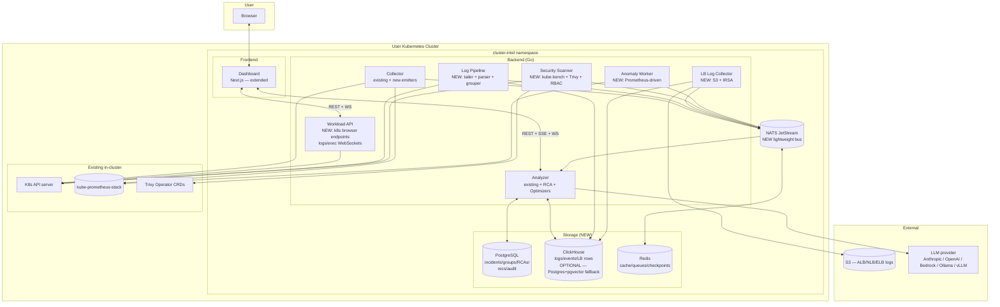
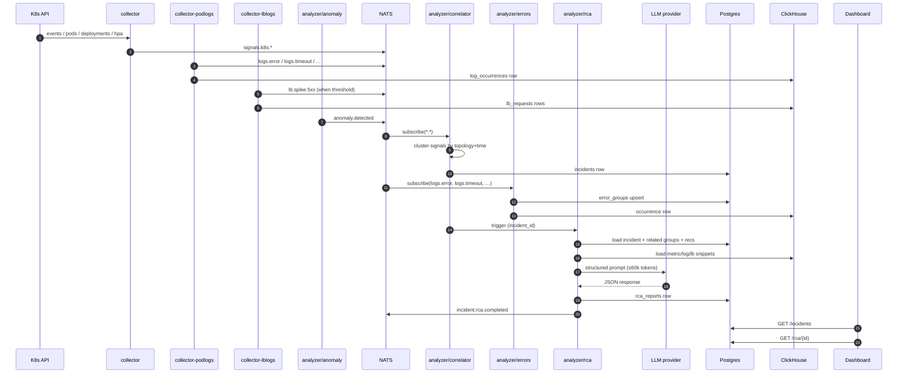

# v7 — Insights, Workloads & Intelligence

**Status:** DRAFT FOR REVIEW
**Date:** 2026-04-09
**Supersedes/extends:** parts of `ROADMAP.md` (v6 in-progress, v7 enterprise), absorbs `POD_HEALTH_MANAGEMENT.md`
**Audience:** project owner — review section by section, leave comments, then we build

> This document is the implementation plan for the next major version of the **K8s Cluster Intelligence Engine**. It is written **after** reading the existing codebase, so the proposals deliberately extend what already exists instead of starting over.

---

## 0. Why this document exists

The user asked for an LLM-powered RCA + optimization + security + workload-browser product on top of the existing repo. The existing repo already contains a working collector / analyzer / dashboard pipeline (v6.0), but is missing the LLM RCA implementation, persistence, log-stream parsing, S3 LB-log ingestion, anomaly detection, real optimization engines, and a k8s-dashboard-style workload browser. This plan fills those gaps as a single coherent v7.

---

## 1. State of the existing project (verified by code reading)

### 1.1 Services that exist

| Service | Path | Lang | Port(s) | Notes |
|---|---|---|---|---|
| Collector | `src/collector/` | Go 1.22 | `8080` API, `9090` metrics | K8s informers, Prometheus scrape, DNS/HPA/PVC collectors, basic event correlator. **In-memory ring buffers only.** |
| Analyzer | `src/analyzer/` | Go 1.24 | `8081` API, `9091` metrics | Health scoring, prompt templates loaded, multi-provider `LLMClient` with metrics & tracing, SSE feed of `ClusterHealthReport`. **No actual RCA execution path yet.** |
| Dashboard | `src/dashboard/` | Next.js 14 + TS + Tailwind + Recharts | `3000` | Single-page health overview. Components: ScoreCard, IssuesList, RecommendationsList, ResourceUtilization, TimelineChart, ClusterSummary, NamespacesTable, AIInsightFeed, CoreDNSHealth, SettingsModal. SSE-driven. |

Shared code lives in `pkg/types` (data models) and `pkg/middleware` (HTTP). Module path is `github.com/your-org/cluster-intel`.

### 1.2 What's actually wired up

- **K8s informers**: Pods, Nodes, Deployments, StatefulSets, DaemonSets, ReplicaSets, Jobs, CronJobs, Services, Endpoints, PVCs, PVs, RBAC, NetworkPolicies, Ingresses, HPAs, ConfigMaps, PDBs, StorageClasses (`manifests/base/rbac.yaml` confirms read perms). Already gives us **most** of the resource catalog needed for a workload browser.
- **Prometheus integration**: `correlator.go` queries `container_cpu_usage_seconds_total`, `container_memory_usage_bytes`, `node_cpu_seconds_total`. `dns.go` queries the full CoreDNS metric set. `storage.go` queries `kubelet_volume_stats_*`. `autoscaling.go` reads HPA state from informers.
- **LLM client (`src/analyzer/llm_metrics.go`)**: Multi-provider HTTP client (openai / azure / anthropic / ollama / vllm / custom), Prometheus metrics, OpenTelemetry tracing, retry/backoff. **The plumbing is done.** What's missing is calling it from a real RCA pipeline.
- **Prompt templates**: Five well-defined ones in `docs/LLM_ORCHESTRATION.md` (RCA, resource optimization, security, cost, architecture). Loaded as `text/template` in `analyzer.initPromptTemplates()`.
- **Scoring**: 5-dimension model in `pkg/types.CalculateOverallScore` with weights and floor caps. Single source of truth — keep it.
- **Pod log fetching**: `correlator.fetchPodLogs` exists but only pulls 50 tail lines around an event for context. No streaming, no parsing, no aggregation.
- **Trivy**: README claims integration; I did not find direct CRD reads in the code I sampled — needs verification before assuming it's wired. (Treating it as **partial**.)

### 1.3 What's missing — verified gaps

| Capability the user asked for | Status today |
|---|---|
| LLM RCA Analyzer pod | Plumbing only — no incident → context → LLM → report path |
| ALB/NLB/ELB S3 log parser & correlator | Absent |
| Pod log parser + Sentry-style error grouping (timeouts, stuck requests, exceptions) | Absent |
| K8s events analyzer & correlation | Partial — `correlator.go` does ad-hoc per-event correlation, no incident model |
| AI pod-sizing recommendations | Prompt template exists, no engine |
| Anomaly detection on requests / errors / latency | Absent |
| Security & CIS benchmarking | Partial — score deducts for findings, but Trivy/CIS scanners not clearly wired |
| Cluster optimization | Absent (only metric collection) |
| CoreDNS optimization | Partial — `dns.go` collects metrics, no recommendations |
| GC optimization | Absent |
| Scaling/HPA optimization | Partial — `autoscaling.go` collects state, no recommendations |
| Single dashboard for all of the above | Dashboard exists but doesn't surface most of these |
| **k8s-dashboard-style workload browser** | **Absent** — current UI is health-overview only |
| Persistent storage | **Absent** — README architecture says SQLite, code uses in-memory ring buffers (max ~10k items, ~100 reports). Everything is lost on pod restart. |
| Multi-tenant / multi-cluster | Absent (designed in `ARCHITECTURE.md`, not built) |

### 1.4 Known issues to fix while we're in there

- `src/collector/go.mod` is Go 1.22; `src/analyzer/go.mod` is Go 1.24. **Version drift** — pin both to the same toolchain.
- `charts/cluster-intel/` is at appVersion `4.0.0` and references the old monolithic `python:3.11-slim` image. Helm install is broken relative to the current Go services. **Chart needs a full rewrite.**
- `manifests/base/*.yaml` use `:latest` image tags — non-deterministic. **Switch to versioned tags.**
- Default namespace in manifests is `utilities` — keep for backwards compatibility but make it overridable.
- README and `ARCHITECTURE.md` claim SQLite/TimescaleDB but neither exists in code. **Either implement or delete the claim.** Plan: implement (see §5.2).
- `pkg/types` uses `map[string]any` for `Metadata` and `Metrics` — fine for v6, but for v7 we want some typed fields for the new pipelines. We will **add** typed structs without breaking the existing ones.

---

## 2. Goals & non-goals for v7

### Goals

1. **Workload browser** comparable to k8s-dashboard / Lens: list + detail views for every common K8s resource, live pod logs, exec terminal, YAML view, and **opt-in** write actions (scale / restart / delete / cordon).
2. **Persistent storage** for events, error groups, incidents, RCA reports, recommendations, audit log.
3. **Sentry-style error grouping** for pod logs — fingerprint, group, count, first/last seen, trend, AI summary.
4. **ALB/NLB/ELB log ingestion from S3** via IRSA, with per-LB stats and URL-grouped failure analysis.
5. **Real LLM RCA path**: incident detected → context built → LLM called → structured report saved → surfaced in UI.
6. **Optimization engines** (right-sizing, HPA, CoreDNS, GC, cluster bin-packing, scaling) — deterministic + LLM rationale.
7. **Anomaly detection** on Prometheus signals (request rate, error rate, p95/p99 latency, restarts, resource pressure).
8. **Security pillar**: kube-bench (CIS), Trivy CRD reads, RBAC over-privilege, Pod Security Standards.
9. **Single dashboard** that exposes every pillar. New navigation, no separate UI.
10. **Reuse existing code aggressively.** Extend `pkg/types`, the `LLMClient`, the analyzer, the dashboard. Do **not** spin up parallel services for the same job.

### Non-goals (v7)

- Replacing Prometheus, Loki, Grafana, ArgoCD, or Falco. We integrate with what's there.
- Multi-cluster federation — designed for, not delivered. Single cluster install in v7.
- Auto-remediation by default. Humans approve every write action; auto-cleanup is opt-in per category (matches `POD_HEALTH_MANAGEMENT.md` design).
- A second LLM provider abstraction. The one in `llm_metrics.go` is good; we extend it.
- Multi-language sprawl. v7 stays Go on the backend (only adds Python as an isolated worker if a specific algorithm needs it — see §5.6).

---

## 3. High-level architecture



### Service consolidation rules

- The **collector** stays the boundary to the K8s API for *passive* watching (informers, events, metrics). New collectors (`collector-lblogs`, `collector-podlogs`) are **separate Deployments** so their scaling characteristics (S3 polling, log fan-out) don't drag the main collector down.
- The **analyzer** stays the brain. New analysis modes (RCA, Optimizers, Anomaly) are added as **internal subsystems** of the analyzer process, not new services, **unless** an algorithm needs Python (see §5.6 for the single Python exception).
- The **workload browser** lives behind the analyzer's HTTP server but in its own package (`internal/workload`). It needs read+optional-write access to the K8s API, which the analyzer's SA does not have today — so we add a **new SA** specifically for workload browser write actions, gated by a Helm flag.
- The **dashboard** stays the only UI. New pages, no second app.

---

## 4. Repository layout after v7

```
k8s-cluster-health/
├── pkg/
│   ├── types/                # extended (see §5)
│   ├── middleware/           # existing
│   ├── store/                # NEW: Postgres + ClickHouse + Redis abstractions
│   ├── bus/                  # NEW: NATS JetStream client
│   ├── llm/                  # NEW: extracted from analyzer/llm_metrics.go
│   │                         #      + prompt registry, context builder, JSON schemas
│   └── kube/                 # NEW: shared client-go bootstrap, informer cache
├── src/
│   ├── collector/            # existing — minor refactor to publish to bus
│   ├── analyzer/             # existing — extended with:
│   │   ├── rca/              # NEW: RCA pipeline
│   │   ├── optimizer/        # NEW: right-sizing/HPA/CoreDNS/GC/cluster
│   │   ├── anomaly/          # NEW: Prometheus-driven detectors
│   │   ├── workload/         # NEW: k8s browser API + logs WS + exec WS
│   │   ├── security/         # NEW: kube-bench/Trivy/RBAC scanners
│   │   └── store/            # NEW: persistence wiring
│   ├── collector-podlogs/    # NEW Go service: tail + parse + emit
│   ├── collector-lblogs/     # NEW Go service: S3 poll + parse + emit
│   ├── worker-anomaly/       # OPTIONAL Python: only if we need Prophet/IsolationForest
│   └── dashboard/            # existing — extended with new pages (see §5.1)
├── deploy/
│   └── helm/cluster-intel/   # REWRITTEN chart (replaces broken charts/cluster-intel)
├── manifests/                # existing kustomize stays for direct apply
├── docs/                     # PLAN_V7.md (this), updated ARCHITECTURE.md after sign-off
└── migrations/               # NEW: SQL migrations for Postgres + ClickHouse
```

`pkg/llm` extraction is important: today the LLM client lives inside `src/analyzer` (`package main`), so it can't be reused by other binaries. We move it to `pkg/llm` without behavior change, then build the RCA pipeline on top.

---

## 4.5 Configuration model (cross-cutting requirement)

**Hard requirement:** every external endpoint — Postgres, ClickHouse, Redis, NATS, Prometheus, Trivy, S3 (per LB), the K8s API, and every LLM provider — must be configurable from a configuration file. No hardcoded hostnames, no defaults baked into binaries that operators cannot override.

### 4.5.1 Sources & precedence

A single Go package `pkg/config` is the only place that knows how to load configuration. Every binary in the repo (`collector`, `analyzer`, `collector-podlogs`, `collector-lblogs`, future workers) imports it.

Precedence, lowest to highest:

1. **Compiled-in defaults** — sensible local-dev values, never production secrets.
2. **YAML file** — path comes from `--config` flag or `CI_CONFIG` env var. Default search path: `/etc/cluster-intel/config.yaml`.
3. **Environment variables** — `CI_*` prefix, e.g. `CI_STORES_POSTGRES_HOST`, `CI_BUS_NATS_URL`. Mirrors the YAML structure with `_` separators.
4. **Secret files** — for any field with a sensitive value (passwords, API keys), a `*File` sibling field reads the value from a file path. This is how K8s Secrets get plumbed (mount the secret as a file, point the `*File` field at it). Always wins over the inline value.
5. **CLI flags** — only for the few knobs that are useful in local dev (`--config`, `--log-level`).

The order means: a binary running in K8s reads its YAML from a ConfigMap mount, gets passwords from Secret-mounted files, and operators can patch any single value with an env var without re-rendering the chart.

### 4.5.2 Config schema (Go)

```go
// pkg/config/config.go

type Config struct {
    Cluster ClusterConfig `yaml:"cluster"`
    Server  ServerConfig  `yaml:"server"`
    Kube    KubeConfig    `yaml:"kube"`
    Stores  StoresConfig  `yaml:"stores"`
    Bus     BusConfig     `yaml:"bus"`
    LLM     LLMConfig     `yaml:"llm"`
    Logging LoggingConfig `yaml:"logging"`
}

type ClusterConfig struct {
    ID          string `yaml:"id"`           // logical cluster name shown in UI
    DisplayName string `yaml:"displayName"`
}

type ServerConfig struct {
    APIPort     int    `yaml:"apiPort"`
    MetricsPort int    `yaml:"metricsPort"`
    BindAddress string `yaml:"bindAddress"`
}

type KubeConfig struct {
    InCluster      bool   `yaml:"inCluster"`     // default true
    KubeconfigPath string `yaml:"kubeconfigPath"` // dev fallback
    QPS            float32 `yaml:"qps"`
    Burst          int     `yaml:"burst"`
}

type StoresConfig struct {
    Postgres   PostgresConfig   `yaml:"postgres"`
    ClickHouse ClickHouseConfig `yaml:"clickhouse"`
    Redis      RedisConfig      `yaml:"redis"`
}

type PostgresConfig struct {
    Enabled         bool          `yaml:"enabled"`
    DSN             string        `yaml:"dsn"`             // takes precedence if set
    DSNFile         string        `yaml:"dsnFile"`         // file path; wins over DSN
    Host            string        `yaml:"host"`
    Port            int           `yaml:"port"`
    Database        string        `yaml:"database"`
    User            string        `yaml:"user"`
    Password        string        `yaml:"password"`
    PasswordFile    string        `yaml:"passwordFile"`    // wins over Password
    SSLMode         string        `yaml:"sslMode"`         // disable|require|verify-ca|verify-full
    SSLRootCertFile string        `yaml:"sslRootCertFile"`
    MaxOpenConns    int           `yaml:"maxOpenConns"`
    MaxIdleConns    int           `yaml:"maxIdleConns"`
    ConnMaxLifetime time.Duration `yaml:"connMaxLifetime"`
    MigrationsPath  string        `yaml:"migrationsPath"`
    AppName         string        `yaml:"appName"`         // for pg_stat_activity
}

type ClickHouseConfig struct {
    Enabled         bool          `yaml:"enabled"`
    DSN             string        `yaml:"dsn"`
    DSNFile         string        `yaml:"dsnFile"`
    Hosts           []string      `yaml:"hosts"`           // multi-node cluster
    Port            int           `yaml:"port"`            // 9000 native, 8123 http
    Database        string        `yaml:"database"`
    User            string        `yaml:"user"`
    Password        string        `yaml:"password"`
    PasswordFile    string        `yaml:"passwordFile"`
    Secure          bool          `yaml:"secure"`          // TLS
    DialTimeout     time.Duration `yaml:"dialTimeout"`
    MaxOpenConns    int           `yaml:"maxOpenConns"`
    MigrationsPath  string        `yaml:"migrationsPath"`
}

type RedisConfig struct {
    Enabled      bool          `yaml:"enabled"`
    Addr         string        `yaml:"addr"`               // host:port
    AddrFile     string        `yaml:"addrFile"`
    Username     string        `yaml:"username"`
    Password     string        `yaml:"password"`
    PasswordFile string        `yaml:"passwordFile"`
    DB           int           `yaml:"db"`
    TLS          bool          `yaml:"tls"`
    DialTimeout  time.Duration `yaml:"dialTimeout"`
    PoolSize     int           `yaml:"poolSize"`
    Sentinel     *RedisSentinelConfig `yaml:"sentinel,omitempty"`
}

type RedisSentinelConfig struct {
    MasterName string   `yaml:"masterName"`
    Addrs      []string `yaml:"addrs"`
}

type BusConfig struct {
    NATS NATSConfig `yaml:"nats"`
}

type NATSConfig struct {
    Enabled       bool          `yaml:"enabled"`
    URL           string        `yaml:"url"`              // nats://host:4222 or comma list
    URLFile       string        `yaml:"urlFile"`
    Token         string        `yaml:"token"`
    TokenFile     string        `yaml:"tokenFile"`
    User          string        `yaml:"user"`
    Password      string        `yaml:"password"`
    PasswordFile  string        `yaml:"passwordFile"`
    NkeyFile      string        `yaml:"nkeyFile"`
    CredsFile     string        `yaml:"credsFile"`
    TLS           bool          `yaml:"tls"`
    TLSCAFile     string        `yaml:"tlsCaFile"`
    StreamPrefix  string        `yaml:"streamPrefix"`     // default "ci"
    Embedded      bool          `yaml:"embedded"`         // run in-process for dev
    EmbeddedStore string        `yaml:"embeddedStore"`    // dir for embedded JetStream
}

type LLMConfig struct {
    Provider     string        `yaml:"provider"`         // openai|anthropic|azure|ollama|vllm|bedrock|custom
    Endpoint     string        `yaml:"endpoint"`
    Model        string        `yaml:"model"`
    APIKey       string        `yaml:"apiKey"`
    APIKeyFile   string        `yaml:"apiKeyFile"`
    MaxTokens    int           `yaml:"maxTokens"`
    Temperature  float64       `yaml:"temperature"`
    Timeout      time.Duration `yaml:"timeout"`
    MaxRetries   int           `yaml:"maxRetries"`
    DailyTokenBudget int       `yaml:"dailyTokenBudget"` // cost guard
    ExplainOptimizations bool  `yaml:"explainOptimizations"`
}

type LoggingConfig struct {
    Level  string `yaml:"level"`  // debug|info|warn|error
    Format string `yaml:"format"` // json|console
}
```

Every endpoint field has both an inline value and a `*File` sibling. The loader resolves files at startup; if a `*File` is set, the inline value is overwritten with the file contents (trimmed). Reload-on-change is **not** in v7 — restart the pod.

### 4.5.3 Example config file (operator-facing)

```yaml
# /etc/cluster-intel/config.yaml — mounted from a ConfigMap
cluster:
  id: prod-us-east-1
  displayName: "Production (us-east-1)"

server:
  apiPort: 8081
  metricsPort: 9091
  bindAddress: "0.0.0.0"

kube:
  inCluster: true
  qps: 50
  burst: 100

stores:
  postgres:
    enabled: true
    host: postgres.cluster-intel.svc.cluster.local
    port: 5432
    database: cluster_intel
    user: cluster_intel
    passwordFile: /var/run/secrets/cluster-intel/postgres-password
    sslMode: require
    maxOpenConns: 25
    maxIdleConns: 5
    connMaxLifetime: 30m
    migrationsPath: /etc/cluster-intel/migrations/postgres

  clickhouse:
    enabled: true
    hosts: [clickhouse.cluster-intel.svc.cluster.local]
    port: 9000
    database: cluster_intel
    user: cluster_intel
    passwordFile: /var/run/secrets/cluster-intel/clickhouse-password
    secure: false
    dialTimeout: 10s
    migrationsPath: /etc/cluster-intel/migrations/clickhouse

  redis:
    enabled: true
    addr: redis.cluster-intel.svc.cluster.local:6379
    passwordFile: /var/run/secrets/cluster-intel/redis-password
    db: 0
    poolSize: 20

bus:
  nats:
    enabled: true
    url: nats://nats.cluster-intel.svc.cluster.local:4222
    credsFile: /var/run/secrets/cluster-intel/nats.creds
    streamPrefix: ci
    embedded: false

llm:
  provider: anthropic
  endpoint: https://api.anthropic.com
  model: claude-sonnet-4-6
  apiKeyFile: /var/run/secrets/cluster-intel/llm-api-key
  maxTokens: 4096
  temperature: 0.2
  timeout: 90s
  maxRetries: 3
  dailyTokenBudget: 1000000
  explainOptimizations: false

logging:
  level: info
  format: json
```

### 4.5.4 Pointing at existing infrastructure

The whole point of this model is that an operator with an existing Postgres / Redis / NATS / Prometheus / Loki cluster can re-use it. The Helm chart's `values.yaml` exposes two top-level toggles per dependency:

```yaml
# deploy/helm/cluster-intel/values.yaml
postgresql:
  bundled: true                 # ship subchart in this release
  external:
    host: ""                    # if bundled=false, fill these
    port: 5432
    database: cluster_intel
    user: cluster_intel
    existingSecret: ""          # name of an existing K8s Secret
    existingSecretPasswordKey: password

clickhouse:
  bundled: false                # default off — heavyweight
  external:
    hosts: []
    port: 9000
    existingSecret: ""

redis:
  bundled: true
  external:
    addr: ""
    existingSecret: ""

nats:
  bundled: true
  external:
    url: ""
    existingSecret: ""
    existingSecretCredsKey: nats.creds
```

The chart's `_helpers.tpl` resolves bundled vs. external and renders the same `config.yaml` ConfigMap either way. **Operators never edit Go source to switch endpoints.**

### 4.5.5 Env var override convention

Env vars mirror the YAML path with `CI_` prefix and `_` separators, uppercase:

| YAML path | Env var |
|---|---|
| `stores.postgres.host` | `CI_STORES_POSTGRES_HOST` |
| `stores.postgres.passwordFile` | `CI_STORES_POSTGRES_PASSWORD_FILE` |
| `bus.nats.url` | `CI_BUS_NATS_URL` |
| `llm.apiKeyFile` | `CI_LLM_API_KEY_FILE` |
| `cluster.id` | `CI_CLUSTER_ID` |

Slices are comma-separated (`CI_STORES_CLICKHOUSE_HOSTS=ch-0,ch-1,ch-2`). Durations parse with `time.ParseDuration`. Booleans accept `true`/`false`/`1`/`0`.

### 4.5.6 Validation

`pkg/config.Load()` returns an error if any required field is missing or contradictory (e.g. `postgres.enabled=true` but no host, or both `dsn` and individual fields set). This runs before any component starts, so misconfiguration fails fast at pod startup, not at first query time.

---

## 5. New & extended components

### 5.1 K8s Workload Browser (NEW pillar)

This is the largest single net-new piece. The goal is **k8s-dashboard parity for the resources users care about**, embedded in the existing dashboard.

#### 5.1.1 Resource catalog (read)

Grouped to match how operators think:

| Group | Resources |
|---|---|
| **Workloads** | Deployments, StatefulSets, DaemonSets, ReplicaSets, Pods, Jobs, CronJobs, ReplicationControllers |
| **Services & networking** | Services, Endpoints, EndpointSlices, Ingresses, IngressClasses, NetworkPolicies |
| **Config & storage** | ConfigMaps, Secrets (metadata only), PVCs, PVs, StorageClasses, VolumeAttachments |
| **RBAC** | ServiceAccounts, Roles, RoleBindings, ClusterRoles, ClusterRoleBindings |
| **Cluster** | Nodes, Namespaces, Events, Leases, PriorityClasses, RuntimeClasses, ResourceQuotas, LimitRanges |
| **Autoscaling** | HPAs, VPAs (if CRD present), PDBs |
| **Custom resources** | CRDs and instances (generic viewer) |

The collector's existing RBAC already grants read on all of these (`manifests/base/rbac.yaml` lines 33-181). **No RBAC change needed for read-only browser.** Write actions are §5.1.4.

#### 5.1.2 Backend API surface (added to analyzer)

```
GET    /api/v1/k8s/resources                  # discovery: list of supported kinds
GET    /api/v1/k8s/{group}/{version}/{kind}                              # cluster-scoped list
GET    /api/v1/k8s/{group}/{version}/namespaces/{ns}/{kind}              # namespaced list
GET    /api/v1/k8s/{group}/{version}/namespaces/{ns}/{kind}/{name}       # detail (full object + computed fields)
GET    /api/v1/k8s/{group}/{version}/namespaces/{ns}/{kind}/{name}/yaml  # YAML
GET    /api/v1/k8s/{group}/{version}/namespaces/{ns}/{kind}/{name}/events
GET    /api/v1/k8s/{group}/{version}/namespaces/{ns}/{kind}/{name}/related # owner refs + selectors

# Pod-specific
GET    /api/v1/k8s/pods/{ns}/{name}/containers
WS     /api/v1/k8s/pods/{ns}/{name}/logs?container=&follow=&tail=
WS     /api/v1/k8s/pods/{ns}/{name}/exec?container=&command=

# Write (optional, gated by Helm value writeActions.enabled=true)
POST   /api/v1/k8s/{group}/{version}/namespaces/{ns}/deployments/{name}/scale     {replicas:int}
POST   /api/v1/k8s/{group}/{version}/namespaces/{ns}/deployments/{name}/restart   # rollout
POST   /api/v1/k8s/{group}/{version}/namespaces/{ns}/{kind}/{name}/delete
PATCH  /api/v1/k8s/{group}/{version}/namespaces/{ns}/{kind}/{name}                # SSA
POST   /api/v1/k8s/nodes/{name}/cordon
POST   /api/v1/k8s/nodes/{name}/uncordon
POST   /api/v1/k8s/nodes/{name}/drain                                              # async; returns drain id
GET    /api/v1/k8s/operations/{id}                                                 # async op status
```

Backed by `client-go` discovery + dynamic client so we don't have to hand-roll a list endpoint per resource type.

#### 5.1.3 Pod logs & exec (the hard parts)

**Logs (WebSocket)**
- Server upgrades the HTTP request, then opens a `pods/log` stream with `follow=true` against the K8s API.
- Pumps lines through the WS with backpressure. Cap at e.g. 10MB/min per connection.
- Supports container selector, since/sinceSeconds, tailLines.
- Multiplexed mode: one WS that subscribes to multiple containers in one pod (we tag each line with container name).

**Exec (WebSocket)**
- Server uses `k8s.io/client-go/tools/remotecommand` to open an SPDY stream against `pods/exec`.
- Bridges WS frames to stdin/stdout/stderr/resize using a small framing protocol (matches what xterm.js expects).
- Strict allowlist of commands by default — `["/bin/sh", "/bin/bash", "/bin/ash"]`. Custom commands gated by RBAC.
- Audit row written to Postgres for every exec session: who, when, pod, container, command, duration.

**Audit & safety**
- Every write or exec call writes a row to `audit_log` (Postgres) and emits a `security.audit` bus event.
- Helm flags: `writeActions.enabled`, `exec.enabled`, `exec.allowedCommands[]`, `protectedNamespaces[]` (default `kube-system, kube-public, kube-node-lease, cluster-intel`).
- All write actions check `protectedNamespaces` and refuse — overridable per-action with `?force=true` and a separate `writeActions.allowProtected: true` Helm flag.

#### 5.1.4 RBAC for write actions

Add a **second** ClusterRole, bound only when the Helm value enables it:

```yaml
# cluster-intel-writer (opt-in)
rules:
  - apiGroups: ["apps"]
    resources: [deployments, statefulsets, daemonsets, deployments/scale, statefulsets/scale]
    verbs: [get, list, patch, update]
  - apiGroups: [""]
    resources: [pods]
    verbs: [delete]
  - apiGroups: [""]
    resources: [pods/exec]
    verbs: [create]
  - apiGroups: [""]
    resources: [nodes]
    verbs: [patch, update]                # for cordon
  - apiGroups: [""]
    resources: [pods/eviction]
    verbs: [create]                       # for drain
```

Default off. Admins flip a single Helm flag.

#### 5.1.5 Frontend additions

New top-level navigation in the dashboard:

```
[ Overview ] [ Workloads ▾ ] [ Errors ] [ Incidents & RCA ] [ LB Logs ]
[ Optimization ] [ Anomalies ] [ Security ] [ Settings ]
```

The `Workloads ▾` menu opens a sidebar with the resource groups from §5.1.1. Each list is a virtualized table (TanStack Table) with: name, namespace, status (computed), age, ready/desired (where applicable), labels filter, free-text search, namespace filter.

Detail view layout:

```
┌─────────────────────────────────────────────────────────────────┐
│ Pods / prod / api-gateway-7d8f...   [Restart] [Scale] [Delete] │ ← actions gated
├─────────────────────────────────────────────────────────────────┤
│ Summary  YAML  Events  Logs  Exec  Related  Metrics            │
├─────────────────────────────────────────────────────────────────┤
│ ...tab content...                                               │
└─────────────────────────────────────────────────────────────────┘
```

Reused libraries (already in `package.json` or compatible with Next.js 14):

- **Table:** TanStack Table (virtualized rows, sorting, filtering)
- **YAML viewer/editor:** Monaco Editor (`@monaco-editor/react`)
- **Terminal:** xterm.js + xterm-addon-fit + xterm-addon-attach
- **Charts:** existing Recharts

**Cross-link with insights:** the same pod card shows a badge if there are open error groups (§5.3) or active incidents (§5.5) involving this pod, with a one-click jump to the Errors / RCA pages.

---

### 5.2 Persistent storage layer (NEW)

Today the project loses everything on restart. We add three stores, all bundled in the Helm chart with `enabled: true` by default and overridable to point at external instances. **All endpoints are configurable via `pkg/config` — see §4.5 for the schema, file format, env-var conventions, and how to point at existing infrastructure without redeploying bundled deps.**

| Store | Purpose | Why this one |
|---|---|---|
| **PostgreSQL 16** | error_groups, incidents, rca_reports, recommendations, audit_log, lb_metadata, integration_secrets (encrypted), users (when auth lands) | Boring, reliable, JSONB for flexible payloads, mature Helm operators (CloudNativePG / Zalando) |
| **ClickHouse** | High-volume rows: parsed pod log occurrences, parsed LB request rows, time-bucketed metric snapshots, raw event archive | Cheap aggregation + columnar; alternative is OpenSearch but it costs ~3x the RAM for our access pattern |
| **Redis** | Cache (workload list, K8s objects), queues (correlator buffer), checkpoints (log tail offsets, S3 object cursors), distributed locks | Already an industry default; tiny footprint |

**Optional simplification:** if the user pushes back on ClickHouse as an extra dependency, we collapse to **Postgres-only** with TimescaleDB hypertables for the time-series tables. Cost: ~3-5x storage, slower aggregations on >1B rows — fine for small/medium clusters. **Decision needed in §10.**

#### 5.2.1 Schema sketch (Postgres)

```sql
CREATE TABLE error_groups (
  id              BIGSERIAL PRIMARY KEY,
  fingerprint     TEXT UNIQUE NOT NULL,
  cluster_id      TEXT NOT NULL,
  service         TEXT,
  namespace       TEXT,
  title           TEXT NOT NULL,
  exception_type  TEXT,
  first_seen      TIMESTAMPTZ NOT NULL,
  last_seen       TIMESTAMPTZ NOT NULL,
  count           BIGINT NOT NULL DEFAULT 0,
  status          TEXT NOT NULL DEFAULT 'open',  -- open|resolved|ignored
  tags            JSONB NOT NULL DEFAULT '{}',
  ai_summary      TEXT,
  ai_summary_at   TIMESTAMPTZ,
  created_at      TIMESTAMPTZ NOT NULL DEFAULT now(),
  updated_at      TIMESTAMPTZ NOT NULL DEFAULT now()
);
CREATE INDEX ON error_groups (cluster_id, status, last_seen DESC);
CREATE INDEX ON error_groups USING GIN (tags);

CREATE TABLE incidents (
  id            BIGSERIAL PRIMARY KEY,
  cluster_id    TEXT NOT NULL,
  severity      TEXT NOT NULL,
  status        TEXT NOT NULL DEFAULT 'open',
  detected_at   TIMESTAMPTZ NOT NULL,
  resolved_at   TIMESTAMPTZ,
  affected      JSONB NOT NULL,    -- [{kind,namespace,name}]
  signals       JSONB NOT NULL,    -- correlated signal refs
  summary       TEXT,
  created_at    TIMESTAMPTZ NOT NULL DEFAULT now()
);

CREATE TABLE rca_reports (
  id            BIGSERIAL PRIMARY KEY,
  incident_id   BIGINT REFERENCES incidents(id) ON DELETE CASCADE,
  model         TEXT NOT NULL,
  prompt_tokens INT,
  output_tokens INT,
  confidence    REAL,
  payload       JSONB NOT NULL,    -- structured RCA per §5.5
  created_at    TIMESTAMPTZ NOT NULL DEFAULT now()
);

CREATE TABLE recommendations (
  id              BIGSERIAL PRIMARY KEY,
  type            TEXT NOT NULL,   -- rightsizing|hpa|coredns|gc|cluster|scaling|security
  severity        TEXT,
  confidence      REAL,
  target          JSONB NOT NULL,  -- {kind,namespace,name}
  current         JSONB,
  suggested       JSONB,
  rationale       TEXT,
  ai_explanation  TEXT,
  evidence        JSONB,
  estimated_savings_monthly NUMERIC(12,2),
  status          TEXT NOT NULL DEFAULT 'open',
  created_at      TIMESTAMPTZ NOT NULL DEFAULT now()
);

CREATE TABLE audit_log (
  id          BIGSERIAL PRIMARY KEY,
  actor       TEXT NOT NULL,
  action      TEXT NOT NULL,    -- workload.scale|workload.delete|pod.exec|...
  target      JSONB NOT NULL,
  request     JSONB,
  result      TEXT NOT NULL,
  error       TEXT,
  created_at  TIMESTAMPTZ NOT NULL DEFAULT now()
);

CREATE TABLE lb_processed_objects (
  bucket      TEXT NOT NULL,
  key         TEXT NOT NULL,
  processed_at TIMESTAMPTZ NOT NULL DEFAULT now(),
  PRIMARY KEY (bucket, key)
);
```

#### 5.2.2 Schema sketch (ClickHouse)

```sql
CREATE TABLE log_occurrences (
  ts            DateTime64(3),
  cluster       LowCardinality(String),
  namespace     LowCardinality(String),
  pod           String,
  container     LowCardinality(String),
  service       LowCardinality(String),
  level         LowCardinality(String),
  fingerprint   String,           -- joins to Postgres error_groups
  message       String,
  url           String,
  request_id    String,
  trace_id      String,
  raw           String CODEC(ZSTD)
) ENGINE = MergeTree
ORDER BY (cluster, namespace, fingerprint, ts)
PARTITION BY toYYYYMM(ts)
TTL ts + INTERVAL 30 DAY;

CREATE TABLE lb_requests (
  ts                DateTime64(3),
  cluster           LowCardinality(String),
  lb_name           LowCardinality(String),
  lb_type           LowCardinality(String),     -- alb|nlb|elb
  target_group      LowCardinality(String),
  url_pattern       String,                     -- templated, not raw
  http_method       LowCardinality(String),
  elb_status        UInt16,
  target_status     UInt16,
  client_ip         IPv4,                       -- IPv6 separate column
  request_processing_time_ms  Float32,
  target_processing_time_ms   Float32,
  response_processing_time_ms Float32,
  trace_id          String,
  user_agent        String
) ENGINE = MergeTree
ORDER BY (cluster, lb_name, target_group, url_pattern, ts)
PARTITION BY toYYYYMM(ts)
TTL ts + INTERVAL 90 DAY;

CREATE MATERIALIZED VIEW lb_requests_1m_agg
ENGINE = SummingMergeTree
ORDER BY (cluster, lb_name, target_group, url_pattern, status_class, ts_minute)
AS SELECT
  cluster, lb_name, target_group, url_pattern,
  intDiv(elb_status, 100) AS status_class,
  toStartOfMinute(ts) AS ts_minute,
  count() AS request_count,
  avgState(target_processing_time_ms) AS avg_target_ms_state,
  quantilesState(0.5, 0.95, 0.99)(target_processing_time_ms) AS p_target_ms_state
FROM lb_requests
GROUP BY cluster, lb_name, target_group, url_pattern, status_class, ts_minute;
```

#### 5.2.3 Migration story

- `migrations/postgres/000X_*.sql` — runs via [`golang-migrate`](https://github.com/golang-migrate/migrate) on analyzer startup with a leader-elected lock (use a Postgres advisory lock).
- `migrations/clickhouse/000X_*.sql` — same tool, separate driver.
- On a fresh install the chart provisions both, runs migrations, and the analyzer waits until they're applied before serving traffic (init container).

---

### 5.3 Pod log pipeline + Sentry-style error grouping (NEW)

Three pieces: **collect**, **parse**, **group**.

#### 5.3.1 Collector — `src/collector-podlogs/`

A new Go service. Two operating modes selected by Helm value:

1. **API mode (default)**: uses K8s API `pods/log` with `follow=true` for namespaces matching `inclusion` selectors. Per-pod goroutine; checkpoint last byte offset in Redis (`podlogs:checkpoint:<ns>/<pod>/<container>`). Re-streams from offset on reconnect. Backpressure: bounded channel per pod, drop+counter on overflow with a warning.
2. **Loki mode**: if a Loki endpoint is configured, the collector uses LogQL queries with `range` polling instead of pod tailing. Cheaper at scale, avoids hitting kube-apiserver for log fan-out. Auto-detected if `LOKI_URL` is set.

In both modes the output is the same struct on the bus.

#### 5.3.2 Parser

Inline in the collector for simplicity. Pipeline:

1. **Format detection** per source: JSON, logfmt, plain. JSON is the easy path; logfmt uses `go-logfmt`; plain triggers regex sniffing.
2. **Field extraction**: `level`, `msg`, `error`, `stack`, `request_id`/`trace_id`, `url`/`path`, `latency_ms`/`duration`, `status`/`http.status_code`. We honor common conventions (zap, zerolog, slog, log4j JSON layout, Pino, Bunyan).
3. **Pattern detectors** — if any matches, the event is enriched with a typed reason:

| Pattern | Reason |
|---|---|
| Java/Kotlin stack trace (`\n\tat …`) | `exception.java` |
| Go panic + goroutine dump | `panic.go` |
| Python traceback (`Traceback (most recent call last):`) | `exception.python` |
| Node.js stack (`at .* \(.*:\d+:\d+\)`) | `exception.node` |
| `.NET` exception (`System\..*Exception`) | `exception.dotnet` |
| `context deadline exceeded`, `i/o timeout`, `connect ETIMEDOUT`, `upstream timeout`, `read tcp .* timeout` | `timeout` |
| `OOMKilled`, `out of memory`, `OutOfMemoryError` | `oom` |
| `HTTP 5\d\d` in message | `http.5xx` |
| Long-running `request_id` X seen in start log without an end log within window | `stuck.request` |
| `gc pause`, `[gc]`, `Full GC`, `pause time`, `STW` | `gc.pressure` |

4. **Service inference**: prefer `app.kubernetes.io/name` label of the owning Deployment, fall back to deployment name.
5. **URL templating** (also used by §5.4): replace numeric segments, UUIDs, hex hashes, base64-looking blobs with `:id`, `:uuid`, `:hash`. The templating rules are configurable via ConfigMap.

Output written to `bus` subjects (`logs.error`, `logs.timeout`, `logs.stuck`, `logs.gc`, `logs.info`) and the raw row to ClickHouse `log_occurrences`.

#### 5.3.3 Error aggregator (analyzer side)

Lives in `src/analyzer/internal/errors/`. Subscribes to the `logs.*` subjects.

**Fingerprinting** (Sentry-inspired):

```go
func Fingerprint(e ParsedLog) string {
    if e.StackTrace != "" {
        normalized := normalizeStack(e.StackTrace)   // strip line numbers, hex addrs, UUIDs
        return sha1(e.Service + "|" + e.ExceptionType + "|" + topNFrames(normalized, 5))
    }
    return sha1(e.Service + "|" + e.Level + "|" + templateMessage(e.Message))
}
```

`templateMessage` replaces numbers, IPs, paths, UUIDs with placeholders so `"failed to dial 10.0.0.5:5432"` and `"failed to dial 10.0.0.7:5432"` collapse.

**Group write path**: upsert into Postgres `error_groups` (`ON CONFLICT (fingerprint) DO UPDATE SET count = count + 1, last_seen = excluded.last_seen, ...`). Insert occurrence row into ClickHouse `log_occurrences`.

**AI summary**: when a group has ≥10 occurrences and no `ai_summary` (or it's older than 24h), enqueue an LLM job that takes the top-3 occurrence messages and asks for a one-sentence summary + a one-sentence likely cause. Cheap, ~200 tokens. Cached for 24h per fingerprint.

#### 5.3.4 Errors page in dashboard

Sentry-like list view:

```
┌──────────────────────────────────────────────────────────────────┐
│ [ Service ▾ ] [ Namespace ▾ ] [ Status ▾ ] [ Search …       ]   │
├─────┬─────────────────────────────────┬──────────┬──────┬───────┤
│ ⚠   │ NullPointerException at …       │ checkout │ 1.2k │ 3m ago│
│ ⚠   │ context deadline exceeded …     │ payments │  482 │ 7m ago│
│ ⛔  │ panic: runtime error: invalid … │ orders   │   38 │ 1h ago│
└─────┴─────────────────────────────────┴──────────┴──────┴───────┘
```

Click → drill-in: trend sparkline, occurrence list, sample stack trace, AI summary, related incidents/RCAs, "Open in Workloads" link to the affected pod.

---

### 5.4 ALB / NLB / ELB log pipeline (NEW)

#### 5.4.1 Collector — `src/collector-lblogs/`

New Go service. Auth via the pod's ServiceAccount + IRSA (`eks.amazonaws.com/role-arn` annotation). For non-EKS clouds, fall back to env-var creds.

Configuration via ConfigMap:

```yaml
loadBalancers:
  - name: prod-alb
    type: alb
    bucket: my-prod-lb-logs
    prefix: AWSLogs/123456789012/elasticloadbalancing/us-east-1/
    region: us-east-1
    pollIntervalSeconds: 60
  - name: edge-nlb
    type: nlb
    bucket: my-prod-lb-logs
    prefix: AWSLogs/123456789012/elasticloadbalancing/us-east-1/
    region: us-east-1
    sqsArn: arn:aws:sqs:us-east-1:123456789012:lb-log-events  # optional event-driven
```

Two modes:
- **Polling**: `ListObjectsV2` with continuation tokens, filtered by `LastModified > last_checkpoint`; idempotent via Postgres `lb_processed_objects` row.
- **Event-driven** (when `sqsArn` set): subscribe to S3 → SQS notifications, process events as they arrive. Falls back to polling if SQS lag exceeds threshold.

#### 5.4.2 Parsers

One per AWS log format (well documented, stable):

- **ALB**: `type time elb client:port target:port request_processing_time …` (space-separated, 30+ fields)
- **NLB**: similar but TCP-flow oriented
- **Classic ELB**: legacy format

Each parser yields a `LBRequest` struct that maps directly to ClickHouse `lb_requests`.

URL templating: same engine as §5.3 to keep cardinality bounded. The raw request URL is preserved in a separate column (`request_url_raw`) for spot-checks but is not indexed.

#### 5.4.3 Aggregations & alerts

Materialized views in ClickHouse provide per-minute, per-(LB, target_group, url_pattern, status_class) aggregates for the UI. The collector also emits derived events to the bus when:

- 5xx/min spikes by ≥3σ over the prior hour for a target_group.
- p99 target processing time crosses a threshold.
- Target health flap detected (rapid alternation between 200 and 5xx for the same target).

Those bus events flow into the correlator/RCA pipeline (§5.5).

#### 5.4.4 LB Logs page in dashboard

```
[ ALB: prod-alb ▾ ]   Time: [ 1h ▾ ]
┌─────────────────────────────────────────────────────────────────┐
│ Requests: 4.2M    5xx: 1,238 (0.03%)    p95: 142ms    p99: 410ms│
├─────────────────────────────────────────────────────────────────┤
│  ▂▂▃▃▅▇█▇▅▃▂▂▂   request rate                                   │
│  __________█___   5xx (spike at 14:32)                          │
├─────────────────────────────────────────────────────────────────┤
│ Top failing URL patterns                                        │
│   POST /api/v1/checkout/:id     422 / 4.1k   p99 1.2s          │
│   GET  /api/v1/users/:id/cart   500 / 982    p99 410ms         │
│   …                                                             │
└─────────────────────────────────────────────────────────────────┘
```

Each row links to the related Errors page (filtered by service inferred from the target_group → Service mapping, which we maintain via informers).

---

### 5.5 LLM RCA pipeline (NEW — fills the existing scaffold)

The plumbing exists; the path doesn't. We add the path.

#### 5.5.1 Trigger conditions

An `incident` is created (and an RCA queued) when **any** of these fire:

1. The correlator clusters ≥2 high-severity signals within a sliding window (default 300s) sharing topology (same Deployment, same Service, same node).
2. An LB-side spike (§5.4.3) coincides with an in-cluster signal (pod restart, error group spike, k8s warning event).
3. An anomaly detector (§5.6) fires above its severity threshold.
4. A user clicks "Run RCA" on an error group, an incident, or a workload card.

The correlator already exists in `src/collector/correlator.go` but only does per-event correlation. We refactor it into `src/analyzer/internal/correlator/` and give it a real incident model that persists to Postgres `incidents`.

#### 5.5.2 Context builder

Deterministic — the LLM never has to "discover" topology. Inputs:

- Incident metadata (severity, affected pods/deployments/services, time window)
- Topology snapshot from the informer cache (pod → deployment → service → ingress → LB target group)
- Recent K8s events for affected resources (last 30 min)
- Top 5 occurrences from each related error group
- Prometheus metric snapshot for each affected workload (CPU, memory, restarts, p95 latency, request rate, error rate) over the last 30 min, downsampled to ~30 points
- LB request stats for related target groups (last 30 min)
- Recent recommendations or RCAs for the same workload (so the LLM can avoid repeating itself)

Token budget: hard cap (default 60k for Claude / 30k for OpenAI). Map-reduce summarization for any input section over its quota. The token budget from `docs/LLM_ORCHESTRATION.md` (8k context split) is the v6 model — we update it for modern context windows.

#### 5.5.3 Prompt

Built from a registry in `pkg/llm/prompts/`. The existing five templates in `docs/LLM_ORCHESTRATION.md` are imported as v1 and ship as the defaults; the registry allows operator overrides via ConfigMap.

System prompt: K8s SRE persona, JSON-only output, must cite evidence by reference, must self-rate confidence.

User prompt: structured incident bundle (see §5.5.2) rendered to YAML for compactness.

#### 5.5.4 Structured output

Pydantic-style schema enforced server-side (parsed in Go via `encoding/json` + a validation pass). Stored as `rca_reports.payload`:

```json
{
  "schemaVersion": "1.0",
  "summary": "string",
  "rootCause": { "primary": "string", "confidence": 0.0, "description": "string" },
  "contributingFactors": [ { "factor": "string", "evidence": "ref:..." } ],
  "blastRadius": { "services": [], "users": "string", "severity": "high|medium|low" },
  "remediation": [
    { "step": "string", "risk": "low|medium|high", "automatable": false, "estimatedEffort": "minutes|hours|days" }
  ],
  "preventiveMeasures": ["string"],
  "evidence": [
    { "id": "ev-1", "type": "log|metric|event|lb", "ref": "string", "snippet": "string" }
  ],
  "relatedIncidents": [ "incident-id" ]
}
```

#### 5.5.5 Cost guards

- Per-day token budget (Helm value, default 1M tokens).
- Per-incident max attempts: 1, with manual "Regenerate" button as the only retry.
- Identical incident fingerprint within 6h reuses the previous RCA + a delta note.
- Circuit breaker: if 3 consecutive LLM calls fail, the pipeline pauses for 5 min and surfaces a banner.

#### 5.5.6 UI surface

`Incidents & RCA` page: list of incidents with severity, status, age. Click → incident detail with timeline of correlated signals, the RCA report rendered nicely (root cause, evidence with click-through, remediation steps), and an interactive "Ask follow-up" chat that re-sends the same context plus the user's question.

Also: every error group, anomaly, and workload page gets an "Ask AI" button that triggers an ad-hoc RCA on-demand.

---

### 5.6 Anomaly detection (NEW)

Goal: catch slow-burn issues before they trip thresholds. Inputs are Prometheus series, outputs are bus events that the correlator and the dashboard consume.

#### 5.6.1 Detectors

Start simple, layer on later:

| Tier | Algorithm | What it watches | Cost |
|---|---|---|---|
| **1 — statistical** | rolling z-score, MAD, EWMA control charts | per-service: request rate, error rate, p95/p99 latency, restart count, container CPU, container memory | tiny — runs in Go inside the analyzer |
| **2 — seasonal** | STL decomposition | request rate weekly seasonality, traffic | small — Go (`gonum`) |
| **3 — ML** (later) | Isolation Forest on multivariate per-service feature vectors | composite anomalies | requires Python — see below |

**v7 ships tiers 1 + 2 in Go** (no Python dependency). Tier 3 is queued for v7.5; if/when added it lives in `src/worker-anomaly/` as a separate Python deployment with its own bus consumer. This is the only place v7 introduces Python and only conditionally.

#### 5.6.2 Per-service feature vector

For each Service (or Deployment if no Service exists), every minute we compute:

```
{request_rate, error_rate, p50, p95, p99, cpu_avg, mem_avg, pod_count, restart_count_5m}
```

Stored in ClickHouse `service_metrics_1m` (a SummingMergeTree). The detectors operate on this rolling table.

#### 5.6.3 Output

Anomaly events on bus subject `anomaly.detected`:

```json
{
  "service": "checkout",
  "namespace": "prod",
  "metric": "p95_latency",
  "score": 4.2,
  "expected": 0.18,
  "observed": 1.62,
  "window": "5m",
  "detected_at": "2026-04-09T10:14:22Z"
}
```

These flow into the correlator (counts as a signal toward an incident) and into the Anomalies page in the dashboard.

---

### 5.7 Optimization engines (NEW — extends existing metrics)

Each optimizer is a module in `src/analyzer/internal/optimizer/` that runs on a schedule and emits `Recommendation` rows. Each recommendation has a deterministic suggestion **and** an optional LLM-generated `ai_explanation` (controlled by a global "explain optimizations with LLM" flag — off by default to save tokens).

| Optimizer | Inputs | Heuristic | Output |
|---|---|---|---|
| **Right-sizing** | Prometheus `container_cpu_usage_seconds_total`, `container_memory_working_set_bytes` over 14d; pod requests/limits | requests = p95 × 1.2, limits = p99 × 1.5; flag OOM risk if `oom_killed > 0`; flag throttle if `throttled_seconds/period > 0.05` | per-container suggested requests/limits + savings estimate |
| **HPA** | HPA spec + status history, target metric series | If `current==max` for >25% of window → raise max. If `current==min` for >75% → lower min. If oscillation count > N → raise stabilization window | suggested HPA YAML patch |
| **CoreDNS** | `coredns_*` Prometheus series + topology | `nxdomain_rate > 5%` → suggest ndots:2 + searchpath audit. `cache_hit_rate < 60%` → suggest cache plugin tuning. `forward_failures > 0` → suggest NodeLocalDNS. High RPS per pod → suggest replica scale | concrete CoreDNS Corefile patches |
| **GC** | Per-runtime metrics: JVM (`jvm_gc_*`), Go (`go_gc_duration_seconds`), Node (`nodejs_gc_*`) + log GC pauses (§5.3) | Heap-to-mem ratios; GC pause budget; suggest `-Xmx` / `GOGC` / `--max-old-space-size` | runtime-flag suggestions |
| **Cluster bin-packing** | Node alloc vs pod requests; scheduler events | Identify candidate scale-down nodes (low util, drainable), unschedulable patterns, anti-affinity inefficiencies | "you can drain N nodes saving $X/mo" |
| **Scaling** | HPA reactivity vs traffic burst patterns; KEDA presence | Suggest predictive scaling, KEDA scalers, scheduled scaling for known patterns | actionable scaling configs |

All optimizers run nightly by default (cron in the analyzer); manual "Run now" button per optimizer. Recommendations land in the `Optimization` page, grouped by type, with copy-paste YAML and a "Why?" expander showing the evidence (and the LLM rationale if enabled).

The existing v6 right-sizing work in `ROADMAP.md §6.1` is **superseded by this** — same goal, integrated path.

---

### 5.8 Pod Health Management — implement the existing design

`docs/POD_HEALTH_MANAGEMENT.md` is a complete, well-thought-out design that's not yet built. v7 implements it as a subsystem of the analyzer (`src/analyzer/internal/podhealth/`) with the action layer wired to the same write-RBAC gate as §5.1.4.

We do **not** rewrite the design. We pull it into the v7 phase plan (§7) and call it done when:

- Detection categories (Evicted, Failed, Pending, Unknown, CrashLoopBackOff, ImagePullBackOff, OOMKilled, Error, Completed, Terminating) are surfaced in a dashboard view
- Per-category root cause heuristics from the doc are implemented
- Manual remediation actions (delete, force-delete, restart deployment) are available behind the write-RBAC gate
- Auto-cleanup is opt-in per category with a dry-run mode and a 24h history view
- Every action lands in `audit_log`

This subsystem reuses the workload browser API for its actions — no parallel write paths.

---

### 5.9 Security & compliance pillar

Three sub-modules under `src/analyzer/internal/security/`:

- **CIS benchmark**: schedule a `kube-bench` Job (CronJob, daily) per node group; analyzer parses the JSON output and writes findings to `recommendations` (type=security) and a `security_findings` table. Already-implemented hardcoded CIS checks in v6 stay as a fast-path live check; kube-bench is the deeper periodic scan.
- **Trivy**: read `VulnerabilityReport`, `ConfigAuditReport`, `RbacAssessmentReport` CRDs from Trivy Operator (already a dependency in the deploy script). If Trivy isn't installed, the UI shows a "install Trivy Operator" prompt.
- **RBAC analyzer**: reuses the read perms we already have to enumerate ClusterRoleBindings and Roles, flags wildcards, `cluster-admin` bindings, dangerous verbs (`escalate`, `bind`, `impersonate`).
- **Pod Security Standards**: walks all pods and evaluates against PSS `restricted` baseline; flags hostPath, privileged, hostNetwork, missing securityContext, etc.

All findings unified in the `Security` page with CIS / RBAC / Images / Pod Security tabs.

---

## 6. Data flow (RCA path end-to-end)



---

## 7. Phased roadmap

Each phase = a reviewable PR series. Every phase ends in a state where the system is **deployable and useful** — no half-built dead-ends.

| Phase | Theme | Concrete deliverables | User-visible win |
|---|---|---|---|
| **0 — Foundations** | Persistence, bus, chart rewrite | Postgres + ClickHouse + Redis + NATS in chart; migrations runner; `pkg/store`; `pkg/bus`; `pkg/llm` extracted; chart rewritten; Go versions aligned | A fresh `helm install` that actually works on the current code |
| **1 — Workload browser (read-only)** | k8s-dashboard core | Discovery API; list & detail endpoints for all groups in §5.1.1; YAML view; events tab; related-resources; new dashboard navigation; tables with virtualization; YAML viewer (Monaco) | Browse pods/deployments/services/etc. in the existing UI |
| **2 — Pod logs & exec** | Workload browser interactive | WebSocket log streaming; xterm.js exec terminal; container picker; audit log; opt-in write RBAC + scale/restart/delete actions | Tail logs and shell into pods from the UI |
| **3 — Pod log pipeline + Errors page** | Sentry-style errors | `collector-podlogs` Go service; format detection; pattern detectors; fingerprinting; error_groups + log_occurrences; Errors page with grouping/search/drill-in | Sentry-like grouped errors per service |
| **4 — LB log pipeline** | S3 logs | `collector-lblogs` Go service; ALB/NLB/ELB parsers; URL templating; ClickHouse rollups; LB Logs page | Per-LB stats, top failing URLs, target health |
| **5 — Correlator + Incidents** | Incident model | Refactor existing correlator; topology+time clustering; `incidents` persistence; Incidents page | Real incidents, not just isolated events |
| **6 — LLM RCA pipeline** | The flagship | Context builder; prompt registry; RCA executor; structured output validator; cost guards; "Ask AI" button on errors/incidents/workloads | First AI RCAs on real incidents |
| **7 — Optimizers** | Right-sizing first | Right-sizing engine; HPA tuner; Optimization page with grouped recs and copy-paste YAML | Concrete cost-saving recs with dollar estimates |
| **8 — Anomaly detection** | Tier 1 + 2 | Per-service feature pipeline in ClickHouse; z-score/MAD/EWMA detectors; STL decomposition; Anomalies page; correlator integration | Detect slow-burn regressions before alerts |
| **9 — Security pillar** | CIS + Trivy + RBAC + PSS | kube-bench CronJob + parser; Trivy CRD reader; RBAC walker; PSS evaluator; unified Security page | Single security overview with remediation |
| **10 — Optimizers cont.** | CoreDNS / GC / Cluster | Implement remaining optimizer modules; integration with Anomaly + RCA evidence | Full optimization coverage |
| **11 — Pod Health Management** | Implement the existing design | Detection categories from `POD_HEALTH_MANAGEMENT.md`; remediation actions via §5.1.4 RBAC; auto-cleanup with dry-run; audit | Replace `kubectl get pods --field-selector=status.phase=Failed` workflows |
| **12 — Polish** | Auth + alerts + self-obs | OIDC (Dex/Keycloak) auth; Slack/PagerDuty/Teams alert channels; ServiceMonitor for self-observability; multi-cluster groundwork (not delivery) | Production-ready v7.0 |

The workload browser is intentionally **phases 1-2**, before any AI work, because (a) it's the most immediately useful thing and (b) every other phase can lean on its UI.

---

## 8. RBAC after v7

Two ClusterRoles, one bound by default and one opt-in:

| Role | Bound by default? | Verbs |
|---|---|---|
| `cluster-intel-reader` | Yes (existing, kept) | `get/list/watch` on everything in `manifests/base/rbac.yaml` |
| `cluster-intel-writer` | **No** — Helm flag `writeActions.enabled=true` | `patch/update/delete` on Deployments/STS/DS, `delete` on Pods, `create` on `pods/exec` and `pods/eviction`, `patch/update` on Nodes |

Security boundary: every write call hits `protectedNamespaces` filter; every exec call respects an `allowedCommands` allowlist by default; every action writes to `audit_log`.

---

## 9. Migration & backwards compatibility

We are touching live code, so:

- `pkg/types` — only **add** fields/structs. The existing `TelemetryEvent`, `ClusterHealthReport`, `Issue`, `Recommendation`, etc. stay binary-compatible with the dashboard.
- `manifests/base/` — kept working. Deprecated but not deleted. Helm chart becomes the supported path.
- `charts/cluster-intel/` — full rewrite under `deploy/helm/cluster-intel/`. Old chart marked deprecated in v7.0, removed in v7.1.
- API: existing endpoints (`/api/v1/health`, `/api/v1/scores`, `/api/v1/vulns`, `/api/v1/cis`, `/api/v1/pods`, `/api/v1/history`, `/api/v1/export`, `/api/v1/scan`) are preserved and continue to work. New endpoints under `/api/v1/k8s/`, `/api/v1/errors/`, `/api/v1/incidents/`, `/api/v1/rca/`, `/api/v1/lb/`, `/api/v1/recommendations/`, `/api/v1/anomalies/`, `/api/v1/workload/...`.
- Go module path stays `github.com/your-org/cluster-intel`. Can be renamed in a separate, isolated PR later.
- Go versions: align both `go.mod` files to **Go 1.24** (the higher of the two; code reading suggests no Go 1.22-only constraints in the collector).

---

## 10. Open decisions — please weigh in

Mark each with a choice or "default is fine":

1. **Persistence shape:** Postgres + ClickHouse (recommended), or Postgres-only with Timescale (simpler ops, slower at scale)?
2. **Default LLM provider:** Anthropic Claude (Opus/Sonnet 4.6), OpenAI GPT-4-class, or Bedrock? (Provider-abstract from day 1 either way; just pick the default in `values.yaml`.)
3. **Bundled deps in chart:** ship Postgres/ClickHouse/Redis/NATS as subcharts (default `enabled: true`) or require external? Recommendation: bundle by default with `enabled` flags.
4. **Workload browser write actions:** ship them in phase 2 as opt-in (recommended), or hold them entirely until phase 11 (Pod Health Management)?
5. **Pod log ingestion mode:** API-tail by default with Loki adapter (recommended), API-only, or Loki-only?
6. **Anomaly tier 3 (Python):** plan it for v7.5 explicitly, or punt to v8?
7. **Auth in v7:** OIDC from phase 12, or stub/basic-auth and OIDC in v7.1?
8. **Namespace:** keep `utilities` (existing default) or switch to `cluster-intel`? Backwards compat: keep, but recommend new installs use `cluster-intel`.
9. **Module path rename** (`github.com/your-org/cluster-intel` → real org): do it now in phase 0, or defer? Recommendation: defer — orthogonal to functionality.
10. **Trivy verification:** I did not confirm Trivy CRD reads exist in code (README claims it; sample didn't show it). Before phase 9 we either confirm and extend, or build from scratch. **You tell me if Trivy is actually wired.**
11. **Exec terminal:** ship with `allowedCommands=[/bin/sh,/bin/bash,/bin/ash]` (recommended) or fully open by default?
12. **Estimated savings currency:** USD only, or configurable? Recommendation: configurable, default USD.
13. **Helm chart path:** `deploy/helm/cluster-intel/` (recommended) or replace `charts/cluster-intel/` in place?

---

## 11. Phase 0 — concrete first PR

So you can see what "go" looks like, the very first PR contains exactly:

1. **Module hygiene**
   - `src/collector/go.mod` and `src/analyzer/go.mod` aligned to Go 1.24.
   - `go.work` regenerated.
2. **`pkg/config`** (per §4.5) — config struct, YAML loader, env-var override engine, `*File` resolver, validator. Both binaries switch to it. Backwards compat: existing env vars (`PROMETHEUS_URL`, `LLM_API_KEY`, `CLUSTER_ID`, etc.) accepted as fallbacks during the transition.
3. **`pkg/llm`** — extract `src/analyzer/llm_metrics.go` to `pkg/llm/`, no behavior change. Constructor takes `config.LLMConfig`. Tests preserved.
4. **`pkg/store`** — Postgres connection helper consuming `config.PostgresConfig`, migration runner via `golang-migrate` with Postgres advisory-lock leader election, schema migrations `000001_init.sql` covering `error_groups`, `incidents`, `rca_reports`, `recommendations`, `audit_log`, `lb_processed_objects`. ClickHouse + Redis connection helpers (config-driven, no schemas yet).
5. **`pkg/bus`** — NATS JetStream client wrapper consuming `config.NATSConfig`. Publish/subscribe + durable consumer helpers. Embedded NATS for dev (when `bus.nats.embedded=true`), real NATS for prod.
6. **`pkg/kube`** — shared client-go bootstrap consuming `config.KubeConfig` (in-cluster + kubeconfig fallback), clientset/dynamic/discovery client constructors, informer factory helper.
7. **`deploy/helm/cluster-intel/`** — new chart that deploys: namespace, SAs, existing collector + analyzer + dashboard (with corrected images), bundled Postgres (Bitnami subchart, default on), bundled Redis (Bitnami, default on), bundled NATS (official, default on), bundled ClickHouse (Bitnami, default off), Ingress, ServiceMonitor for self-observability. `values.yaml` exposes every toggle from §10 plus `bundled` vs. `external` for each dependency per §4.5.4. The chart renders a single `config.yaml` ConfigMap consumed by both binaries.
8. **Migration runner init container** — analyzer pod runs `cluster-intel migrate` (a small subcommand of the analyzer binary) before serving traffic. Postgres advisory lock prevents races across replicas.
9. **`docs/PLAN_V7.md`** — this document, finalized after our review.
10. **`docs/ARCHITECTURE.md`** — replace the v6 diagrams with v7 versions (the mermaid in §3 here) and add a configuration model overview pointing at §4.5.
11. **Smoke tests** — `scripts/e2e-phase0.sh` brings up a local kind cluster, helm-installs the chart, asserts every component is `Ready`, and posts a fake event to NATS. `make e2e-phase0` wraps it.

No new functionality yet — but every later phase plugs into a working chassis.

---

## 12. What I need from you to move forward

1. Read this end-to-end and leave inline comments / objections.
2. Answer §10 (decisions) — even if the answer is "default is fine".
3. Confirm or correct §1.2 — if I missed existing functionality (especially Trivy wiring) tell me before phase 9.
4. Confirm phase order in §7 — particularly: workload browser before LLM RCA, or flip?
5. Confirm the Phase 0 PR scope in §11 — anything to add or remove?

Once those are answered, I'll start with Phase 0 and we iterate from there.
