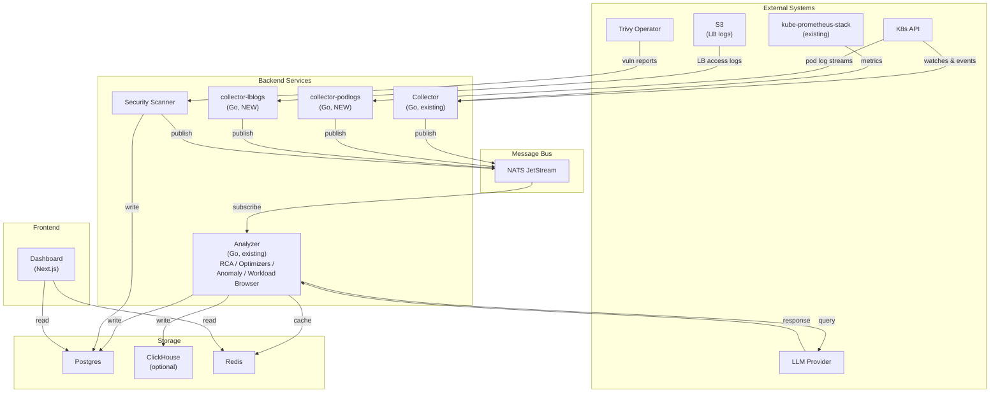
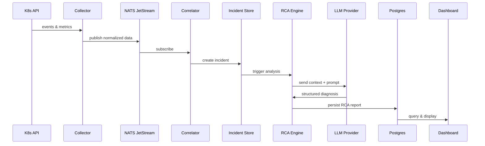
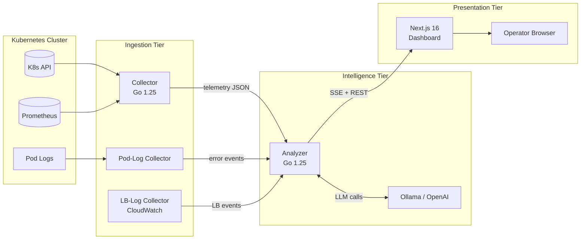
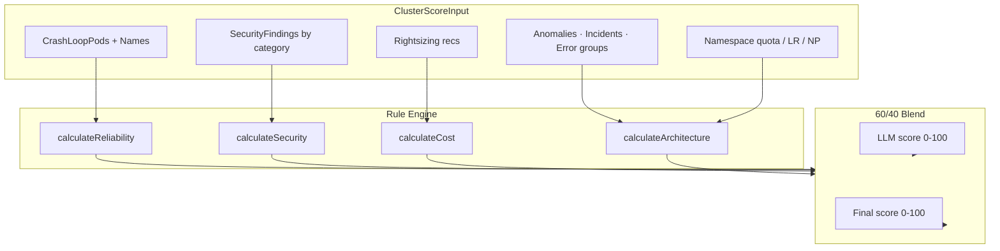
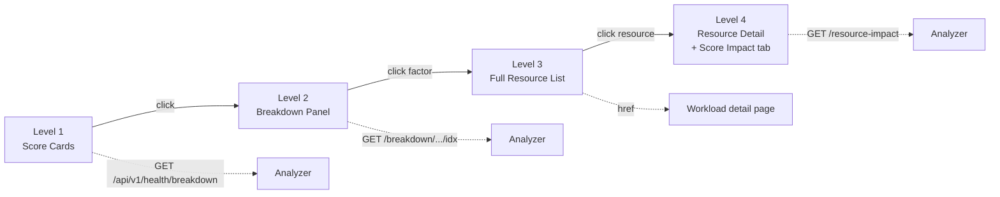

# K8s Cluster Intelligence Engine — Documentation

This file consolidates all documentation from the `docs/` directory. Original files are preserved; this README is the single entry point for browsing the full corpus.

---

## Table of Contents

### 1. Overview & Architecture
- [System Overview (ARCHITECTURE.md)](#system-overview)
- [API Contracts & Data Structures (API_CONTRACTS.md)](#api-contracts--data-structures)
- [Confidence Scores (CONFIDENCE_SCORES.md)](#confidence-scores)
- [Local Context Summary (docs_context.md)](#local-context-summary)

### 2. Running & Operating
- [Local Development Script (script_usage.md)](#local-development-script)
- [Helm Migration (MIGRATION.md)](#helm-migration)
- [Optimization: Config Persistence (OPTIMIZATION_CONFIG_PERSISTENCE.md)](#optimization-config-persistence)
- [Demo Walkthrough (DEMO_WALKTHROUGH.md)](#demo-walkthrough)
- [Presentation Slide Notes (presentation/SLIDE_NOTES.md)](#presentation-slide-notes)
- [Incident Investigation 2026-02-22 (incident-investigation-2026-02-22.md)](#incident-investigation-2026-02-22)

### 3. Feature Deep-Dives
- [Scoring System (SCORING_SYSTEM.md)](#scoring-system)
- [LLM Orchestration (LLM_ORCHESTRATION.md)](#llm-orchestration)
- [Pod Health Management (POD_HEALTH_MANAGEMENT.md)](#pod-health-management)
- [Errors Feature Plan (ERRORS_PLAN.md)](#errors-feature-plan)
- [Errors Feature Audit (ERRORS_AUDIT.md)](#errors-feature-audit)
- [UI Improvements (UI_IMPROVEMENTS.md)](#ui-improvements)

### 4. Development & Planning
- [v7 Plan (PLAN_V7.md)](#v7-plan)
- [Roadmap (ROADMAP.md)](#roadmap)
- [Deep Analysis & Improvement Plan (deep-analysis-improvement-plan.md)](#deep-analysis--improvement-plan)
- [Suggested Improvements (SUGGESTED_IMPROVEMENTS.md)](#suggested-improvements)

### 5. Reference
- [Implementation Verification (IMPLEMENTATION_VERIFICATION.md)](#implementation-verification)
- [Test Observations (TEST_OBSERVATIONS.md)](#test-observations)

---

# 1. Overview & Architecture

---

## System Overview

> Source: `ARCHITECTURE.md`

### Architecture Diagram (v7)



### Component Responsibilities

#### Data Collection Layer

| Component | Responsibility | Data Sources |
|-----------|---------------|--------------|
| Collector (Go, existing) | Watch cluster state changes and scrape metrics | Pods, Deployments, Events, Nodes, Services, PVCs, RBAC, NetworkPolicies via K8s API; CPU, Memory, Network, Disk via kube-prometheus-stack |
| collector-podlogs (Go, NEW) | Stream and forward pod logs | K8s API pod log streams |
| collector-lblogs (Go, NEW) | Ingest load-balancer access logs | S3 buckets |
| Security Scanner | Aggregate vulnerability and misconfiguration reports | Trivy Operator CRDs |

#### Message Bus

| Component | Responsibility | Notes |
|-----------|---------------|-------|
| NATS JetStream | Durable, ordered delivery between collectors and analyzers | Subjects per data type; at-least-once semantics |

#### Analyzer (Go, existing + v7 extensions)

| Sub-component | Responsibility | Output |
|---------------|---------------|--------|
| Correlator | Correlate events, metrics, and logs into incidents | Incident records |
| RCA Engine | Root-cause analysis via LLM | RCA reports |
| Optimizers | Resource, cost, and reliability optimization suggestions | Scored recommendations |
| Anomaly Detector | Detect anomalous patterns in time-series and logs | Anomaly alerts |
| Workload Browser | Queryable inventory of workloads and their status | Workload index |

#### Security Scanner

| Component | Responsibility | Output |
|-----------|---------------|--------|
| Vuln Aggregator | Collect Trivy Operator VulnerabilityReports | Vulnerability summaries |
| Policy Checker | Evaluate workloads against security baselines | Policy violations |

#### Frontend

| Component | Responsibility | Output |
|-----------|---------------|--------|
| Dashboard (Next.js) | Visualize health, incidents, RCA reports, recommendations | Interactive UI |

### Data Flow — End-to-end RCA Path



### Resource Footprint

#### Small Cluster (<100 nodes)

| Component | CPU | Memory | Storage |
|-----------|-----|--------|---------|
| Collector | 100m | 256Mi | - |
| collector-podlogs | 100m | 128Mi | - |
| collector-lblogs | 50m | 128Mi | - |
| Analyzer | 500m | 1Gi | - |
| Security Scanner | 100m | 256Mi | - |
| Dashboard | 50m | 128Mi | - |
| NATS JetStream | 100m | 256Mi | 2Gi |
| Redis | 100m | 256Mi | 1Gi |
| PostgreSQL | 200m | 512Mi | 10Gi |
| **Total** | **~1.3 cores** | **~2.9Gi** | **~13Gi** |

#### Medium Cluster (100–1000 nodes)

| Component | CPU | Memory | Storage |
|-----------|-----|--------|---------|
| Collector | 500m | 1Gi | - |
| collector-podlogs | 250m | 512Mi | - |
| collector-lblogs | 100m | 256Mi | - |
| Analyzer | 2000m | 4Gi | - |
| Security Scanner | 250m | 512Mi | - |
| Dashboard | 100m | 256Mi | - |
| NATS JetStream | 500m | 1Gi | 10Gi |
| Redis | 500m | 1Gi | 5Gi |
| PostgreSQL | 1000m | 2Gi | 50Gi |
| ClickHouse (optional) | 1000m | 2Gi | 100Gi |
| **Total** | **~6.2 cores** | **~12.5Gi** | **~165Gi** |

#### Large Scale (1000–10000+ nodes)

- Deploy collector as DaemonSet with node-level aggregation
- Shard analyzer across multiple pods
- Use ClickHouse for high-volume log and metric retention
- Implement hierarchical aggregation
- Consider multi-cluster federation

### Security Model

#### RBAC Requirements

```yaml
# cluster-intel-reader (existing) - read-only access for collection
apiVersion: rbac.authorization.k8s.io/v1
kind: ClusterRole
metadata:
  name: cluster-intel-reader
rules:
  - apiGroups: [""]
    resources: ["pods", "pods/log", "services", "endpoints", "nodes", "events",
                "namespaces", "configmaps", "secrets", "persistentvolumeclaims"]
    verbs: ["get", "list", "watch"]
  - apiGroups: ["metrics.k8s.io"]
    resources: ["pods", "nodes"]
    verbs: ["get", "list"]
  - apiGroups: ["apps"]
    resources: ["deployments", "replicasets", "statefulsets", "daemonsets"]
    verbs: ["get", "list", "watch"]
  - apiGroups: ["autoscaling"]
    resources: ["horizontalpodautoscalers"]
    verbs: ["get", "list", "watch"]
  - apiGroups: ["networking.k8s.io"]
    resources: ["networkpolicies", "ingresses"]
    verbs: ["get", "list", "watch"]
  - apiGroups: ["rbac.authorization.k8s.io"]
    resources: ["roles", "rolebindings", "clusterroles", "clusterrolebindings"]
    verbs: ["get", "list", "watch"]
  - apiGroups: ["policy"]
    resources: ["poddisruptionbudgets", "podsecuritypolicies"]
    verbs: ["get", "list", "watch"]
  - apiGroups: ["aquasecurity.github.io"]
    resources: ["vulnerabilityreports", "configauditreports"]
    verbs: ["get", "list", "watch"]
```

```yaml
# cluster-intel-writer (new, opt-in) - write access for remediation actions
apiVersion: rbac.authorization.k8s.io/v1
kind: ClusterRole
metadata:
  name: cluster-intel-writer
rules:
  - apiGroups: ["apps"]
    resources: ["deployments", "statefulsets"]
    verbs: ["patch", "update"]
  - apiGroups: ["autoscaling"]
    resources: ["horizontalpodautoscalers"]
    verbs: ["create", "patch", "update"]
  - apiGroups: [""]
    resources: ["events"]
    verbs: ["create"]
```

#### Performance Considerations

| Operation | Default Rate | Configurable |
|-----------|-------------|--------------|
| K8s API calls | 50 QPS | Yes |
| LLM requests | 10 RPM | Yes |
| Metric scrapes | 15s interval | Yes |
| Event processing | 1000/s | Yes |

Caching: L1 (In-memory, 5m TTL) → L2 (Redis, 1h TTL) → L3 (DB, queryable history).

#### Air-Gap Deployment

```yaml
llm:
  backend: "ollama"
  endpoint: "http://ollama.ai-system.svc:11434"
  model: "llama3:70b"
telemetry:
  externalExport: false
updates:
  mode: "offline"
  packagePath: "/mnt/updates"
```

All external endpoints are configurable via `pkg/config` — see [v7 Plan](#v7-plan) section 4.5 for the complete specification.

---

## API Contracts & Data Structures

> Source: `API_CONTRACTS.md`

### Core Data Models

#### ClusterHealthReport

```json
{
  "clusterId": "prod-us-east-1",
  "timestamp": "2026-02-14T10:30:00Z",
  "scores": {
    "overall": 82,
    "reliability": 91,
    "security": 72,
    "cost": 65,
    "architecture": 88
  },
  "summary": {
    "totalNodes": 47,
    "totalPods": 1284,
    "totalNamespaces": 23,
    "healthyPods": 1256,
    "unhealthyPods": 28,
    "pendingPods": 12,
    "evictedPods": 3
  },
  "resourceUtilization": {
    "cpu": {"requested": 45.2, "used": 32.1, "capacity": 94.0, "unit": "cores"},
    "memory": {"requested": 186.5, "used": 142.3, "capacity": 376.0, "unit": "Gi"},
    "storage": {"requested": 2.4, "used": 1.8, "capacity": 10.0, "unit": "Ti"}
  },
  "topIssues": [
    {
      "id": "issue-001",
      "severity": "critical",
      "category": "reliability",
      "title": "CrashLoopBackOff in production",
      "affectedResources": ["prod/api-gateway-7d8f9c6b5-x2k9m"],
      "confidence": 0.94
    }
  ],
  "estimatedMonthlySavings": 4250.00,
  "currency": "USD"
}
```

#### TelemetryEvent

```json
{
  "id": "evt-2026021410300001",
  "timestamp": "2026-02-14T10:30:00.123Z",
  "cluster": "prod-us-east-1",
  "source": "kubernetes",
  "type": "Warning",
  "reason": "BackOff",
  "involvedObject": {
    "kind": "Pod",
    "namespace": "prod",
    "name": "api-gateway-7d8f9c6b5-x2k9m",
    "uid": "abc123-def456-ghi789"
  },
  "message": "Back-off restarting failed container",
  "count": 15,
  "firstTimestamp": "2026-02-14T10:15:00Z",
  "lastTimestamp": "2026-02-14T10:30:00Z"
}
```

#### ResourceMetrics

```json
{
  "timestamp": "2026-02-14T10:30:00Z",
  "cluster": "prod-us-east-1",
  "resourceType": "pod",
  "resource": {"namespace": "prod", "name": "api-gateway-7d8f9c6b5-x2k9m"},
  "metrics": {
    "cpu": {"usage": 0.245, "request": 0.5, "limit": 1.0, "throttled_seconds": 12.5},
    "memory": {"usage_bytes": 268435456, "request_bytes": 536870912, "limit_bytes": 1073741824, "oom_killed": false},
    "network": {"rx_bytes": 1048576, "tx_bytes": 524288, "rx_errors": 0, "tx_errors": 0},
    "restarts": 15
  },
  "trends": {"cpu_7d_avg": 0.22, "cpu_7d_p95": 0.41, "memory_7d_avg": 251658240, "memory_7d_p95": 285212672}
}
```

#### Recommendation

```json
{
  "id": "rec-2026021410300001",
  "category": "cost",
  "subcategory": "right-sizing",
  "severity": "medium",
  "confidence": 0.87,
  "title": "Reduce CPU request for api-gateway",
  "affectedResources": [{"kind": "Deployment", "namespace": "prod", "name": "api-gateway"}],
  "impact": {
    "costSavings": {"monthly": 125.50, "currency": "USD"},
    "resourceSavings": {"cpu": 0.25, "unit": "cores"},
    "riskLevel": "low",
    "blastRadius": "single-service"
  },
  "status": "pending",
  "aiReasoning": "Based on 7-day metrics analysis...",
  "tags": ["quick-win", "automated", "low-risk"]
}
```

#### SecurityFinding

```json
{
  "id": "sec-2026021410300001",
  "category": "container-security",
  "subcategory": "image-vulnerability",
  "severity": "high",
  "cveId": "CVE-2026-1234",
  "title": "Critical vulnerability in base image",
  "affectedResources": [{"kind": "Pod", "namespace": "prod", "name": "web-frontend-abc123", "image": "nginx:1.21"}],
  "cisControl": "5.1.1",
  "compliance": ["PCI-DSS", "SOC2"],
  "remediation": {"type": "image-update", "targetImage": "nginx:1.25.4", "automated": false},
  "status": "open"
}
```

#### AnalysisRequest / AnalysisResponse (LLM Pipeline)

The `AnalysisRequest` carries `requestId`, `analysisType`, time window, focus resource, related events, metrics, logs, and topology. The `AnalysisResponse` returns structured `rootCause` (primary, confidence, description), `contributingFactors`, `blastRadius`, `recommendations`, `preventiveMeasures`, and `metadata` (model, tokens, latency). Full JSON schemas in `API_CONTRACTS.md`.

### REST API Endpoints

```
# Health & Scores
GET /api/v1/clusters/{clusterId}/health
GET /api/v1/clusters/{clusterId}/scores
GET /api/v1/clusters/{clusterId}/scores/history?from=&to=

# Namespaces
GET /api/v1/clusters/{clusterId}/namespaces
GET /api/v1/clusters/{clusterId}/namespaces/{namespace}/health
GET /api/v1/clusters/{clusterId}/namespaces/{namespace}/pods
GET /api/v1/clusters/{clusterId}/namespaces/{namespace}/recommendations

# Recommendations
GET  /api/v1/clusters/{clusterId}/recommendations
GET  /api/v1/clusters/{clusterId}/recommendations/{id}
POST /api/v1/clusters/{clusterId}/recommendations/{id}/apply
POST /api/v1/clusters/{clusterId}/recommendations/{id}/dismiss
GET  /api/v1/clusters/{clusterId}/recommendations/summary

# Security
GET /api/v1/clusters/{clusterId}/security/findings
GET /api/v1/clusters/{clusterId}/security/compliance
GET /api/v1/clusters/{clusterId}/security/rbac-analysis

# Cost
GET  /api/v1/clusters/{clusterId}/cost/summary
GET  /api/v1/clusters/{clusterId}/cost/breakdown
GET  /api/v1/clusters/{clusterId}/cost/forecast
POST /api/v1/clusters/{clusterId}/cost/what-if

# Analysis
POST /api/v1/clusters/{clusterId}/analysis/trigger
GET  /api/v1/clusters/{clusterId}/analysis/{analysisId}
GET  /api/v1/clusters/{clusterId}/analysis/history

# Events & Timeline
GET /api/v1/clusters/{clusterId}/events
GET /api/v1/clusters/{clusterId}/timeline
GET /api/v1/clusters/{clusterId}/incidents
```

### WebSocket Subscriptions

```
WS /api/v1/ws/clusters/{clusterId}/stream

// Subscribe
{"action": "subscribe", "channels": ["health", "events", "recommendations", "alerts"]}

// Message format
{"channel": "events", "type": "event.new", "timestamp": "...", "data": { /* TelemetryEvent */ }}
```

### GraphQL Schema (Excerpt)

```graphql
type Query {
  cluster(id: ID!): Cluster
  clusters: [Cluster!]!
  recommendations(clusterId: ID!, category: RecommendationCategory, severity: Severity, limit: Int, offset: Int): RecommendationConnection!
  securityFindings(clusterId: ID!, severity: Severity, status: FindingStatus): [SecurityFinding!]!
}

type ClusterHealth {
  overall: Int!
  reliability: Int!
  security: Int!
  cost: Int!
  architecture: Int!
  lastUpdated: DateTime!
}

enum RecommendationCategory { RELIABILITY COST SECURITY ARCHITECTURE }
enum Severity { CRITICAL HIGH MEDIUM LOW INFO }

type Mutation {
  applyRecommendation(id: ID!): ApplyResult!
  dismissRecommendation(id: ID!, reason: String): Recommendation!
  triggerAnalysis(clusterId: ID!, type: AnalysisType!): Analysis!
}

type Subscription {
  clusterHealth(clusterId: ID!): ClusterHealth!
  newEvents(clusterId: ID!, types: [String!]): TelemetryEvent!
  recommendations(clusterId: ID!): Recommendation!
}
```

---

## Confidence Scores

> Source: `CONFIDENCE_SCORES.md`

### Where Confidence Appears

| Where the user sees it | Wire field | Source code | Actual derivation today |
|---|---|---|---|
| "Top Issues" list | `Issue.Confidence` | `src/analyzer/main.go:1420` | **LLM self-reported.** Default **0.5** when absent. |
| "Recommendations" list | `Recommendation.Confidence` | `src/analyzer/main.go:1438` | **Hardcoded constant `0.8`.** Not a measurement. |
| Optimization page (per rec) | `OptRecommendation.Confidence` | `src/analyzer/optimizer_*.go` | **Per-optimizer hardcoded heuristic** (see table below). |
| Incident → RCA report | `RCAReport.Confidence` and `RootCause.Confidence` | `src/analyzer/rca.go:29,43` | **LLM self-reported.** Default **0** if absent. |

### Optimizer Hardcoded Values (not data-driven)

| Rule | File | Line | Value |
|---|---|---|---|
| Rightsizing | `optimizer_rightsizing.go` | 146 | `0.8` |
| HPA (stuck at max) | `optimizer_hpa.go` | 53 | `0.75` |
| HPA (other) | `optimizer_hpa.go` | 109 | `0.6` |
| CoreDNS (high query rate) | `optimizer_coredns.go` | 31 | `0.7` |
| CoreDNS (other) | `optimizer_coredns.go` | 60 | `0.6` |
| GC (Go, >50ms pause) | `optimizer_gc.go` | 41 | `0.6` |
| GC (JVM, >100ms pause) | `optimizer_gc.go` | 76 | `0.7` |

None of these values are recomputed from cluster state.

### What Confidence Does NOT Measure Today

- Historical accuracy — no feedback loop tracking past recs
- LLM calibration — model self-reported 0.9 ≠ "correct 90% of the time"
- Data quality — thin evidence carries the same format as corroborated evidence
- Inter-model agreement — single LLM call, no ensemble
- Distance from a policy threshold — 25% CPU underuse reports same 0.8 as 5% CPU

### Relationship to Rule-Based Health Scores

The dimension scores (`reliability`, `security`, `cost`, `architecture`, `overall`) are a **separate system** and do not use any `confidence` field:

```
score = 100 - Σ deductions
where each deduction = min(count × perItemImpact, ruleMaxImpact)
```

The 60/40 LLM blend (`BlendWithLLM`) can shift a score by ±20 points but does not introduce a confidence concept.

### Path to a Calibrated Version (not yet built)

1. Persist outcomes (accepted/dismissed/applied, whether metric improved within 7d)
2. Compute rolling precision per (rule, severity) bucket
3. Calibrate LLM confidence against post-hoc verified correctness
4. Penalise thin evidence multiplicatively
5. Surface the derivation in a tooltip

Until built: **confidence values in this project are display-only metadata, not a statistical claim.**

### How to Inspect in a Running Session

```bash
# Recommendation confidence (hardcoded):
curl -s http://localhost:18081/api/v1/recommendations | jq '.recommendations[] | {type, rule: .rationale, confidence}'

# Issue LLM-self-reported confidence:
curl -s http://localhost:18081/api/v1/health | jq '.topIssues[] | {title, confidence}'

# RCA report confidence:
curl -s http://localhost:18081/api/v1/incidents/1/rca | jq '.confidence, .rootCause.confidence'
```

---

## Local Context Summary

> Source: `docs_context.md`

This is the meta-summary of all major doc categories for the K8s Cluster Intelligence project.

1. **Architecture**: Multiple layers — Data Collection (K8s API, Prometheus, OTel, Audit Logs), Processing Pipeline (normalization, aggregation), LLM Analysis, and Recommendation Engine. Redis for caching, TimescaleDB for metrics, PostgreSQL for storage.

2. **API Contracts**: Core JSON structures — `ClusterHealthReport`, `TelemetryEvent`, `ResourceMetrics`, `Recommendation`. REST API with WebSocket and GraphQL for real-time events.

3. **Scoring System**: Health Score across four dimensions: Reliability (35%), Security (30%), Cost (20%), Architecture (15%). Recommendations prioritised by impact vs effort with risk multipliers.

4. **Pod Health Management**: Detects and categorizes non-running pods (Evicted, CrashLoopBackOff). Action Matrix for safe auto-remediations. Protected namespaces, dry-run mode.

5. **LLM Orchestration**: Multiple backends (OpenAI, Anthropic, Ollama, Azure, vLLM). Token Budget Allocation. JSON extraction and Pydantic validation.

6. **Implementation and Test Status**: v6.0 standalone Python app (`src/simple/app.py`) with full API/UI coverage. Go microservices with SSE, analyzer pipeline, scoring engine. Some remaining `datetime.utcnow()` deprecations in `manifests/simple/deployment.yaml`.

7. **UI Improvements**: 47 resolved issues — Accessibility (ARIA labels, focus states), UX/UI Design, Responsiveness, Code Quality. WCAG AA compliance.

8. **Incident Report (2026-02-22)**: 17TB+ bandwidth in 7 days due to Tailscale DERP fallback relays multiplying Calico VXLAN traffic. Triggered repeated Calico network resynchronization from node flapping.

9. **Roadmap**: v6.0 — Resource Right-sizing, Prometheus Metrics, LLM Foundation, Advanced Alerting. v7.0 — Multi-cluster federation, GitOps, OPA integration. v8.0 — Falco, secrets management, SBOM.

---

# 2. Running & Operating

---

## Local Development Script

> Source: `script_usage.md`

### TL;DR

```bash
scripts/run-local.sh start --yes        # accept env-file defaults silently
scripts/run-local.sh start --yes -e uat # run against UAT env file
scripts/run-local.sh stop
scripts/run-local.sh status
scripts/run-local.sh logs analyzer
scripts/run-local.sh doctor             # pre-flight without starting
scripts/run-local.sh setup -e dev       # wizard to write a fresh env/dev.env
```

`make` shortcuts:

```bash
make doctor
make run    ENV=dev
make stop
make status
```

### Sub-commands

| Command | What it does |
|---|---|
| `start` | Load env file → prompt for config → validate → start analyzer + dashboard → `wait_for_http`. In `DASHBOARD_MODE=prod` runs `npm run build` first. |
| `stop` | Kill via pidfile + tear down entire process group (`setsid` leader + `pgrep -P` tree walk). SIGTERM, then SIGKILL after 1s. |
| `status` | Tabular: `SERVICE / PIDFILE / PID / HTTP / URL` |
| `restart` | `stop` then `start` |
| `logs [name]` | `tail -F` analyzer, dashboard, collector, or all |
| `build` | Rebuild binaries if sources are newer |
| `setup` | Interactive wizard → write `env/<env>.env` |
| `doctor` | Pre-flight: tools, env-file, kubeconfig, port availability, binary freshness. Never mutates state. |
| `lint` | Validate env file syntax + values |
| `version` | Print `cluster-intel: git <sha> · chart <ver>` |

### Global Flags

| Flag | Description |
|---|---|
| `-e ENV` | Pick `env/<ENV>.env`. Defaults to `$ENVIRONMENT` or `dev`. |
| `-y`, `--yes` | Accept all env-file defaults silently. |
| `--non-interactive` | Hard-fail if any required value is missing. Use in CI. |
| `--env-file PATH` | Override the env-file path entirely. |
| `--log-dir PATH` | Override `/tmp/cluster-intel-logs`. |

### Env Files

| File | Tracked | Contents |
|---|---|---|
| `env/dev.env` | yes | Local-laptop / LAN-demo defaults |
| `env/uat.env` | yes | Staging-like (live profile, real LLM provider) |
| `env/prod.env.example` | yes | Template — copy to `env/prod.env` (gitignored) |

**Precedence:** `CLI / parent env > env-file value > built-in default`

The script snapshots variables before sourcing the env file and restores them after, so CLI-set values always win.

### Configurable Variables

**Runtime:** `ENVIRONMENT` (dev/uat/prod), `PROFILE` (live/mock), `BIND_ADDRESS`, `NEXT_HOSTNAME`, `DASHBOARD_MODE` (dev/prod)

**Ports:** `ANALYZER_PORT` (18081), `METRICS_PORT` (19091), `DASHBOARD_PORT` (3003), `COLLECTOR_PORT` (18080), `COLLECTOR_METRICS_PORT` (19090)

**Collector:** `COLLECTOR_URL` — always prompted; scheme auto-prepended if missing

**LLM:**

| Variable | Default | Validator |
|---|---|---|
| `LLM_PROVIDER` | `ollama` | `ollama\|openai\|anthropic\|vllm\|llamacpp\|azure\|bedrock\|none` |
| `LLM_ENDPOINT` | `http://localhost:11434` | URL syntax → reachability (warn-only) |
| `LLM_MODEL` | `llama3` | discovered from endpoint when interactive |
| `LLM_API_KEY` | empty | masked; not required for ollama/llamacpp/none |

**Smart-router model discovery:** queries `GET <endpoint>/api/tags` (ollama) or `/v1/models` (openai-compatible) and presents a numbered picker. Falls back to free-text input on failure.

**Intervals:** `ANALYSIS_INTERVAL` (30s), `EVICT_INTERVAL` (30s), `MOCK_INTERVAL` (20s). Bare integers assumed seconds.

**Kubernetes (live profile only):** `KUBECONFIG` — validated via `kubectl cluster-info`.

### Validation Policy

| Severity | What it catches |
|---|---|
| **Hard-fail** | Port already bound, missing kubeconfig in live mode, bad enum/integer, port out of range |
| **Soft-warn** | URL not reachable, empty `COLLECTOR_URL` in live mode |

### Common Recipes

```bash
# First-time setup
scripts/run-local.sh doctor
scripts/run-local.sh setup -e dev
scripts/run-local.sh start

# Daily dev loop
make run ENV=dev
make status
make stop

# CI invocation
scripts/run-local.sh start --yes --non-interactive -e prod

# Investigate failed startup
scripts/run-local.sh status
scripts/run-local.sh logs analyzer
```

### Exit Codes

| Code | Meaning |
|---|---|
| 0 | Success |
| 1 | Validation failure, port collision, unknown command, user aborted |

### Logs and Pidfiles

Default location: `/tmp/cluster-intel-logs/`

```
/tmp/cluster-intel-logs/
├── analyzer.{log,pid}
├── dashboard.{log,pid}
└── collector.{log,pid}
```

`stop` removes pidfiles. `status` reports `(stale)` for non-running PIDs.

### How `stop` Finds and Kills Child Processes

1. **Process group:** dashboard launched via `setsid`; `kill -TERM -- -<pgid>` signals the entire group.
2. **Tree walk:** `kill_tree` recurses through `pgrep -P <pid>` and signals every descendant.
3. **Escalation:** SIGKILL after 1 second if anything survives SIGTERM.

### What It Does NOT Do

- Persist edits back into the env file (use `setup`)
- Start a remote collector
- Generate systemd units
- Cross-host orchestration
- TLS bootstrap

For production, see `deploy/helm/cluster-intel/` and `docs/MIGRATION.md`.

### Sub-command Verification Matrix

Last verified end-to-end at commit `54649fb2`:

| Command | What was checked | Result |
|---|---|---|
| `start --yes -e dev` | both services reach `200` from `127.0.0.1` and `192.168.1.10` | ✓ |
| `stop` | all ports released (verified via `ss -tlnp`) | ✓ |
| `doctor` | flags port collisions when services running | ✓ |
| `PROFILE=mock ./run-local.sh start --yes` | CLI overrides env-file | ✓ |
| `LLM_ENDPOINT=192.168.1.10:11434 ./run-local.sh start --yes` | scheme auto-prepended | ✓ |
| `ANALYSIS_INTERVAL=30 ./run-local.sh start --yes` | bare int normalised to `30s` | ✓ |
| `discover_models ollama …` (interactive) | enumerates 9 real Ollama models | ✓ |

---

## Helm Migration

> Source: `MIGRATION.md`

As of chart `0.2.0` (appVersion `7.0.0`), **all deployments go through Helm**. The legacy kustomize manifests at `manifests/` and `deploy.sh` wrapper have been removed.

### What Changed

| Before | After |
|---|---|
| `./deploy.sh` | `make helm-deploy` or `helm upgrade --install …` |
| `kubectl apply -k manifests/base/` | `helm upgrade --install cluster-intel deploy/helm/cluster-intel/` |
| `kubectl apply -k manifests/overlays/production/` | `helm upgrade --install … -f values-deploy.yaml` |
| NetworkPolicy always applied | Now `--set networkPolicy.enabled=true` (opt-in) |
| PDB, securityContext, anti-affinity were kustomize-only | Now in every deployment template, gated by toggles |

### Day-1 Install

```bash
make helm-deps    # builds sub-chart tarballs (once)
make helm-deploy  # = helm upgrade --install …

# Or manually:
helm dependency build deploy/helm/cluster-intel/
helm upgrade --install cluster-intel deploy/helm/cluster-intel/ \
  --namespace cluster-intel --create-namespace \
  -f values-deploy.yaml
```

### Enabling Optional Features

```bash
# NetworkPolicy (zero-trust)
--set networkPolicy.enabled=true \
--set networkPolicy.llmEgressCIDR=10.0.0.50/32 \
--set networkPolicy.llmEgressPort=11434

# PodDisruptionBudgets (only when replicas >= 2)
--set collector.pdb.enabled=true --set collector.pdb.minAvailable=1 \
--set analyzer.pdb.enabled=true  --set analyzer.pdb.minAvailable=1 \
--set dashboard.pdb.enabled=true --set dashboard.pdb.minAvailable=1

# Observability stack
--set monitoring.enabled=true \
--set monitoring.ollama.externalIP=10.0.0.50

# Slack routing
kubectl create secret generic alertmanager-slack -n monitoring \
  --from-literal=slack-webhook-url=https://hooks.slack.com/services/XXX/YYY/ZZZ
--set monitoring.alertmanager.enabled=true \
--set monitoring.alertmanager.slackWebhookSecret.name=alertmanager-slack
```

### Rolling Upgrade from 0.1.x

Running `helm upgrade` from `0.1.x` to `0.2.0` will:
1. Leave existing deployments unchanged (no new resources by default).
2. Add a container-level `securityContext` block — may trigger a rolling restart.
3. NOT create NetworkPolicies, PDBs, or monitoring resources unless explicitly enabled.

If you were previously applying `manifests/base/network-policies.yaml` via kustomize, set `networkPolicy.enabled=true` on the first upgrade.

### Uninstalling

```bash
helm uninstall cluster-intel -n cluster-intel
# PVCs are retained by default. To also delete persistent data:
kubectl delete pvc -n cluster-intel -l app.kubernetes.io/instance=cluster-intel
kubectl delete namespace cluster-intel
```

### What's Gone

- `deploy.sh` — replaced by `make helm-deploy`
- `manifests/` (entire directory)
- `scripts/pre-deploy-check.sh` and `scripts/bump-version.sh`

---

## Optimization: Config Persistence

> Source: `OPTIMIZATION_CONFIG_PERSISTENCE.md`

Reviews the implementation of UI-driven configuration + persistence.

### What Is Implemented

**Layered config resolution:** Base (`CI_CONFIG`) → Override (`CI_CONFIG_OVERRIDE`) → Env (`CI_*`). `LoadLayeredRelaxed` returns diagnostics instead of failing startup. Diagnostics surfaced via `GET /api/v1/status`.

**Persistence backends:** `ConfigStore` abstraction — in-cluster via `cluster-intel-runtime` ConfigMap, or local filesystem runtime override YAML.

**Config APIs:** `GET/PUT /api/v1/config` — read effective config + diagnostics, write runtime override YAML layer. Collector URL and LLM (non-secret) fields persist to runtime overrides from the UI.

**UI behavior:** Renders a diagnostic panel when live dependencies are down. 10-minute reminder while Live mode is blocked.

**Helm / RBAC:** Runtime override ConfigMap mounted and `CI_CONFIG_OVERRIDE` set. Namespaced RBAC for ConfigMap mutations (`get/update/patch` only — not `create`).

### Correctness Notes / Gaps

1. **Read-only mount is correct.** Analyzer persists overrides via the K8s API (ConfigMap updates), not by writing the mounted file. Document this explicitly in UI text.

2. **RBAC: avoid `create` on ConfigMaps.** Updated to only allow `get/update/patch` for `cluster-intel-runtime`.

3. **Partial "apply without restart" semantics.** `PUT /api/v1/config` persists override YAML but only a subset is applied immediately in-memory. Recommended: surface `appliedNow: [keys...]` and `requiresRestart: [keys...]` in the API response.

4. **Legacy env vars still in use.** Analyzer still reads `PROMETHEUS_URL`, etc. alongside `ucfg.Analyzer.*`. Consolidate to always prefer unified config; keep legacy as compatibility-only.

5. **YAML override is "power user" UX.** Add basic forms for top 5 operator knobs (Collector URL, CORS origins, analysis intervals, Prometheus URL, LLM settings). Keep YAML editor as "Advanced".

6. **Toasts are easy to miss.** Add a sticky banner (dismissible per-session) when live is blocked, with a CTA to "Open Settings".

### Documentation Drift

- `README.md` references Python/SQLite/old endpoints — needs a "Current architecture & config" section.
- `docs/script_usage.md` describes a fully interactive wizard that the current script doesn't implement — either implement or correct.

### Security Hardening Opportunities

- Add authn/authz before allowing config edits
- Server-side validation for override YAML (forbid secrets, validate URLs and durations)
- Rate-limit config mutation endpoints
- Audit log for config changes (who/what/when/source IP)

### Suggested Next Optimizations (High ROI)

1. **Typed config forms** for key settings + keep YAML "Advanced"
2. **Config reload semantics** — apply more changes without restart, or clearly communicate restart required
3. **Validation + redaction** pipeline for overrides
4. **Sticky banner** for misconfiguration
5. **Docs alignment** with new config layers and runtime override model

---

## Demo Walkthrough

> Source: `DEMO_WALKTHROUGH.md`

### 1. System at a Glance



Components:

| Directory | Purpose |
|---|---|
| `src/collector` | Scrapes K8s API + Prometheus, emits ring-buffered telemetry |
| `src/collector-podlogs` | Tails container logs, parses errors, publishes via NATS |
| `src/collector-lblogs` | Pulls AWS load-balancer logs via CloudWatch |
| `src/analyzer` | Scoring, correlation, RCA, drill-down APIs, eviction |
| `src/dashboard` | Next.js 16 app; SSE for live, REST for everything else |
| `pkg/*` | Shared types, middleware, LLM client, store, bus, K8s client |

### 2. Scoring Engine



```go
type ScoreResult struct {
    Score      int
    Base       int
    Deductions []ScoreDeduction
    Bonuses    []ScoreDeduction
}

type ScoreDeduction struct {
    Rule         string
    Impact       int
    Max          int
    Count        int
    Resources    []string // truncated to 10 for wire
    AllResources []string // full list, json:"-"
}
```

Blending: rule × 0.6 + LLM × 0.4, clamped 0–100. If LLM output is nil or negative, returns rule score unchanged.

### 3. Four-Level Drill-Down



**Index-alignment regression test:** `src/analyzer/handlers_drilldown_test.go:TestHandleHealthBreakdown_IndexAlignment` walks every factor and asserts `rule` field matches across levels. This is the critical regression guard preventing wrong data at Level 3.

### 4. TTL + Max-Size Eviction

Five handler maps, one sweep every 5 minutes. **Ordering is load-bearing** — RCA must run after Correlator (so orphan detection works correctly). Test: `TestRunEvictionSweep_CorrelatorBeforeRCA`.

| Var | Default |
|---|---|
| `EVICT_INTERVAL` | `5m` |
| `EVICT_INCIDENT_RESOLVED_TTL` / `_ACTIVE_TTL` / `_MAX` | `24h` / `48h` / `500` |
| `EVICT_ERROR_GROUP_TTL` / `_MAX` | `168h` / `200` |
| `EVICT_ANOMALY_STATS_TTL` / `_MAX` | `2h` / `1000` |
| `EVICT_RCA_REPORT_TTL` / `_MAX` | `48h` / `500` |
| `EVICT_OPT_REC_TTL` / `_MAX` | `168h` / `300` |

### 5. Signal → Incident → RCA

Incidents are created by the Correlator clustering topology-matching signals within a time window. The RCA engine (LLM-backed) summarises and proposes remediation. Rate-limited to 1 concurrent LLM call; capacity 100; timeout 3min.

### 6. Teleprompter Log Viewer (the math)

Newest line anchored at viewport midpoint. Without a spacer div, `scrollTop = scrollHeight - clientHeight × 0.5` exceeds max scrollable position and clamps to bottom (making it look identical to regular autoscroll). A `ResizeObserver` keeps the spacer at 50% of visible container. A `programmaticScroll` ref prevents false pause-on-scroll detection.

```
+--------------------------+
|   …older log lines…      |
|===== pod/log line N =====|  <- bottomRef anchor
|                          |  <- spacer div (height = container.clientHeight × 0.5)
+--------------------------+
```

Code: `src/dashboard/app/workloads/[kind]/[namespace]/[name]/page.tsx:460-513`.

### 7. Test Pyramid

| Layer | Count | Where |
|---|---|---|
| Go unit / httptest | **112** | `src/analyzer/*_test.go`, `src/collector/*_test.go`, `pkg/*/*_test.go` |
| Playwright E2E (chromium + mobile) | **34** | `src/dashboard/tests/*.spec.ts` |
| Total automated | **146** | — |

Coverage highlights: rule-based scoring, eviction ordering, drill-down index-alignment, log scroll spacer DOM invariants, irregular plurals (`/workloads/ingresses/...` sends `kind=Ingress`).

### 8. Running the Demo

```bash
scripts/run-local.sh start
# → dashboard: http://localhost:3003/
# → analyzer:  http://localhost:18081/
# → logs:      tail -f /tmp/cluster-intel-logs/{analyzer,dashboard}.log
```

Demo path:
1. Open `http://localhost:3003/` → Overall Health card
2. Click a score card → breakdown panel expands
3. Click any factor → Level-3 inline panel with full resource list and namespace filter
4. Click a resource → workload detail page → **Score Impact tab** (Level 4)
5. Navigate to **Incidents** → open one → RCA report with confidence
6. Switch **Profile → Demo** (header badge) for synthetic consistent data
7. Logs tab → scrolling keeps newest line at midpoint; scroll up to pause

### 9. Roadmap (Next Session Hooks)

- CI workflow (`.github/workflows/ci.yml` — none today)
- Persistence (SQLite or Postgres; maps currently in-memory)
- Historical trend views for dimension scores
- Confidence calibration (see `CONFIDENCE_SCORES.md`)
- Delete legacy `src/e2e/*.js` Puppeteer tests
- Test coverage for `pkg/bus`, `pkg/kube`, `pkg/llm`, `pkg/store`

---

## Presentation Slide Notes

> Source: `presentation/SLIDE_NOTES.md`

Speaker script for the engineering demo (`docs/presentation/index.html`). Navigation: Right arrow / Space (next), ESC (overview/jump), P (presenter console).

| Slide | Anchor | Message | Timing |
|---|---|---|---|
| Title | `#title` | "Signal to Insight" — deterministic scoring + explainable drill-down + optional LLM-backed RCA | 15–25s |
| Agenda | `#agenda` | Problem → architecture → differentiators → ops → demo | 20–30s |
| Problem | `#problem` | Raw counts don't tell you what matters. Deterministic rules first, explainable drill-down, LLM as assist | 45–60s |
| Architecture | `#architecture` | Sources → collector → analyzer → dashboard. Collector buffers + rate-limits; analyzer runs scored pipeline; dashboard reads via REST + SSE | 60–75s |
| Collector | `#collector` | K8s informers → ring buffer → rate-limits → scrape cadence → normalized telemetry stream | 45–60s |
| Analyzer pipeline | `#analyzer-pipeline` | Every interval: collect → score → blend → correlate → RCA → publish | 60–90s |
| Scores | `#scores` | Score starts at 100; rules apply deductions with caps. Every dimension score is auditable | 45–60s |
| Rules | `#rules` | `ClusterScoreInput` typed struct; `ScoreDeduction` fields; blend formula | 60–90s |
| Drill-down | `#drill` | L1: score cards → L2: factors → L3: full resource list + namespace filter → L4: per-resource rule impact | 60–90s |
| Eviction | `#eviction` | Bounded caps + TTL eviction; ordering is load-bearing; tested | 45–75s |
| Log viewer | `#teleprompter` | Newest line anchored at midpoint via spacer + ResizeObserver + guard ref | 45–60s |
| Scanners | `#scanners` | Pods: 2m, Security: 5m, Anomaly: 3m, Optimizers: 10m, Analysis: 30s | 30–45s |
| Scale | `#scale` | Realistic numbers from config/constants — capacity envelope | 45–60s |
| Confidence | `#confidence` | LLM self-report vs heuristics vs hardcoded. Honesty beats fake precision | 45–60s |
| Tests | `#tests` | 112 Go + 34 Playwright = 146 total. Protects index alignment, eviction ordering, drill-down correctness | 30–45s |
| Roadmap | `#roadmap` | Near-term: CI, persistence, trends, calibration. Medium: multi-cluster, pluggable rules, RBAC | 45–60s |
| Demo | `#demo` | Overall → reliability → factor → resource list → pod → score impact → logs → incidents/RCA | ~4–7 min |
| Config | `#config-persistence` | Load order: Defaults → CI_CONFIG → CI_CONFIG_OVERRIDE → CI_* env. UI writes minimal YAML patch to `cluster-intel-runtime` ConfigMap | 60–90s |
| Q&A | `#thanks` | References for follow-up: scoring math, confidence definitions, deployment | 15–30s |

---

## Incident Investigation 2026-02-22

> Source: `incident-investigation-2026-02-22.md`

**Incident Dates:** February 22, 2026 and February 28, 2026  
**Status:** Root Cause Identified

### Executive Summary

Two Lima VM nodes transmitted **17.6 TB** through Tailscale interfaces in 7 days, peak rates of **140 Mbps**. Root cause: cascading failure involving Tailscale DERP relay fallback + Calico VXLAN tunnel resynchronization.

### Timeline

| Spike | Peak Rate | Duration |
|---|---|---|
| Feb 22 (1,668 GB) | **0.427 Gbps** | 18:00–20:00 UTC |
| Feb 28 (285 GB) | **0.596 Gbps** | 17:30–21:00 UTC |

### Cluster Topology

| Node | Tailscale IP | Status | 7-day Traffic |
|---|---|---|---|
| cylon (control plane) | 100.89.50.27 | Ready, direct | 1.48 TB |
| lima-mm0-k0s-ubuntu | 100.80.23.82 | Ready, direct | **8.94 TB** |
| lima-mm1-k0s-ubuntu | 100.79.109.104 | NotReady, relay "blr" | **8.65 TB** |
| raspberrypi | 100.75.0.32 | Ready, direct | 0.01 TB |
| typhoon | 100.82.46.84 | Ready, direct | 0.01 TB |

### Root Cause

**Primary: Tailscale DERP Relay Fallback.** When Lima VMs failed to establish direct P2P connections, all inter-node traffic routed through Tailscale's DERP relay in Bengaluru (~28ms latency vs ~1ms LAN). DERP relay counts traffic 4× (2× upload + 2× download).

**Secondary: Calico VXLAN Tunnel Resynchronization.** Increased latency caused kubelet health check timeouts → node flapping → Calico VXLAN `Always` mode required full tunnel teardown and re-establishment on each transition. Top traffic sources were `calico-node` and `kube-proxy` pods on both Lima nodes (~7,757 GB each in 24h).

### Feedback Loop

Tailscale P2P Failure → Node Flapping → Calico VXLAN Resync → Increased Latency → DERP Relay Fallback → Massive Traffic → [repeat]

### Immediate Actions

```bash
# On lima-mm1-k0s-ubuntu:
tailscale status
tailscale ping 100.80.23.82
tailscale down && tailscale up
tailscale netcheck   # "MappingVariesByDestIP: true" = symmetric NAT = P2P will fail

# Cordon and drain or remove:
kubectl cordon lima-mm1-k0s-ubuntu
kubectl drain lima-mm1-k0s-ubuntu --ignore-daemonsets --delete-emptydir-data
```

### Long-term Improvements

**Tailscale:**
- Switch Lima VMs to bridged networking (gives real LAN IPs, eliminates NAT layers)
- Ensure firewall allows UDP 41641 (WireGuard) between nodes
- Alert on any node using DERP relay for more than 5 minutes
- Consider subnet routing for pod CIDRs to keep K8s traffic on LAN

**Kubernetes:**
- Switch to `vxlanMode: CrossSubnet` if nodes share a subnet
- Implement node health monitoring: `changes(kube_node_status_condition{condition="Ready"}[30m]) > 5`
- Set resource limits on Lima VMs to prevent kubelet timeouts

### Prometheus Queries for Monitoring

```promql
# Tailscale traffic by node (MB/s)
rate(node_network_transmit_bytes_total{device="tailscale0"}[5m]) / 1048576

# Tailscale vs physical interface (DERP indicator)
rate(node_network_transmit_bytes_total{device="tailscale0"}[5m])
  / rate(node_network_transmit_bytes_total{device=~"eth0|enp.*"}[5m])

# Node flapping
changes(kube_node_status_condition{condition="Ready"}[1h])
```

### Recommended Alerts

```yaml
- alert: TailscaleHighTraffic
  expr: rate(node_network_transmit_bytes_total{device="tailscale0"}[5m]) > 52428800
  for: 10m
  labels:
    severity: warning
  annotations:
    summary: "High Tailscale traffic on {{ $labels.instance }}"
    description: "Tailscale interface transmitting >50MB/s. Check for DERP relay fallback."

- alert: TailscaleTrafficAnomaly
  expr: |
    rate(node_network_transmit_bytes_total{device="tailscale0"}[5m])
    > 10 * avg_over_time(rate(node_network_transmit_bytes_total{device="tailscale0"}[5m])[1h:5m])
  for: 5m
  labels:
    severity: critical
  annotations:
    summary: "Tailscale traffic spike on {{ $labels.instance }}"
    description: "Traffic is 10x higher than hourly average. Likely DERP relay fallback."
```

---

# 3. Feature Deep-Dives

---

## Scoring System

> Source: `SCORING_SYSTEM.md`

### Score Dimensions

#### Reliability Score (0–100, weight 35%)

Base: 100. Deductions:

| Rule | Per Item | Max |
|---|---|---|
| CrashLoopBackOff pods | -10 | -30 |
| OOMKilled events (24h) | -5 | -20 |
| Pending pods > 5min | -3 | -15 |
| Node NotReady | -15 | -30 |
| Failed probes (1h) | -2 per 10 | -10 |
| Evictions (24h) | -3 | -15 |
| Missing PDB for critical | -5 | -15 |
| Single replica deployments | -2 | -10 |
| No resource limits | -1 | -10 |

Bonuses: all pods healthy 7d (+5), zero evictions 30d (+3), PDB coverage >80% (+2).

#### Security Score (0–100, weight 30%)

Base: 100. Critical deductions:

| Rule | Per Item | Max |
|---|---|---|
| Privileged containers | -15 | -30 |
| Root containers | -10 | -30 |
| Host network/PID/IPC | -10 | -20 |
| Cluster-admin bindings | -10 | -20 |
| Secrets in env vars | -5 | -15 |
| No network policies | -5 per ns | -20 |
| Critical CVEs | -10 | -30 |
| High CVEs | -3 | -15 |

Bonuses: Pod Security Standards restricted (+5), all images scanned (+5), network policies 100% (+5), no critical CVEs (+5).

#### Cost Efficiency Score (0–100, weight 20%)

Components: CPU efficiency 40% + Memory efficiency 40% + Storage efficiency 20%.

- CPU/Memory: Optimal (60–80% used/requested) = 100; under-utilized (<30%) = (used/requested) × 100; over-utilized (>90%) = 100 − ((util − 90) × 2).
- Storage deductions: unused PVCs −20 (max −40), PVC util <20% −5 (max −20), unbound PVCs >24h −10 (max −20).
- Additional deductions: idle deployments (<1% CPU) −5 (max −20), zombie pods −3 (max −15).

#### Architecture Score (0–100, weight 15%)

Base: 100. Deductions:

| Rule | Per Item | Max |
|---|---|---|
| Single zone deployment | flat | -20 |
| No pod anti-affinity | -3 | -15 |
| Monolith pods (>4 containers) | -5 | -15 |
| Missing topology spread | -3 | -10 |
| Tight coupling (shared PVC) | -5 | -15 |
| No HPA for variable load | -3 | -10 |
| Circular dependencies | -10 | -20 |
| Resource quota missing | -5 per ns | -15 |

Bonuses: multi-zone (+5), multi-region (+5), service mesh (+3), GitOps deployed (+2).

### Overall Health Score

```python
def calculate_overall_health(reliability, security, cost, architecture):
    weights = {'reliability': 0.35, 'security': 0.30, 'cost': 0.20, 'architecture': 0.15}
    weighted_sum = (
        reliability * weights['reliability'] +
        security * weights['security'] +
        cost * weights['cost'] +
        architecture * weights['architecture']
    )
    # Floor caps for critical issues
    if security < 50:
        weighted_sum = min(weighted_sum, 60)
    if reliability < 50:
        weighted_sum = min(weighted_sum, 50)
    return round(weighted_sum)
```

### Recommendation Priority Matrix

Priority = base_priority (Impact × Effort grid) + risk_modifier (Low: 0, Medium: +1, High: +2).

| Priority | Meaning |
|---|---|
| P1 Critical | Immediate action |
| P2 High | Within 24 hours |
| P3 Medium | Within 1 week |
| P4 Low | Within 1 month |
| P5 Informational | Nice to have |

Quick wins: high/medium impact + low effort + low risk + confidence ≥ 0.8.

### Evidence-Based Confidence

```python
def calculate_confidence(finding):
    score = 0.0
    if finding.has_metric_evidence:
        score += 0.40
        if finding.metric_timespan_days >= 7:
            score += 0.10
    if finding.has_correlated_events:
        score += 0.20
    if finding.has_log_evidence:
        score += 0.15
    historical_accuracy = get_historical_accuracy(finding.type)
    score += historical_accuracy * 0.15
    return min(score, 1.0)
```

| Range | Level |
|---|---|
| 0.90–1.00 | Very High |
| 0.75–0.89 | High |
| 0.60–0.74 | Medium |
| 0.40–0.59 | Low |
| 0.00–0.39 | Very Low |

### Score History (SQL)

```sql
CREATE TABLE score_history (
    id SERIAL PRIMARY KEY,
    cluster_id VARCHAR(255) NOT NULL,
    timestamp TIMESTAMPTZ NOT NULL DEFAULT NOW(),
    overall_score INTEGER NOT NULL,
    reliability_score INTEGER NOT NULL,
    security_score INTEGER NOT NULL,
    cost_score INTEGER NOT NULL,
    architecture_score INTEGER NOT NULL
);
CREATE INDEX idx_score_history_cluster_time ON score_history(cluster_id, timestamp DESC);
```

---

## LLM Orchestration

> Source: `LLM_ORCHESTRATION.md`

### Architecture

The pipeline: Telemetry Buffer → Context Builder → Prompt Template → Prompt Assembly (system prompt + domain context + telemetry data + output schema) → Rate Limiter → LLM Gateway → Response Parser → Analysis Dispatch (Reliability/Security/Cost/Architecture engines).

### Prompt Templates

Five templates: Root Cause Analysis, Resource Optimization Analysis, Security Risk Assessment, Cost Optimization Analysis, Architecture Quality Analysis. Each has a structured system prompt defining the persona and a user prompt with YAML/JSON context blocks. All output JSON schemas are defined in the template.

### Token Budget (8K Context)

| Section | Tokens | % |
|---|---|---|
| System Prompt | 800 | 10% |
| Context Data (Events 1500 / Metrics 1500 / Logs 1000 / Config 1000 / Topology 600) | 5600 | 70% |
| Query | 400 | 5% |
| Response Buffer | 1200 | 15% |

Context prioritization when over budget: Critical (error events, resource state, direct metrics) → High (warning events, related pod metrics, recent logs) → Medium (summarized info events, historical metrics) → Low (omit labels/annotations, extended history).

### Chunking Strategy

Level 1: namespace summary → Level 2: cross-namespace correlation → Level 3: executive summary with action plan.

### Response Parsing

```python
def parse_llm_response(raw_response: str) -> dict:
    # Try direct JSON parse
    # Extract from markdown code block
    # Find JSON object in text
    # Return error structure on failure
```

### LLM Backend Configuration

Supported: OpenAI (gpt-4-turbo), Azure OpenAI, Anthropic (claude-3-opus), Ollama (llama3:70b), vLLM, custom OpenAI-compatible. Fallback chain: openai → azure → ollama.

Rate limits: OpenAI 60 RPM / 150k TPM; Azure 120 RPM / 300k TPM; Ollama 30 RPM / 50k TPM; global max 10 concurrent, 60s timeout, 3 retries with [1000, 2000, 4000]ms backoff.

### Analysis Scheduling

Event-driven triggers: Warning/BackOff/Unhealthy (debounce 60s), OOMKilled/Killing (debounce 30s). Scheduled: full cluster health every 6h, resource optimization daily at 2am, security audit weekly Sunday 3am. On-demand: max 3 concurrent, queue 100, timeout 30min.

### Confidence Score Calculation

```python
def calculate_confidence(llm_confidence, evidence_strength, historical_accuracy, data_completeness):
    weights = {'llm': 0.30, 'evidence': 0.35, 'historical': 0.20, 'completeness': 0.15}
    score = (weights['llm'] * llm_confidence + weights['evidence'] * evidence_strength +
             weights['historical'] * historical_accuracy + weights['completeness'] * data_completeness)
    if data_completeness < 0.5:
        score *= 0.8
    return round(min(score, 1.0), 2)
```

| Evidence Type | Weight |
|---|---|
| Direct metric correlation | 1.0 |
| Event correlation | 0.9 |
| Log evidence | 0.8 |
| Historical pattern | 0.7 |
| Inference | 0.5 |
| Speculation | 0.3 |

---

## Pod Health Management

> Source: `POD_HEALTH_MANAGEMENT.md`

Design document v1.0. Status: Proposed (implementation planned in v7 Phase 11).

### Architecture

```
K8s API (Informer) → DETECTOR → ANALYZER → ACTIONER → ACTION LOG (SQLite)
                                                  ↓
                                             REST API ← Web UI (Pod Health Tab)
```

### Detection Categories

| Category | Detection Logic |
|---|---|
| Evicted | `status.reason == "Evicted"` |
| Failed | `phase == "Failed" && reason != "Evicted"` |
| Pending | `phase == "Pending"` |
| Unknown | `phase == "Unknown"` |
| CrashLoopBackOff | `container.state.waiting.reason == "CrashLoopBackOff"` |
| ImagePullBackOff | `reason in ["ImagePullBackOff", "ErrImagePull"]` |
| OOMKilled | `container.state.terminated.reason == "OOMKilled"` |
| Error | `container.state.terminated.exitCode != 0` |
| Completed | `phase == "Succeeded"` |
| Terminating | `deletionTimestamp != null && age > 5m` |

Root cause analysis heuristics implemented for Pending (FailedScheduling events: CPU/memory/taint/selector) and CrashLoopBackOff (exit code 137 → OOM, exit code 1 → application error).

### Action Matrix

| Category | Action | Risk | Auto-Safe |
|---|---|---|---|
| Evicted | Delete | Low | Yes |
| Failed (>24h) | Delete | Low | Yes |
| Completed (>1h) | Delete | Low | Yes |
| CrashLoopBackOff | Restart Deploy | Medium | No |
| CrashLoopBackOff | Delete Pod | Medium | No |
| Stuck Terminating | Force Delete | Medium | No |
| Pending | Diagnose | None | N/A |
| OOMKilled | Increase Limits | Medium | No |

### Safety Mechanisms

1. **Protected namespaces:** `kube-system`, `kube-public`, `kube-node-lease`
2. **Owner awareness:** check OwnerReferences before deletion; warn if pod will not recreate
3. **Confirmation requirements:** force/batch/restart actions require explicit confirmation
4. **Rate limiting:** max 30 actions per minute
5. **Dry-run mode:** all destructive actions support `dry_run=True`
6. **Action logging:** every action persisted to SQLite `action_log` with timestamp, type, target, initiator, result

### API Specification

```
GET    /api/v1/pods/unhealthy              # all non-running pods with analysis
GET    /api/v1/pods/evicted                # evicted pods only
DELETE /api/v1/pods/evicted                # bulk delete evicted pods
DELETE /api/v1/pods/{namespace}/{name}     # delete specific pod (?force=true)
POST   /api/v1/deployments/{ns}/{name}/restart
GET    /api/v1/actions/log                 # action history
GET    /api/v1/actions/dry-run             # preview cleanup
```

### Configuration

| Variable | Default | Description |
|---|---|---|
| `POD_HEALTH_ENABLED` | `true` | Enable pod health features |
| `AUTO_DELETE_EVICTED` | `true` | Auto-delete evicted pods |
| `AUTO_DELETE_EVICTED_INTERVAL` | `1800` | Seconds between auto-cleanup |
| `AUTO_DELETE_COMPLETED_AFTER` | `3600` | Seconds before deleting completed pods |
| `AUTO_DELETE_FAILED_AFTER` | `86400` | Seconds before deleting failed pods |
| `PROTECTED_NAMESPACES` | `kube-system,kube-public` | Comma-separated |
| `DRY_RUN_MODE` | `false` | Preview without executing |
| `MAX_BATCH_SIZE` | `100` | Max pods per batch |
| `RATE_LIMIT_PER_MINUTE` | `30` | Max actions per minute |

### Implementation Plan (5 Phases)

1. Detection + categorization + root cause + basic UI tab (Week 1)
2. Manual delete/restart + action logging + confirmation modals (Week 2)
3. Bulk actions + dry-run preview + result notifications (Week 3)
4. Auto-cleanup scheduler + settings UI + rate limiting (Week 4)
5. Performance optimization + security review + documentation (Week 5)

### Exit Code Reference

| Code | Signal | Meaning |
|---|---|---|
| 0 | — | Success |
| 1 | — | General error |
| 137 | SIGKILL (9) | Killed (often OOM) |
| 143 | SIGTERM (15) | Graceful termination |

---

## Errors Feature Plan

> Source: `ERRORS_PLAN.md`

**Status:** All phases shipped. See [Errors Feature Audit](#errors-feature-audit) for implementation status.

### Starting Point Audit

| Area | Today | File / line |
|---|---|---|
| Grouping key | SHA1(service \| exceptionType \| top-5 stack frames); SHA1(service \| level \| templated-msg) fallback | `fingerprint.go:13-131` |
| Storage | in-memory map, 200 group cap, 50 occurrences/group ring buffer, 7-day TTL | `errors.go:50-66` |
| Sort | `last_seen desc` only | `errors.go:298-305` |
| Summary | hard-coded `topGroups[:10]`, no pagination | `errors.go:230-233` |
| LLM touch | single button, top 5 open groups, markdown blob into `AISummary` | `analyzer/main.go:2311-2472` |
| Exemplar | "first 3 messages win" | `errors.go:121-126` |
| Correlation | none | — |
| Metrics | none | — |

### Phase 1 — Analysis & Readability

| # | Change | Files |
|---|---|---|
| 1.1 | **Rate buckets** — `count1m/5m/1h/24h` from occurrence ring buffer; sparkline + spike badge | `errors.go`, `page.tsx` |
| 1.2 | **Severity column** — sortable, coloured chip (fatal > error > warn) | `page.tsx` |
| 1.3 | **Remove hard-coded 10-cap** — `?limit=&offset=` on `/errors/summary` and `/errors/groups`; frontend pagination | `errors.go`, `page.tsx` |
| 1.4 | **Detail-page filters** — time range, pod, container, message search; evicted watermark | `errors/[id]/page.tsx` |
| 1.5 | **Correlated context panel** — `GET /errors/groups/{id}/context` fanning out to correlator incidents, pod events, optimizer recs | new handler |
| 1.6 | **Prometheus metrics** — ingest_total, fingerprint_miss, evict_total{reason=ttl\|cap}, llm_latency_seconds | instrumentation |

### Phase 2 — Intelligent De-duplication

| # | Change |
|---|---|
| 2.1 | **`faultKey`** — SHA1(exceptionType \| top-3 frames) without service. Cross-service rollup toggle in UI. |
| 2.2 | **Embedding near-dup (GATED)** — pluggable `NearDupScorer`; token-set cosine default; real embedding via OpenAI-compatible `/embeddings` endpoint. `NearDupMode` tri-state: off → shadow → auto. |
| 2.3 | **Manual merge/split UI** — `PATCH /errors/groups/{id}/merge-into/{target}`, `POST /errors/groups/{id}/split`. `MergedFrom []string` audit trail. |
| 2.4 | **Scored exemplar** — stack-trace > URL > longest unique > random (replaces "first 3 wins"). |

### Phase 3 — LLM-Based Findings

Typed `ErrorAnalysis` struct replaces markdown `AISummary`:

```go
type ErrorAnalysis struct {
    RootCause   string     `json:"rootCause"`
    Impact      string     `json:"impact"`
    Fix         string     `json:"fix"`
    Severity    string     `json:"severity"` // critical|high|medium|low
    Confidence  float64    `json:"confidence"`
    Evidence    []Evidence `json:"evidence,omitempty"`
    Model       string     `json:"model,omitempty"`
    GeneratedAt time.Time  `json:"generatedAt"`
}
```

| # | Change |
|---|---|
| 3.1 | **Typed `Analysis *ErrorAnalysis`** replaces markdown `AISummary`. Frontend renders each field with its own affordance. |
| 3.2 | **Async triggers + token budget** — auto-analyse on new group, on rate spike (`count5m/count1h > 3×`), on umbrella fault (≥3 groups share `faultKey`). Reuse `LLMTokenBudget.TryReserve`. |
| 3.3 | **Signal-based confidence** — `0.2×hasStackTrace + 0.1×multiPod + 0.2×correlatedIncident + 0.5×llmSelfReport` clamped 0–1. |

### Rollout Order

**1.1 → 1.2 → 1.3 → 2.1 → 2.3 → 3.1 → 3.3 → 1.5 → 2.4 → 2.2 → 1.4 → 3.2 → 1.6**

Cheapest / most-visible wins first. Embeddings (2.2) only after the typed `Analysis` struct (3.1) exists.

---

## Errors Feature Audit

> Source: `ERRORS_AUDIT.md`

**Purpose:** Independent verification of every claim in `ERRORS_PLAN.md` against committed code.

### Test & Lint Baseline

| Check | Before errors plan | v2 followup | v3 followup |
|---|---|---|---|
| Go test functions | 112 | 143 | **147** |
| New error-feature tests | 0 | 31 | **35** |
| Full suite | green | green | **green (0 failures)** |
| golangci-lint issues | 50 | 0 | **0** |
| Dashboard TypeScript | clean | clean | clean |
| Dashboard ESLint | broken | clean | clean |

### Phase-by-Phase Status (all PASS)

All 13 items in `ERRORS_PLAN.md` are code-complete. Notable verifications:

**1.1 Rate buckets:** `computeRate` in `errors.go`, attached on `handleListGroups` and `handleGetGroup`. Live: `GET /api/v1/errors/groups?limit=3` returns `"rate":{"count1m":1,"count5m":1,"count1h":1,"count24h":1,"spark":[...]}`.

**2.1 faultKey:** `faultKey()` in errors.go (SHA1 of exceptionType + top-3 frames, no service). Live: real cluster had one `faultKey=29478a6ad82d7cec` spanning 4 services with 20 total events.

**2.2 Near-dup:** Token-set cosine (default, zero-dep). Pluggable `NearDupScorer` for real embeddings. `NearDupMode` tri-state: off → shadow → auto. 60s background scanner. `POST /near-duplicates/{id}/{accept,reject}` review API. `GET /near-duplicates/stats` returns per-band accept-rates for data-driven flip to auto.

**2.2 Embedding scorer:** `EmbeddingScorer` speaks both OpenAI (`POST /embeddings`) and Ollama native (`POST /api/embeddings`). `NewEmbeddingScorerAuto` detects API shape from URL. Env-driven activation via `ERRORS_NEARDUP_{MODE,THRESHOLD}` + `ERRORS_EMBEDDING_{ENDPOINT,MODEL,API_KEY,API}`.

**3.2 Async triggers:** `newGroup` auto-fires on ingest. `ScanTriggers` fires `rateSpike` when `count5m*12 > count1h*2 AND count5m>=3`. `umbrellaFault` on largest group when faultKey has ≥3 members. Rate-spike hysteresis: skips subsequent scan unless rate > 1.5× last-fired OR 30 min elapsed.

**3.3 Signal-based confidence:** `computeConfidence` — hasStack (+0.20), multiPod (+0.10), correlatedIncident (+0.20), llmSelfReport (×0.50), clamped 0..1.

### Red Flags Summary (all fixed)

| # | Area | Status |
|---|---|---|
| 1 | 2.2 real embeddings | Fixed — `EmbeddingScorer` with OpenAI/Ollama auto-detection |
| 2 | 2.2 background scanner | Fixed — `errorsBackgroundLoop` 60s ticker in main.go |
| 3 | 2.2 auto-merge untested | Mitigated — tri-state NearDupMode + review API |
| 4 | 3.2 spike/umbrella triggers | Fixed — `ScanTriggers` with hysteresis |
| 5 | 1.5 `RecsForTarget` match | Fixed — tiered matching (exact Name > Container > HasPrefix with `-` suffix guard) |
| 6 | 1.6 `evict_total` | Fixed — `TestEvictMetric_RecordsTTLAndCap` verifies both reason labels |
| 7 | 3.1 dual-write | Fixed — `SetAnalysis` no longer synthesises markdown |

### Live Verification (v3)

```
cluster_intel_errors_groups_active              200
cluster_intel_errors_ingest_total              9982
cluster_intel_errors_scan_ticks_total             1
cluster_intel_errors_scan_fired_total{trigger="rateSpike"}      1
cluster_intel_errors_scan_fired_total{trigger="umbrellaFault"}  1
```

All three new endpoints return 200: `/near-duplicates`, `/near-duplicates/stats`, `/near-duplicates/scan`.

### Residual Known Limitations

- Scoring thresholds (0.85 similarity, 1.5× hysteresis, 30-min window) are eyeballed; shadow-mode review stats will provide calibration data.
- Accepting a rejected suggestion requires a fresh scan.
- Embedding cache eviction only runs when the scanner runs (no impact when `ERRORS_NEARDUP_MODE=off`).

### Verify

```bash
go test -v ./src/analyzer/...
curl -s http://127.0.0.1:18081/api/v1/errors/faults | jq .
curl -s http://127.0.0.1:19091/metrics | grep cluster_intel_errors_
```

---

## UI Improvements

> Source: `UI_IMPROVEMENTS.md`

47 issues across 6 categories — all addressed. Status: COMPLETED.

### Issues by Category (Summary)

**Accessibility (A11y) — 10 issues, all fixed:**
- ARIA labels on all interactive buttons and SVG elements
- Full keyboard navigation for tabs (Arrow keys, Home, End)
- Focus-visible states with ring indicators
- Focus trap in Modal
- Skip navigation link in layout
- Color contrast improved (slate-400 instead of slate-500 for muted text)
- `aria-live` regions for dynamic content
- Icons given accessible labels

**Visual Design — 8 issues, all fixed:**
- Header buttons visually grouped
- Active tab state with underline indicator
- Skeleton loading states matching exact layout
- Standardized icon sizes (responsive w-5 h-5 sm:w-6 sm:h-6)

**UX — 10 issues, 9 fixed, 1 deferred (U09 bookmark):**
- Toast notification system (success/error/info, auto-dismiss 5s)
- Modal entry/exit animations
- Real-time search/filter for issues (title, description, category, resources)
- Relative time display ("2h ago", "5m ago")
- Confirmation for destructive actions

**Responsiveness — 7 issues, all fixed:**
- Score cards: 2 cols mobile, 3 cols tablet, 5 cols desktop
- Header layout truncates gracefully on mobile
- Horizontal scroll for tabs on mobile
- Modal padding optimized for mobile

**Interactive States — 5 issues, all fixed:** disabled states, hover tooltips, cursor feedback, score ring entrance animation.

**Code Quality — 5 items, 2 fixed, 3 noted:** error boundaries added; mock data extraction and React.memo deferred for API integration phase.

### Files Modified

11 files: `app/layout.tsx`, `app/page.tsx`, `app/globals.css`, `components/Modal.tsx`, `components/ScoreCard.tsx`, `components/IssuesList.tsx`, `components/RecommendationsList.tsx`, `components/ResourceUtilization.tsx`, `components/TimelineChart.tsx`, `components/ClusterSummary.tsx`, `components/AIInsightFeed.tsx`.

### New Features Added

- **Toast Notification System** — 3 types, auto-dismiss, animated entry from right
- **Skeleton Loading** — full-page skeleton matching content layout with pulse animation
- **Search & Filter (Issues)** — real-time search + severity filter + filtered/total count
- **Keyboard Navigation** — tab list arrows, modal Escape + Tab trap, skip link
- **Responsive Breakpoints** — mobile-first, sm/md/lg/xl breakpoints across all components

### Success Metrics

- WCAG 2.1 AA compliance
- All interactive elements keyboard accessible
- Mobile-first responsive design
- Lighthouse Accessibility score: expected > 95

---

# 4. Development & Planning

---

## v7 Plan

> Source: `PLAN_V7.md`

Status: DRAFT FOR REVIEW. Date: 2026-04-09. Supersedes/extends parts of `ROADMAP.md`.

### 0. Why This Document Exists

The existing repo has a working collector / analyzer / dashboard pipeline (v6.0) but is missing: LLM RCA implementation, persistence, log-stream parsing, S3 LB-log ingestion, anomaly detection, real optimization engines, and a k8s-dashboard-style workload browser. This plan fills those gaps as a single coherent v7.

### 1. Existing Project State

#### Services

| Service | Path | Lang | Port(s) | Notes |
|---|---|---|---|---|
| Collector | `src/collector/` | Go 1.22 | 8080/9090 | K8s informers, Prometheus scrape, in-memory ring buffers |
| Analyzer | `src/analyzer/` | Go 1.24 | 8081/9091 | Health scoring, multi-provider LLMClient, SSE. No actual RCA execution path yet. |
| Dashboard | `src/dashboard/` | Next.js 14 | 3000 | Single-page health overview. SSE-driven. |

#### What's Actually Wired Up

- K8s informers: Pods, Nodes, Deployments, StatefulSets, DaemonSets, ReplicaSets, Jobs, CronJobs, Services, Endpoints, PVCs, PVs, RBAC, NetworkPolicies, Ingresses, HPAs, ConfigMaps, PDBs, StorageClasses
- Prometheus: CPU, memory, node metrics, CoreDNS metrics, kubelet volume stats, HPA state
- LLM client: multi-provider HTTP (openai/azure/anthropic/ollama/vllm/custom), Prometheus metrics, OpenTelemetry tracing, retry/backoff. **Plumbing done; RCA pipeline missing.**
- Prompt templates: 5 templates (RCA, resource optimization, security, cost, architecture)
- Scoring: 5-dimension model in `pkg/types.CalculateOverallScore`

#### Verified Gaps

| Capability | Status today |
|---|---|
| LLM RCA pipeline | Plumbing only |
| ALB/NLB/ELB S3 log parser | Absent |
| Sentry-style error grouping | Absent |
| Real incident model | Partial (ad-hoc per-event only) |
| Anomaly detection | Absent |
| Security/CIS scanners | Partial |
| k8s-dashboard-style workload browser | **Absent** |
| Persistent storage | **Absent** (everything lost on pod restart) |

### 2. Goals & Non-Goals for v7

**Goals:** workload browser, persistent storage, Sentry-style error grouping, LB log ingestion, real LLM RCA path, optimization engines, anomaly detection, security pillar, single dashboard for all pillars, reuse existing code aggressively.

**Non-goals:** replacing Prometheus/Loki/Grafana/ArgoCD, multi-cluster federation (designed for, not delivered), auto-remediation by default, multi-language sprawl beyond one optional Python worker.

### 3. High-Level Architecture

See the [System Overview](#system-overview) mermaid diagram. Service consolidation rules: collector stays K8s API boundary; analyzer stays the brain with new subsystems added internally; workload browser lives behind analyzer's HTTP server; dashboard stays the only UI.

### 4. Repository Layout After v7

```
k8s-cluster-health/
├── pkg/
│   ├── types/         # extended
│   ├── middleware/    # existing
│   ├── store/         # NEW: Postgres + ClickHouse + Redis abstractions
│   ├── bus/           # NEW: NATS JetStream client
│   ├── llm/           # NEW: extracted from analyzer + prompt registry
│   └── kube/          # NEW: shared client-go bootstrap
├── src/
│   ├── collector/     # existing — minor refactor to publish to bus
│   ├── analyzer/      # extended with rca/ optimizer/ anomaly/ workload/ security/
│   ├── collector-podlogs/
│   ├── collector-lblogs/
│   ├── worker-anomaly/  # OPTIONAL Python (tier-3 anomaly only)
│   └── dashboard/     # extended with new pages
├── deploy/helm/cluster-intel/   # REWRITTEN chart
├── manifests/         # kept for direct apply (deprecated path)
├── docs/
└── migrations/        # SQL migrations for Postgres + ClickHouse
```

### 4.5 Configuration Model

Single Go package `pkg/config`. Precedence (lowest to highest): compiled-in defaults → YAML file (`CI_CONFIG`) → env vars (`CI_*`) → secret files (`*File` sibling fields) → CLI flags.

**Config schema (Go):**

```go
type Config struct {
    Cluster ClusterConfig `yaml:"cluster"`
    Server  ServerConfig  `yaml:"server"`
    Kube    KubeConfig    `yaml:"kube"`
    Stores  StoresConfig  `yaml:"stores"`
    Bus     BusConfig     `yaml:"bus"`
    LLM     LLMConfig     `yaml:"llm"`
    Logging LoggingConfig `yaml:"logging"`
}
```

Key sub-types: `PostgresConfig` (DSN/DSNFile, host, port, database, user, password/PasswordFile, SSLMode, MaxOpenConns, MigrationsPath), `ClickHouseConfig` (Hosts[], Port, secure, DialTimeout), `RedisConfig` (Addr/AddrFile, Sentinel option), `NATSConfig` (URL, Token, Nkey/Creds, embedded mode), `LLMConfig` (Provider, Endpoint, Model, APIKey/APIKeyFile, MaxTokens, DailyTokenBudget).

**Env var convention:** `CI_STORES_POSTGRES_HOST`, `CI_BUS_NATS_URL`, `CI_LLM_API_KEY_FILE`, `CI_CLUSTER_ID`, etc.

**Helm bundled vs external toggles:**

```yaml
postgresql:
  bundled: true
  external: {host: "", port: 5432, existingSecret: ""}
clickhouse:
  bundled: false
  external: {hosts: [], existingSecret: ""}
redis:
  bundled: true
  external: {addr: "", existingSecret: ""}
nats:
  bundled: true
  external: {url: "", existingSecret: ""}
```

### 5. New & Extended Components

**5.1 K8s Workload Browser:** Resource catalog (Workloads, Services & networking, Config & storage, RBAC, Cluster, Autoscaling, CRDs). Backend API under `/api/v1/k8s/…` using dynamic client. Pod-specific: `WS /pods/{ns}/{name}/logs`, `WS /pods/{ns}/{name}/exec`. Write actions (gated): scale, restart, delete, patch, cordon/uncordon/drain. New dashboard navigation with TanStack Table + Monaco YAML viewer + xterm.js.

**5.2 Persistent Storage:** PostgreSQL 16 (error_groups, incidents, rca_reports, recommendations, audit_log, lb_processed_objects), ClickHouse (log_occurrences, lb_requests, materialized views for aggregation), Redis (cache, queues, checkpoints, locks). ClickHouse optional — Postgres-only with TimescaleDB is the fallback. Migrations via golang-migrate with Postgres advisory-lock leader election.

**5.3 Pod Log Pipeline + Sentry-Style Error Grouping:** `collector-podlogs` in API or Loki mode. Parser: format detection (JSON/logfmt/plain), field extraction (level, msg, error, stack, request_id, url, latency), pattern detectors for 10 error patterns. Fingerprinting: SHA1(service | exceptionType | top-5 normalized frames) or SHA1(service | level | templated-msg). Error aggregator in `src/analyzer/internal/errors/`.

**5.4 ALB/NLB/ELB Log Pipeline:** `collector-lblogs` with IRSA auth. Polling or event-driven (SQS) modes. Parsers for ALB/NLB/Classic ELB formats. URL templating. ClickHouse materialized views for per-minute aggregates. Derived bus events on 5xx spike, p99 threshold, target health flap.

**5.5 LLM RCA Pipeline:** Trigger conditions: ≥2 signals sharing topology, LB spike + in-cluster signal, anomaly above threshold, user-triggered. Context builder: incident metadata + topology snapshot + K8s events + error group occurrences + Prometheus metric snapshot + LB request stats. Token budget: 60k Claude / 30k OpenAI. Structured output stored in `rca_reports.payload`. Cost guards: per-day token budget, 1 attempt per incident (manual Regenerate), 6h dedup, circuit breaker after 3 consecutive failures.

**5.6 Anomaly Detection:** Tier 1 (Go): rolling z-score, MAD, EWMA. Tier 2 (Go): STL decomposition. Tier 3 (Python, v7.5): Isolation Forest. Per-service feature vector: {request_rate, error_rate, p50, p95, p99, cpu_avg, mem_avg, pod_count, restart_count_5m} stored in ClickHouse.

**5.7 Optimization Engines:** Right-sizing (p95×1.2 requests, p99×1.5 limits), HPA tuner, CoreDNS (nxdomain rate, cache hit rate, forward failures), GC (JVM/Go/Node), cluster bin-packing, scaling. All run nightly by default; manual "Run now" per optimizer; Optimization page with grouped recs and copy-paste YAML.

**5.8 Pod Health Management:** Implements the full `POD_HEALTH_MANAGEMENT.md` design as `src/analyzer/internal/podhealth/`. Uses workload browser RBAC gate for write actions.

**5.9 Security & Compliance:** kube-bench CronJob + JSON parser; Trivy CRD reads (VulnerabilityReport, ConfigAuditReport, RbacAssessmentReport); RBAC analyzer (ClusterRoleBindings, wildcards, cluster-admin bindings, dangerous verbs); Pod Security Standards evaluator. Unified Security page with CIS/RBAC/Images/Pod Security tabs.

### 6. Data Flow (RCA Path End-to-End)

The sequence: K8s API → collector → NATS → correlator → Postgres incident → RCA engine → LLM → structured response → Postgres rca_reports → Dashboard. Simultaneously: pod logs → ClickHouse + error_groups, LB logs → ClickHouse, anomalies → correlator.

### 7. Phased Roadmap (12 Phases)

| Phase | Theme | User-Visible Win |
|---|---|---|
| 0 | Foundations (Postgres/CH/Redis/NATS/chart rewrite) | `helm install` that actually works |
| 1 | Workload browser (read-only) | Browse pods/deployments/services in existing UI |
| 2 | Pod logs & exec | Tail logs and shell into pods from UI |
| 3 | Pod log pipeline + Errors page | Sentry-like grouped errors per service |
| 4 | LB log pipeline | Per-LB stats, top failing URLs, target health |
| 5 | Correlator + Incidents | Real incidents, not just isolated events |
| 6 | LLM RCA pipeline | First AI RCAs on real incidents |
| 7 | Optimizers | Cost-saving recs with dollar estimates |
| 8 | Anomaly detection | Detect slow-burn regressions |
| 9 | Security pillar | Single security overview with remediation |
| 10 | Optimizers cont. (CoreDNS/GC/Cluster) | Full optimization coverage |
| 11 | Pod Health Management | Replace `kubectl get pods` workflows |
| 12 | Polish (auth + alerts + self-obs) | Production-ready v7.0 |

### 8. RBAC After v7

| Role | Default? | Verbs |
|---|---|---|
| `cluster-intel-reader` | Yes (existing) | get/list/watch on everything |
| `cluster-intel-writer` | No — `writeActions.enabled=true` | patch/update/delete on Deployments/STS/DS/Pods/Nodes |

### 9. Migration & Backwards Compatibility

- `pkg/types` — only add fields/structs; existing types stay binary-compatible
- `manifests/base/` — kept but deprecated; Helm becomes supported path
- Existing API endpoints preserved; new endpoints added under `/api/v1/k8s/`, `/api/v1/errors/`, `/api/v1/incidents/`, etc.
- Go modules aligned to Go 1.24

### 10. Open Decisions

1. Persistence shape: Postgres + ClickHouse vs Postgres-only with Timescale
2. Default LLM provider: Anthropic Claude vs OpenAI vs Bedrock
3. Bundled deps in chart: recommended bundle with enabled flags
4. Workload browser write actions: phase 2 (recommended) vs phase 11
5. Pod log ingestion: API-tail + Loki adapter (recommended)
6. Anomaly tier 3 (Python): v7.5 vs v8
7. Auth: OIDC from phase 12 vs stub/basic-auth earlier
8. Namespace: keep `utilities` (backwards compat) vs switch to `cluster-intel`
9. Module path rename: defer (orthogonal)
10. Trivy verification needed before phase 9
11. Exec terminal: `allowedCommands=[/bin/sh,/bin/bash]` (recommended) vs fully open
12. Savings currency: configurable, default USD
13. Helm chart path: `deploy/helm/cluster-intel/` (recommended)

### 11. Phase 0 — Concrete First PR

1. Module hygiene — Go 1.24 alignment, `go.work` regenerated
2. `pkg/config` — config struct, YAML loader, env-var override, `*File` resolver, validator
3. `pkg/llm` — extract `src/analyzer/llm_metrics.go` to `pkg/llm/`
4. `pkg/store` — Postgres connection helper + migration runner + `000001_init.sql`
5. `pkg/bus` — NATS JetStream wrapper; embedded mode for dev
6. `pkg/kube` — shared client-go bootstrap
7. `deploy/helm/cluster-intel/` — new chart (namespace, SAs, collector + analyzer + dashboard + bundled Postgres/Redis/NATS; ClickHouse default off)
8. Migration runner init container
9. `docs/PLAN_V7.md` — this document, finalized
10. `docs/ARCHITECTURE.md` — replace v6 diagrams with v7
11. `scripts/e2e-phase0.sh` — kind cluster smoke test

---

## Roadmap

> Source: `ROADMAP.md`

### Current Version: 5.0

Pod Health Management, Trivy vulnerability scanning, CIS Kubernetes Benchmark, health scoring system, Web UI dashboard.

### Version 6.0 — Enhanced Intelligence (In Progress)

**6.1 Resource Right-Sizing:** Query Prometheus for actual CPU/memory usage (avg, p95, max). Categorize pods as over-provisioned (<50% used), under-provisioned (>80% limits), no limits, or optimal. Generate recommended resource YAML with cost savings.

**6.2 Prometheus Metrics Export:**

```prometheus
cluster_intel_health_score{cluster="x",type="overall"} 72
cluster_intel_pod_health_total{cluster="x",category="evicted"} 783
cluster_intel_vulnerabilities_total{cluster="x",severity="critical"} 12
cluster_intel_cis_checks_total{cluster="x",status="pass"} 8
```

**6.3 Advanced Alerting:** Slack, Teams, PagerDuty, OpsGenie, generic webhook, SMTP. Alert grouping, cooldown periods, severity escalation, rich formatting. Endpoints: `GET /api/v1/alerts`, `POST /api/v1/alerts/test`, `POST /api/v1/alerts/acknowledge`.

Alert rules example:
```yaml
rules:
  - name: critical_vulnerabilities
    condition: vulnerabilities.critical > 0
    severity: critical
    channels: [slack, pagerduty]
  - name: low_health_score
    condition: scores.overall < 50
    severity: warning
    channels: [slack]
    cooldown: 1h
```

**6.4 LLM Integration Foundation:** Context Builder, Response Parser, Confidence Scoring, Caching Layer. Endpoints: `POST /api/v1/ai/analyze`, `POST /api/v1/ai/ask`, `GET /api/v1/ai/insights`.

### Version 7.0 — Enterprise Features (Planned)

- Multi-Cluster Federation (centralized management, cross-cluster comparison)
- GitOps Integration (ArgoCD/Flux sync status, auto-generate PRs, drift detection)
- Policy Engine (OPA/Gatekeeper/Kyverno)
- Cost Management (cloud provider API, showback/chargeback)

### Version 8.0 — Advanced Security (Planned)

- Runtime Security (Falco, suspicious process detection, container escape)
- Secret Management (detect secrets in ConfigMaps, Vault integration, rotation)
- SBOM & Supply Chain (license compliance, dependency vulnerability tracking)

### Implementation Priority

| Feature | Priority | Effort | Impact |
|---|---|---|---|
| Resource Right-Sizing | P0 | Medium | High (cost savings) |
| Prometheus Metrics | P0 | Low | High (observability) |
| Slack Alerting | P0 | Low | High (operations) |
| LLM Foundation | P1 | High | High (intelligence) |
| Multi-Cluster | P2 | High | Medium |
| GitOps Integration | P2 | Medium | Medium |

---

## Deep Analysis & Improvement Plan

> Source: `deep-analysis-improvement-plan.md`

Full analysis of v6.0.0 across all source code, configurations, manifests, and infrastructure files.

### Current Architecture (v6)

Three services in `utilities` namespace: Collector (Go 1.22, ports 8080/9090), Analyzer (Go 1.24, 8081/9091), Dashboard (Next.js 14, 3000). External: LLM APIs, Slack/Discord/PagerDuty, Grafana/Tempo/OTEL/AlertManager.

### Issues Found — CRITICAL (5)

| # | Issue | Files |
|---|---|---|
| 1 | No authentication on any API endpoint | analyzer/main.go, collector/main.go |
| 2 | Duplicated type definitions (Collector ↔ Analyzer) | collector/main.go:44-80, analyzer/main.go:41-75 |
| 3 | Analyzer has no Kubernetes client — security prompt templates reference fields it cannot fetch | analyzer/go.mod |
| 4 | Helm chart deploys wrong architecture (v4 monolith `python:3.11-slim`) | charts/cluster-intel/ |
| 5 | `prometheus.MustRegister` panics on restart | collector/main.go:223-228, analyzer/main.go:333-339 |

### Issues Found — HIGH (8)

Go version inconsistency (collector 1.22, analyzer 1.24, Dockerfiles use 1.22-alpine); empty deployment informer handler; near-zero test coverage; report history lost on pod restart; hardcoded pgAdmin credentials (`admin/admin123`); CORS wide open; SSE subscriber channel leak potential; ring buffer uses `interface{}` instead of generics.

### Issues Found — MEDIUM (9)

Collector egress NetworkPolicy overly broad (`cidr: 0.0.0.0/0`); scoring weight inconsistency between Helm values and code; Helm chart `runAsNonRoot: false`; no server-side validation in dashboard; no API rate limiting; placeholder Go module paths; `latest` image tags; no graceful HTTP shutdown; three separate frontend implementations.

### Issues Found — LOW (5)

Empty test files; compiled binaries checked into git; cost template references undefined fields; outdated K8s client libs (v0.29.2); `node_modules/` and `venv/` not in `.gitignore`.

### 7 Major Improvement Areas

1. **Shared types package** — extract `TelemetryEvent`, `ResourceMetrics`, etc. into `pkg/types/`
2. **Authentication layer** — JWT or mTLS between services; API key for external access; restrict CORS
3. **Persistent storage** — SQLite/Postgres for report history
4. **Unify Go versions** — standardize on Go 1.24; `go.work` workspace
5. **Upgrade Helm chart** — deploy collector + analyzer + dashboard; sync `appVersion`
6. **CI/CD pipeline** — lint, test, build, container push, deploy stages; Trivy container scanning
7. **Consolidate frontend** — pick Next.js dashboard; deprecate embedded HTML UIs

### Implementation Phases

Phase 1 (critical fixes: 1 day each): Go version, CORS, MustRegister, scoring weights, remove binaries, empty handler, cost template, Helm runAsNonRoot.

Phase 2 (core: 1–2 days): shared types, graceful shutdown, SSE cleanup, generic ring buffer, rate limiting.

Phase 3 (security: 1–3 days): JWT auth, restrict NetworkPolicies, remove hardcoded creds.

Phase 4 (testing/CI: 2–3 days): unit tests, integration tests, CI/CD pipeline.

Phase 5 (architecture: 2–3 days): persistent storage, Helm microservices, K8s client for security, frontend strategy.

---

## Suggested Improvements

> Source: `SUGGESTED_IMPROVEMENTS.md`

### 1. Security & Dependency Upgrades

- **Next.js & React Upgrade**: Upgrade to Next.js 16.x to resolve `glob` and DoS transitive vulnerabilities.
- **Python Security Scanning**: Add `bandit` and `safety` to the backend CI pipeline.

### 2. Technical Debt & Code Fixes

- **Manifest Deprecations**: `manifests/simple/deployment.yaml` still uses `datetime.utcnow()` in 12+ locations (lines 109, 125, 134, 143, 889, 916, 1053, 1139, 1187, 1204, 1226, 1298, 1306). Must update to `datetime.now(timezone.utc)`.
- **Mock Data Elimination**: `TimelineChart.tsx` and `ResourceUtilization.tsx` render static mock data. Must wire to real `/api/v1/history` and `/api/v1/health` endpoints.

### 3. Architecture & Networking (Based on Incident Report)

- **DERP Fallback Loop Mitigation**: Switch Lima VMs from NAT to bridged network mode in `~/.lima/<vm-name>/lima.yaml` so nodes receive direct LAN IPs.
- Switch Calico `IPPool` to `vxlanMode: CrossSubnet` instead of `Always`.

### 4. Testing Infrastructure

- **Missing Backend Tests**: Establish a complete pytest suite for API endpoints, logic, and scoring functions.
- **Comprehensive E2E**: Migrate loose Puppeteer tests from root to a proper Playwright/Cypress suite under `e2e/`.

### 5. Roadmap Continuation

- Integrate OpsGenie and PagerDuty alongside Slack alerting.
- Implement automated periodic background scans with local Ollama for weekly right-sizing digest alerts.

---

# 5. Reference

---

## Implementation Verification

> Source: `IMPLEMENTATION_VERIFICATION.md`

Verified Date: 2026-02-15.

### Verification Summary

| Category | Status |
|---|---|
| Backend API | Partially Implemented — full in `src/simple/app.py`; K8s deployment has enhanced API |
| Frontend Dashboard | Fully Implemented |
| Security Updates | Updated (with known limitations) |
| Code Quality | Partially Fixed (deployment.yaml datetime issue remains) |
| New Features | Significantly Enhanced |

### Backend API Status

**Standalone app (`src/simple/app.py`):** All 13 endpoints verified — `/healthz`, `/readyz`, `/api/v1/health`, `/api/v1/scores`, `/api/v1/issues`, `/api/v1/recommendations`, `/api/v1/vulns`, `/api/v1/cis`, `/api/v1/pods`, `/api/v1/history`, `/api/v1/export`, `/api/v1/scan`, `/api/v1/alerts/test`.

**K8s deployment (`manifests/simple/deployment.yaml`):** Enhanced API with additional endpoints: `GET /api/v1/pods/health`, `GET /api/v1/resources`, `GET /api/v1/resources/export/csv`, `GET /api/v1/resources/export/html`, `POST /api/v1/diagnose/pod`, `POST /api/v1/ai/analyze`.

### Code Quality

`datetime.utcnow()` fixed in `src/simple/app.py`. **Remaining in `manifests/simple/deployment.yaml`:** lines 109, 125-126, 134, 143, 889, 916, 1053, 1139, 1187, 1204, 1226, 1298, 1306.

### Security Updates

All dashboard dependencies updated to latest patched versions. **Remaining vulnerabilities** require Next.js 16 (breaking change): `glob` transitive dependency (High), next DoS vulnerability (High).

### New Features (Beyond Test Observations)

1. **Pod Diagnosis** — `POST /api/v1/diagnose/pod` — real logs, events, analysis with modal UI
2. **Resource Export** — Excel (`GET /api/v1/resources/export/csv`) and PDF (`GET /api/v1/resources/export/html`)
3. **Enhanced Resource UI** — potential savings, side-by-side comparison, YAML modal
4. **Cleanup Feature** — stale ReplicaSets, completed/failed Jobs, orphaned PVCs, empty Namespaces
5. **LLM Integration** — task-specific models, Ollama/OpenAI/Anthropic, AI-powered RCA

### Action Items

**High Priority:**
- Update `manifests/simple/deployment.yaml` `datetime.utcnow()` → `datetime.now(timezone.utc)` (12 occurrences)

**Medium Priority:**
- Add missing endpoints to K8s deployment: `/api/v1/scores`, `/api/v1/issues`, `/api/v1/recommendations`, `/api/v1/vulns`, `/api/v1/cis`

**Low Priority:**
- Connect TimelineChart to live `/api/v1/history`
- Connect ResourceUtilization to metrics API
- Add unit tests for API endpoints
- Add E2E tests for UI flows

---

## Test Observations

> Source: `TEST_OBSERVATIONS.md`

Test Date: 2026-02-15. Version: 6.0. Status: ALL CRITICAL ISSUES FIXED.

### Executive Summary

| Category | Passed | Warnings | Total |
|---|---|---|---|
| Backend API | 13 | 0 | 13 |
| Frontend Dashboard | 7 | 2 | 9 |
| Security | 1 | 1 | 2 |
| Code Quality | 2 | 0 | 2 |
| **Total** | **23** | **3** | **26** |

### Backend API

All 14 endpoints pass: `/healthz`, `/readyz`, `/api/v1/health`, `/api/v1/scores`, `/api/v1/issues`, `/api/v1/recommendations`, `/api/v1/vulns`, `/api/v1/cis`, `/api/v1/pods`, `/api/v1/history`, `/api/v1/export?format=json`, `/api/v1/export?format=csv`, `POST /api/v1/scan`, `POST /api/v1/alerts/test`. Demo mode (Kubernetes-less) fully functional.

### Frontend Dashboard

All critical components pass. Notes: Timeline chart uses static mock data (by design); Resource utilization uses static mock data (by design).

Modal component: opens/closes, Escape key, click outside, multiple sizes (sm/md/lg/xl), YAML copy all verified.

### Security Updates

| Package | Before | After |
|---|---|---|
| next | 14.1.0 | 14.2.35 |
| react | 18.2.0 | 18.3.1 |
| recharts | 2.12.0 | 2.15.0 |
| tailwindcss | 3.4.1 | 3.4.17 |
| typescript | 5.3.3 | 5.7.3 |

Remaining: `glob` transitive and next DoS require Next.js 16.

### Code Quality Fixes

- `datetime.utcnow()` → `datetime.now(timezone.utc)` in `src/simple/app.py` (8 occurrences)
- Recommendations API format unified: includes `id`, `category`, `severity`, `impact`, `fix.yaml`

### New Features

- Missing API endpoints added: `/vulns`, `/cis`, `/pods`, `/history`, `/export`, `/scan`, `/alerts/test`
- `Modal.tsx` — reusable modal with focus trap, animations, keyboard nav
- Button handlers: View Details, Apply Fix, Dismiss, Copy YAML, View all issues

### Test Commands

```bash
# Start backend (demo mode)
cd /home/dk/Documents/git/k8s-cluster-health
python3 src/simple/app.py

# Start frontend
cd src/dashboard && NEXT_PUBLIC_API_URL=http://localhost:8080 npm run dev

# Test API
curl http://localhost:8080/api/v1/health
curl http://localhost:8080/api/v1/vulns
curl http://localhost:8080/api/v1/cis
curl -X POST http://localhost:8080/api/v1/scan
```

### Files Modified

| File | Changes |
|---|---|
| `src/simple/app.py` | Fixed datetime, 7 new endpoints, updated rec format |
| `src/dashboard/components/Modal.tsx` | New — reusable modal |
| `src/dashboard/components/RecommendationsList.tsx` | Added View Details, Apply Fix, Dismiss |
| `src/dashboard/components/IssuesList.tsx` | Detail modal, view-all handler |
| `src/dashboard/app/page.tsx` | Wired up onViewAll callback |
| `src/dashboard/package.json` | Updated dependencies |

### Recommendations for Future Work

1. Upgrade to Next.js 15/16 to address remaining security vulnerabilities
2. Connect TimelineChart to live `/api/v1/history`
3. Connect ResourceUtilization to metrics API
4. Add unit tests for API endpoints and components
5. Add Playwright/Cypress E2E tests for UI flows
