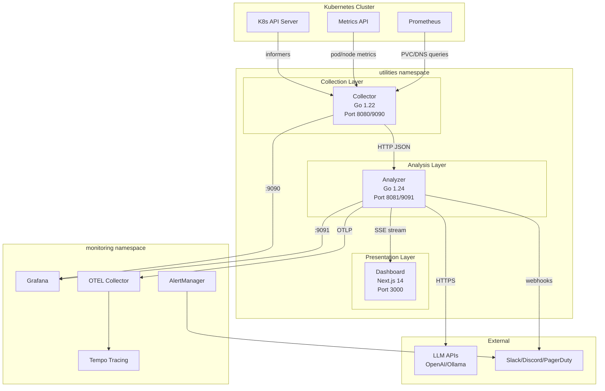
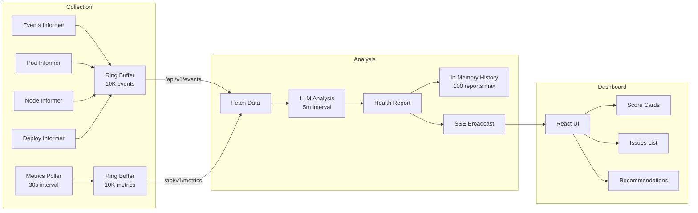
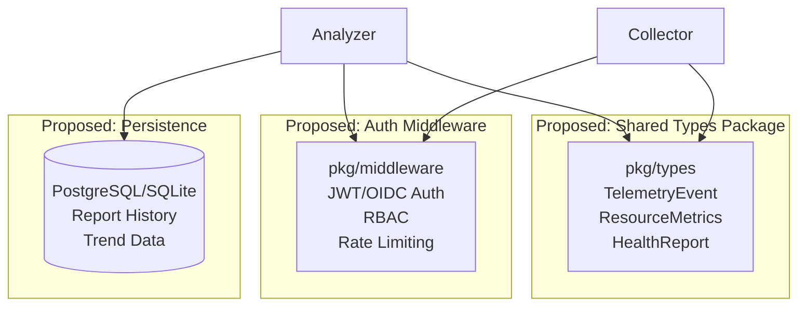
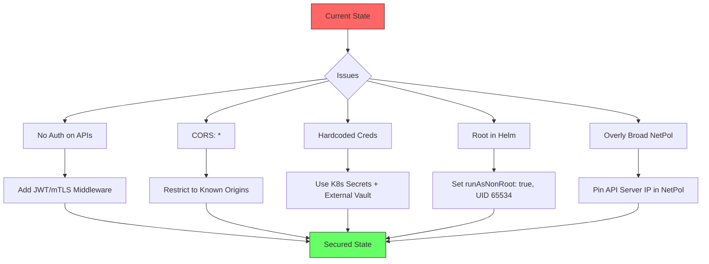
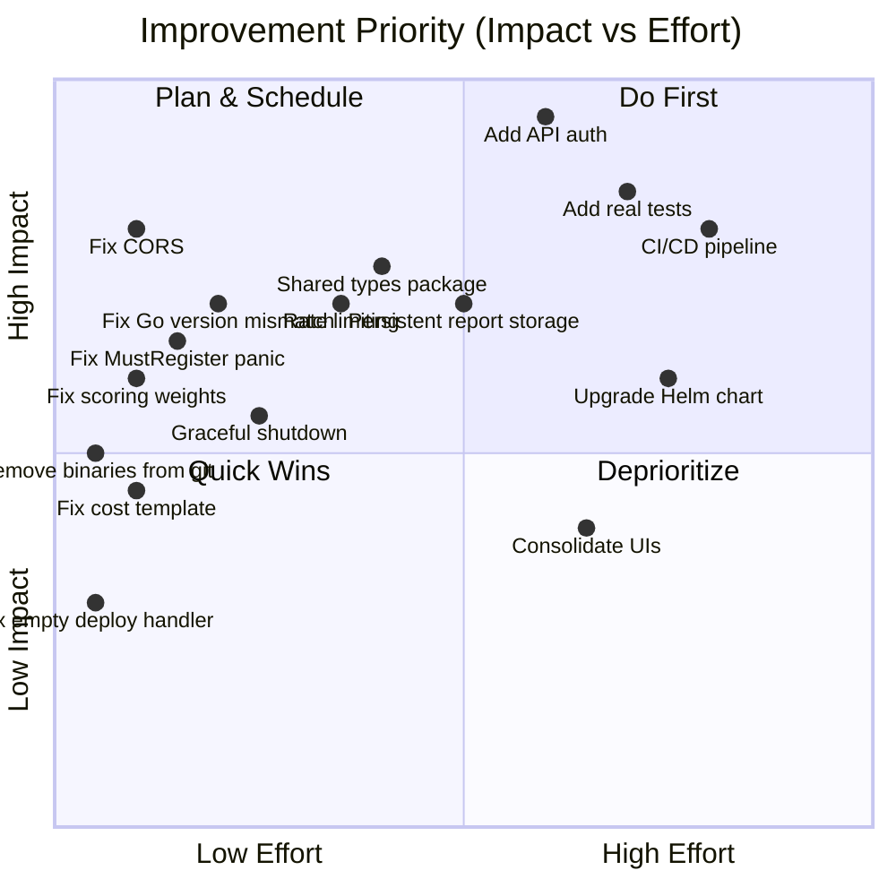
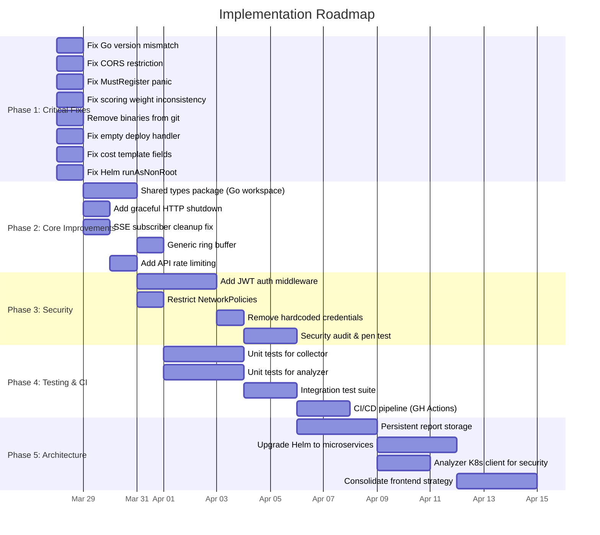
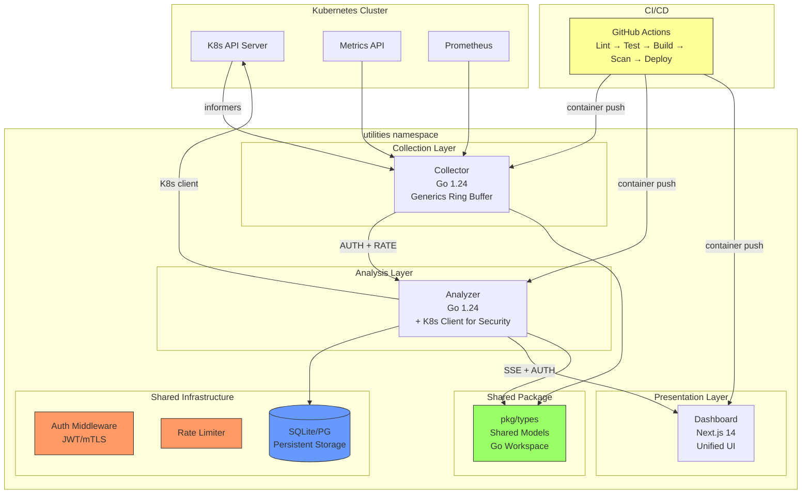

# K8s Cluster Intelligence Engine - Deep Analysis & Improvement Plan

## Context

After a thorough analysis of all source code, configurations, manifests, and infrastructure files across the entire K8s Cluster Intelligence Engine (v6.0.0), this document catalogs **issues, bugs, security gaps, architectural concerns, and improvement opportunities** organized by severity and category.

---

## 1. Architecture Overview (Current State)

---

## 2. Data Flow (Current State)

---

## 3. Issues Found - CRITICAL

### 3.1 No Authentication on Any API Endpoint
- **Files**: `src/analyzer/main.go`, `src/collector/main.go`
- **Impact**: All APIs are publicly accessible within the cluster
- **Detail**: No auth middleware on any endpoint. CORS is open (`*`). Anyone with network access can read cluster health data, trigger analyses, and access pod logs.
- **Risk**: Information disclosure, unauthorized analysis triggers, potential abuse of LLM credits

### 3.2 Duplicated Type Definitions (Collector <-> Analyzer)
- **Files**: `src/collector/main.go:44-80`, `src/analyzer/main.go:41-75`
- **Impact**: Maintenance nightmare, silent drift risk
- **Detail**: `TelemetryEvent`, `InvolvedObject`, `ResourceMetrics`, `ResourceIdentifier` are copy-pasted between services with no shared package. Changes in one won't propagate to the other.

### 3.3 Analyzer Has No Kubernetes Client
- **File**: `src/analyzer/go.mod` - no `k8s.io/client-go` dependency
- **Impact**: Security and cost analysis templates reference pod security contexts, RBAC, and network policies, but the analyzer **cannot fetch this data** from the cluster directly.
- **Detail**: The security prompt template expects `{{.PodSecurityData}}`, `{{.RBACData}}`, `{{.NetworkPolicies}}` but there's no code to populate these fields. The LLM gets empty data.

### 3.4 Helm Chart Version Mismatch
- **File**: `charts/cluster-intel/Chart.yaml` - `appVersion: "4.0.0"` but project is at v6.0.0
- **File**: `charts/cluster-intel/values.yaml` - deploys `python:3.11-slim` (simple app) not the Go microservices
- **Impact**: Helm chart deploys the wrong architecture. Users expecting microservices get the monolith.

### 3.5 `prometheus.MustRegister` Panics on Restart
- **Files**: `src/collector/main.go:223-228`, `src/analyzer/main.go:333-339`
- **Impact**: If a service restarts within the same process (e.g., tests, hot reload), `MustRegister` panics because metrics are already registered.
- **Fix**: Use a custom `prometheus.Registry` instead of the global one.

---

## 4. Issues Found - HIGH

### 4.1 Go Version Inconsistency Between Services
- **Collector**: `go 1.22` (`src/collector/go.mod:3`)
- **Analyzer**: `go 1.24.0` (`src/analyzer/go.mod:3`)
- **Dockerfiles**: Both use `golang:1.22-alpine`
- **Impact**: Analyzer code may use Go 1.24 features that fail to compile in the Docker build.

### 4.2 Empty Deployment Informer Handler
- **File**: `src/collector/main.go:322-330`
- **Detail**: `setupDeploymentInformer()` registers an UpdateFunc that does nothing: `// Track deployment changes for analysis`
- **Impact**: Wasted resources watching deployments with no processing.

### 4.3 Essentially Empty Test Suite
- **File**: `src/analyzer/main_test.go` - 16 lines, tests only `100 == 100`
- **File**: `src/collector/main_test.go` - not found
- **Impact**: Zero meaningful test coverage for core business logic.

### 4.4 In-Memory Report History Will Be Lost on Pod Restart
- **File**: `src/analyzer/main.go:266` - `reportHistory []*ClusterHealthReport`
- **Impact**: All historical analysis reports (up to 100) are lost on every pod restart or deployment update. No persistence layer.

### 4.5 Hardcoded Credentials in pgAdmin Manifest
- **File**: `manifests/db-ui/pgadmin.yaml`
- **Detail**: Default credentials `admin/admin123` in the manifest.
- **Impact**: Security vulnerability if deployed as-is.

### 4.6 CORS Wide Open in Production
- **File**: `src/analyzer/main.go` - CORS allows all origins (`*`)
- **Impact**: Any website can make API requests to the analyzer if exposed.

### 4.7 SSE Subscriber Leak Potential
- **File**: `src/analyzer/main.go:273` - `subscribers map[chan *ClusterHealthReport]struct{}`
- **Detail**: If a client disconnects without proper cleanup, the channel stays in the map. Broadcast to a closed channel will panic.
- **Risk**: Service crash from unhandled channel write to disconnected client.

### 4.8 Ring Buffer Uses `interface{}` Instead of Generics
- **File**: `src/collector/main.go:100-151`
- **Impact**: No type safety, requires type assertions on every read, allocates on heap due to interface boxing. Go 1.22+ supports generics.

---

## 5. Issues Found - MEDIUM

### 5.1 Collector Egress NetworkPolicy Overly Broad
- **File**: `manifests/base/network-policies.yaml:31-39`
- **Detail**: Collector egress to K8s API uses `cidr: 0.0.0.0/0` on ports 443/6443. This allows traffic to any IP on those ports, not just the API server.
- **Fix**: Use the actual API server IP or service CIDR.

### 5.2 Scoring Weight Inconsistency
- **Helm values** (`charts/cluster-intel/values.yaml:94-98`): reliability=0.25, security=0.40, cost=0.15, architecture=0.20
- **Analyzer code** (`src/analyzer/main.go`): reliability=0.35, security=0.30, cost=0.20, architecture=0.15
- **Impact**: Different scoring depending on deployment method.

### 5.3 Helm Chart `runAsNonRoot: false`
- **File**: `charts/cluster-intel/values.yaml:38`
- **Impact**: Helm deployment runs as root, contradicting the security posture of the base manifests which use UID 65534.

### 5.4 Dashboard Has No Server-Side Validation
- **File**: `src/dashboard/app/page.tsx`
- **Detail**: All data from the analyzer API is trusted without validation. Malformed SSE events could crash the UI.

### 5.5 No Rate Limiting on API Endpoints
- **Files**: `src/analyzer/main.go`, `src/collector/main.go`
- **Detail**: No request rate limiting. An actor could spam `/api/v1/analysis/trigger` to exhaust LLM credits.

### 5.6 Placeholder Module Paths
- **Files**: `src/collector/go.mod:1`, `src/analyzer/go.mod:1`
- **Detail**: Module paths are `github.com/your-org/cluster-intel-*` - placeholder, not real.

### 5.7 Image Tags Use `latest` in Base Manifests
- **File**: `manifests/base/kustomization.yaml`
- **Detail**: All three images use `newTag: latest` which is non-deterministic and problematic for rollbacks.

### 5.8 No Graceful Shutdown for HTTP Servers
- **Files**: `src/collector/main.go`, `src/analyzer/main.go`
- **Detail**: HTTP servers are started with `ListenAndServe` in goroutines but there's no `Shutdown(ctx)` call on SIGTERM. In-flight requests may be dropped.

### 5.9 Three Separate Frontend Implementations
- `src/dashboard/` - Next.js React app
- `src/simple/ui.html` - 94.5KB embedded HTML
- `manifests/frontend/ui-configmap.yaml` - Another embedded HTML UI
- **Impact**: Three UIs to maintain, feature drift between them.

---

## 6. Issues Found - LOW / Code Quality

### 6.1 Empty Test Files
- `test-critical.js`, `test-simple.js`, `test-ipv4.js`, `test-console.js` - all empty/placeholder

### 6.2 Compiled Binaries Checked Into Git
- `src/analyzer/cluster-intel-analyzer` (binary)
- `src/collector/cluster-intel-collector` (binary)
- Should be in `.gitignore`

### 6.3 Cost Template References Undefined Fields
- **File**: `src/analyzer/main.go:443-447`
- **Detail**: Template uses `{{.RequestedCPU}}` and `{{.RequestedMemory}}` but `ResourceMetrics` has no such fields.

### 6.4 Kubernetes Dependencies Outdated
- Collector uses `k8s.io/client-go v0.29.2` (Jan 2024)
- Current stable is v0.31.x+

### 6.5 `node_modules/` and `venv/` Not in `.gitignore`
- These directories are present in the project tree and should be excluded.

---

## 7. Improvement Opportunities

### Architecture Improvements

### 7.1 Introduce Shared Go Module for Types
- Extract `TelemetryEvent`, `ResourceMetrics`, `InvolvedObject`, etc. into `pkg/types/`
- Both collector and analyzer import from this shared package
- Prevents drift, enables compile-time type checking

### 7.2 Add Authentication Layer
- Implement JWT or mTLS between services
- Add API key authentication for external access
- Restrict CORS to known origins

### 7.3 Persistent Storage for Reports
- Store report history in SQLite/PostgreSQL instead of in-memory slice
- Enable trend analysis across pod restarts
- The simple app already uses SQLite - apply the same pattern

### 7.4 Unify Go Versions and Module Structure
- Standardize on Go 1.24 across all services
- Consider a Go workspace (`go.work`) to share code
- Update Dockerfiles to match

### 7.5 Upgrade Helm Chart to Microservice Architecture
- Update Helm chart to deploy collector + analyzer + dashboard
- Add subchart support or umbrella chart
- Sync `appVersion` with VERSION file

### 7.6 Add CI/CD Pipeline
- No GitHub Actions / GitLab CI found
- Add: lint, test, build, container push, deploy stages
- Add Trivy container scanning in CI

### 7.7 Consolidate Frontend
- Pick one UI implementation (recommend Next.js dashboard)
- Deprecate/remove embedded HTML UIs
- Or clearly document them as separate deployment modes

---

## 8. Security Hardening Flow

---

## 9. Proposed Improvement Priority Matrix

---

## 10. Recommended Implementation Phases

---

## 11. Complete Issue Summary Table

| # | Severity | Category | Issue | File(s) |
|---|----------|----------|-------|---------|
| 1 | CRITICAL | Security | No API authentication | analyzer/main.go, collector/main.go |
| 2 | CRITICAL | Architecture | Duplicated types between services | collector/main.go, analyzer/main.go |
| 3 | CRITICAL | Functionality | Analyzer can't fetch K8s security data | analyzer/go.mod |
| 4 | CRITICAL | Deployment | Helm chart deploys wrong architecture (v4 monolith) | charts/cluster-intel/ |
| 5 | CRITICAL | Reliability | MustRegister panics on metric re-registration | collector/main.go:223, analyzer/main.go:333 |
| 6 | HIGH | Build | Go version mismatch (1.22 vs 1.24 vs Docker) | go.mod files, Dockerfiles |
| 7 | HIGH | Code Quality | Empty deployment informer handler | collector/main.go:322-330 |
| 8 | HIGH | Testing | Near-zero test coverage | analyzer/main_test.go |
| 9 | HIGH | Reliability | Report history lost on pod restart | analyzer/main.go:266 |
| 10 | HIGH | Security | Hardcoded pgAdmin credentials | manifests/db-ui/pgadmin.yaml |
| 11 | HIGH | Security | CORS allows all origins | analyzer/main.go |
| 12 | HIGH | Reliability | SSE subscriber channel leak/panic | analyzer/main.go:273 |
| 13 | HIGH | Performance | Ring buffer uses interface{} not generics | collector/main.go:100-151 |
| 14 | MEDIUM | Security | Collector egress NetworkPolicy too broad | network-policies.yaml:31-39 |
| 15 | MEDIUM | Config | Scoring weights differ Helm vs code | values.yaml vs analyzer/main.go |
| 16 | MEDIUM | Security | Helm chart runs as root | values.yaml:38 |
| 17 | MEDIUM | Reliability | No server-side data validation in dashboard | dashboard/app/page.tsx |
| 18 | MEDIUM | Security | No API rate limiting | analyzer/main.go, collector/main.go |
| 19 | MEDIUM | Code Quality | Placeholder Go module paths | go.mod files |
| 20 | MEDIUM | Deployment | `latest` image tags in base manifests | base/kustomization.yaml |
| 21 | MEDIUM | Reliability | No graceful HTTP shutdown | collector/main.go, analyzer/main.go |
| 22 | MEDIUM | Maintenance | Three separate frontend implementations | dashboard/, simple/ui.html, ui-configmap.yaml |
| 23 | LOW | Code Quality | Empty test files | test-critical.js, test-simple.js, etc. |
| 24 | LOW | Git Hygiene | Compiled binaries in repo | src/*/cluster-intel-* |
| 25 | LOW | Functionality | Cost template references undefined fields | analyzer/main.go:443-447 |
| 26 | LOW | Dependencies | Outdated K8s client libs (v0.29.2) | collector/go.mod |
| 27 | LOW | Git Hygiene | node_modules/ and venv/ in repo | project root |

---

## 12. Proposed Target Architecture

---

## Summary

**27 issues** identified across 4 severity levels:
- **5 CRITICAL**: Authentication, duplicated types, missing K8s client, Helm mismatch, MustRegister panic
- **8 HIGH**: Version mismatch, empty handlers, no tests, data loss, hardcoded creds, CORS, SSE leak, no generics
- **9 MEDIUM**: Broad network policy, scoring inconsistency, root containers, no validation, no rate limiting, placeholder paths, latest tags, no graceful shutdown, UI fragmentation
- **5 LOW**: Empty test files, binaries in git, template bugs, outdated deps, gitignore gaps

**7 major improvement areas**: Shared types, authentication, persistence, version unification, Helm upgrade, CI/CD, frontend consolidation.
